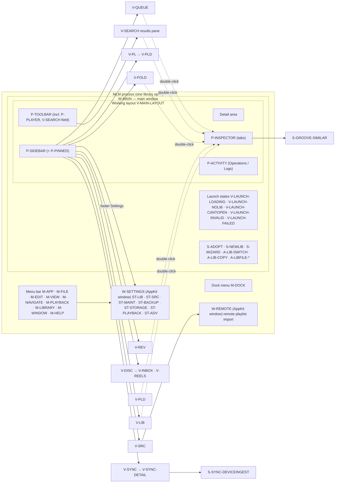

# MLM — B1 UI Inventory

**Status:** Ground work for the B1 design session (`ROADMAP.md` §3). Describes what exists **today**; proposes nothing.
**Written:** 2026-10-05, against commit `91b4463`. Read from code and documents only; the app was not launched.
**Audience:** Oliver and the design agent ("Fable"), who should be able to understand the whole app from this inventory without reading Swift.
**Size:** 49 surfaces · 18 context menus · 33 sheets/panels · 28 alerts · 10 menus · 52 shortcuts · 15 drag & drop interactions (+ 35 expected but missing) · 43 global states · 24 flows · 363 recorded problems · 240 IDs in total.

## Contents

0. [How to read this](#0-how-to-read-this)
1. [Product context](#1-product-context)
2. [App map](#2-app-map)
3. [Surfaces](#3-surfaces)
4. [Context menus](#4-context-menus)
5. [Sheets, popovers, panels, alerts](#5-sheets-popovers-panels-alerts)
6. [Menu bar & keyboard](#6-menu-bar--keyboard)
7. [Drag & drop](#7-drag--drop)
8. [Global states & vocabulary](#8-global-states--vocabulary)
9. [End-to-end flows](#9-end-to-end-flows)
10. [Background work visible to the user](#10-background-work-visible-to-the-user)
11. [Known pain points & doc-vs-code discrepancies](#11-known-pain-points--doc-vs-code-discrepancies)
12. [Coverage proof](#12-coverage-proof)

Area files: [shell](inventory/shell.md) · [main](inventory/main.md) · [library](inventory/library.md) · [inspector](inventory/inspector.md) · [playlists](inventory/playlists.md) · [sync](inventory/sync.md) · [sources-review](inventory/sources-review.md) · [discover](inventory/discover.md) · [settings](inventory/settings.md) · [activity](inventory/activity.md)

---

## 0. How to read this

**What this is.** A complete map of what a user can see and do in MLM *today* (code as of commit `91b4463`, 2026-10-05), written for the B1 design session. It describes the territory: purposes, user goals, information needs, elements, interactions, states and problems. It contains **no design proposals**. Where a design idea came up, it is phrased as an *open question for the designer*.

**Where things live.**

| File | Contents |
|---|---|
| `design/B1-UI-INVENTORY.md` (this file) | §0–§2 orientation and app map · §3–§7 ID registers (every ID, linking into the area files) · §8 global states · §9 end-to-end flows · §10 background work · §11 pain points and doc-vs-code discrepancies · §12 coverage proof |
| `design/inventory/shell.md` | Windows, app launch and library-file lifecycle, first-run wizard, menu bar, Dock menu, global shortcuts, cross-view triggers |
| `design/inventory/main.md` | Main window composition, sidebar (incl. pinned playlists), toolbar, player bar, queue, global search, universal search, URL import entry points |
| `design/inventory/library.md` | Library view, the shared track table, the shared track context menu, track status/cover primitives, selection-creation sheets |
| `design/inventory/inspector.md` | Track inspector and all its tabs (metadata, waveform, similar tracks, Groove Studio, debug) |
| `design/inventory/playlists.md` | Playlists grid, playlist detail, Folders |
| `design/inventory/sync.md` | Sync profiles, profile detail, pickers, device ingest |
| `design/inventory/sources-review.md` | Sources, remote-playlists window, Review (duplicates and conflicts) |
| `design/inventory/discover.md` | Discover, Reels inbox, Discovery inbox |
| `design/inventory/settings.md` | Settings window: all seven tabs |
| `design/inventory/activity.md` | Activity panel: Operations and Logs |

**ID scheme.** IDs are stable. Oliver and Fable reference them in feedback, so they are never renumbered. New IDs are only ever appended.

| Prefix | Meaning | Example |
|---|---|---|
| `W-` | Window / scene | `W-MAIN` |
| `V-` | Sidebar section or main view | `V-LIB` |
| `P-` | Persistent panel (sidebar, toolbar, player bar, Activity panel, inspector) | `P-PLAYER` |
| `ST-` | Settings tab | `ST-BACKUP` |
| `S-` | Sheet, popover, panel, file dialog | `S-NEWLIB` |
| `A-` | Alert / confirmation dialog | `A-LIB-SWITCH` |
| `CM-` | Context menu | `CM-TRACK` |
| `M-` | Menu-bar menu or Dock menu (items as `.E01` …) | `M-FILE.E02` |
| `K-` | Keyboard shortcut | `K-NAV-LIBRARY` |
| `D-` | Drag & drop interaction | `D-PL-TRACKS-TO-CARD` |
| `F-` | End-to-end flow (§9) | `F-03` |
| `G-` | Global state (§8) | `G-DRIVE-OFFLINE` |
| `<ID>.E01` | Element inside a surface | `V-LIB.E04` = a column of the Library table |

Most IDs carry an area code after the prefix (e.g. `S-PL-…` = a Playlists-area sheet) so that IDs stay unique across areas.

**Frequency legend** (on every user goal): **daily** = part of the normal listening/browsing session · **weekly** = recurring maintenance or curation · **rare** = setup, recovery, one-off.

**Citations.** `MLM/Views/Library/LibraryView.swift:40-88` means lines 40–88 of that file at commit `91b4463`. Every surface entry cites the code that implements it. Labels in backticks are quoted verbatim from code. `UI-GROUNDTRUTH.md §3.1` refers to the August 2026 design reference, which is partly aspirational. Where it and the code disagree, this inventory describes the **code** and records the difference in §11. Audit findings are cited by ID (`UI-002`, `LOGIC-013`) from `docs/audit/`. *(inferred)* marks a user goal that is not directly evidenced by code or docs.

**Method.** Everything here comes from reading code and documents. The app was never launched, and no screenshots or live data were used. Data-scale numbers come from `ROADMAP.md` §0–§1 (read off the live DB on 2026-10-04).

---

## 1. Product context

### 1.1 Who uses MLM and how

- **One user: Oliver**, owner and only user. A DJ-ish music collector and power user (keyboard, multi-select, dense tables are welcome — `UI-GROUNDTRUTH.md` §1.1.3).
- **Library:** ~**12,935 tracks**, the audio on an **external disk** (`/Volumes/Lexxar/Music`) that is **often unmounted** (`ROADMAP.md` §0.1, §1.1; `todo_dump.md:4` — "i dislike having to always plug my external disk into my mac").
- **Where music comes from:** SoundCloud likes and playlists, YouTube, Spotify, Apple Music, direct downloads. The download chain is SoundCloud → DAB (FLAC) → YouTube fallback (`.planning/STATE.md` Phase 39 summary). There are both *remote* tracks (known, not downloaded: `organized_path IS NULL`) and *local* tracks (downloaded, inside the library folder).
- **Where music goes:** sync profiles copy or transcode tracks to devices and folders (e.g. Rockbox/iPod). Device ingest pulls files back (see `inventory/sync.md`).
- **The aspiration:** MLM should become the app Oliver **lives in daily**, for navigating and listening in one surface, not only a manager. Self-report from 2026-05-04: *"I'm not using MLM. I have a nice library and I can search but there's just no structure inside it."* The locked direction is the **daily-driver loop**: a disk-folder explorer, native MLM playlists (create, drag songs in, edit, delete), **spacebar preview** ("dreams of the system-level Quick Look behavior") and bulk actions on multi-selection (project memory "Daily-Driver Loop Direction", 2026-05-04).
- **His open wishes for MLM** (`todo_dump.md`): consistent UI conventions that agents can follow (`:2`); transparency and control over where data lives, built-in backups and multiple libraries (`:4`, largely built in Track A); **albums** with their own track order and cover (`:6`); **remove source-as-album** and replace it with real albums, without leaking provenance when sharing an MP3 (`:8`); a design session covering "each view, each use flow and so on each element, logs, settings, tables, menu bar items" where "the whole liquid glass thing should come to shine" (`:10`).
- **Known frustration with analysis features** (`.planning/todos/pending/audio-analysis-ux-cleanup.md`): *"I click a button and I don't know what's happening. I get no feedback, then it's not responsive, and it crashes … Uncool."*

### 1.2 Platform facts a designer needs

| Fact | Value | Source |
|---|---|---|
| Deployment target | `.macOS("15.0")` | `Package.swift:7` |
| SDK in use | macOS 27 SDK (snapshot baselines are recorded for `macos27-arm64`) | `ROADMAP.md` §3 B-track Q2 |
| Liquid Glass APIs | `glassEffect(_:in:)`, `GlassEffectContainer`, `Glass.interactive`, `.buttonStyle(.glass)` are **macOS 26.0+**. With a 15.0 target, every use needs an `if #available(macOS 26, *)` fallback. `glassBackgroundEffect` is visionOS-only. The code uses **no** glass API today (no `glassEffect` / `#available(macOS 26…)` anywhere in `MLM/`). | `docs/audit/LIQUID-GLASS-PLAN.md` §1–§2 |
| Implementation | SwiftUI + some AppKit, SwiftPM package (no Xcode project), GRDB/SQLite | `Package.swift` |
| Main window | **One** main window: a `Window("MLM", id: "main")` scene (not `WindowGroup`) since A3. There are no second main windows and no tabs. | `MLM/App/MLMApp.swift:63` |
| Other windows | The **Settings window** and the **remote-playlists window** are AppKit-managed `NSWindow`s created by `AppDelegate` (not a SwiftUI `Settings` scene) | `MLM/App/AppDelegate.swift`, `inventory/shell.md` W- entries |
| Missing SwiftUI affordances | No `.searchable`, no `.inspector` modifier anywhere in `MLM/` (search field and track inspector are custom) | §12 grep counts G05, G13 = 0 |
| Language | English UI only | `UI-GROUNDTRUTH.md` §1.7.1 |

### 1.3 Locked decisions the designer must respect

| # | Decision | Source |
|---|---|---|
| L1 | **Native macOS look only**: system colours, materials and containers. No custom theme or palette (the old "Solar" palette is rejected). Reference apps: Apple Music, Mail, System Settings, Little Snitch, Reeder. | Oliver's standing feedback (agent memory "macOS-App native look"); `UI-GROUNDTRUTH.md` §1.1.5 |
| L2 | **Native toolbar stays.** No `.windowStyle(.hiddenTitleBar)`, no custom window chrome, no floating player overlays. These were rejected repeatedly. `.principal` centres between the leading and trailing groups, not in the window. | `ROADMAP.md` §3 (B1 constraint), §6.2 |
| L3 | **English UI only**; every German string is a defect | `UI-GROUNDTRUTH.md` §1.7.1, §1.5 banned list |
| L4 | **One meaning per word**: the glossary is exhaustive. "Library" = the collection, stored in one "Library file" (`.mlibm`) | `UI-GROUNDTRUTH.md` §1.1.4, §1.5; `ROADMAP.md` §2 A3 decision 7 |
| L5 | **Critical states are always text, never icon-only** | `UI-GROUNDTRUTH.md` §1.1.1, §1.4 iconography |
| L6 | **Automation is visible, controllable, reversible** | `UI-GROUNDTRUTH.md` §1.1.2 |
| L7 | **One active library per process**; switching = relaunch (v1). No merged views, no cross-library search, no tabs | `A0-LIBRARY-DEFINITION.md` D4; `ROADMAP.md` §2 A3 decision 1 |
| L8 | A library is a `.mlibm` file package (manifest + DB + playlist covers). Audio is referenced, never contained. Credentials are global. The library-file icon is a dedicated static icon (a B1 asset) | `A0-LIBRARY-DEFINITION.md` D1–D3, D9 |
| L9 | Finder actions always read `Show in Finder` (never "Reveal in Finder") | `UI-GROUNDTRUTH.md` §5.6; `ROADMAP.md` §2 A3 decision 13 |
| L10 | Provenance must **survive** (in `track_sources`) but must not leak when sharing a file | `ROADMAP.md` §4 C3; `todo_dump.md:8` |
| L11 | `UI-GROUNDTRUTH.md` stays binding until B2 replaces it. The glossary (§1.5) and state vocabulary (§1.6) are design-independent and likely carry forward | `ROADMAP.md` §3, §6.6 |

### 1.4 Data realities that shape the UI

| Reality | Number | Why it matters for design |
|---|---|---|
| Library size | 12,935 tracks | Every list is a large table. Sorting, filtering, selection and scroll performance matter |
| Remote vs local | `organized_path IS NULL` = remote/not downloaded. 19,596 `track_sources` rows (~1.5 per track) | Every track list mixes playable and not-playable rows |
| "Unknown album" | **6,209 tracks = 48.0 %** have `album = 'unknown album'`. Another 132 have a source name as the album (`SoundCloud`, `YouTube`, `Downloads`, `Web`), 298 have `SoundCloud Likes` | Any album-centred view would be dominated by one bogus "album" |
| Albums in DB | 8,020 album rows but only 1,616 distinct album strings (~1.6 tracks per album). 11,039 tracks linked. **No album UI exists**. No track order exists (`tracks` has no `track_number`/`disc_number`) | Albums are a "future" area (§9 albums flow). The backend exists but is unused by any view |
| Playlist covers | 36 cover files | Most playlists fall back to generated covers |
| External drive | Library folder on `/Volumes/Lexxar`, frequently unmounted | Every surface needs a "Not connected" story (§8) |
| Database | ~130 MB + 3 MB WAL, 44 migrations | Backups, adoption and migrations are long, visible operations |
| Long-running background work | Downloads, imports, audio analysis, artwork backfill, sync and transcoding, device ingest, backups, path migration, library adoption | See §10. The Activity panel is the main window onto it |

---

## 2. App map

### 2.1 Navigation tree (diagram)

### 2.2 Navigation tree (indented, with IDs)

- **W-MAIN** — main window `MLM` (the only `Window` scene)
  - Launch states: replace the whole content until a library is open
    - V-LAUNCH-LOADING `Loading Library...`
    - V-LAUNCH-NOLIB `No library open` (+ S-NEWLIB on first run)
    - V-LAUNCH-CANTOPEN `"‹name›" can't be opened` (Not found / Not connected / identity mismatch)
    - V-LAUNCH-INVALID `"‹name›" isn't a valid library file.`
    - V-LAUNCH-FAILED `Failed to Initialize`
    - S-ADOPT `Set up your library file` (old install) · A-LIB-COPY (Finder copy) · S-WIZARD (no library folder yet; window overlay) → S-WIZ-FOLDER
  - **V-MAIN-LAYOUT** — the working layout
    - **P-TOOLBAR** — sidebar toggle · **P-PLAYER** (player bar, centred) → S-PLAYER-COVER · **V-SEARCH** field (⌘F) · view-specific items (e.g. `Re-scan Library` in V-LIB, `Refresh` in V-SYNC-DETAIL)
    - **P-SIDEBAR**
      - `Library` → **V-LIB** (tabs Local / Remote; shared **V-TRACK-TABLE**; menu **CM-TRACK** → S-SEL-NEWPLAYLIST, S-SEL-NEWSYNCPROFILE, A-TRACK-REMOVE)
      - `Playlists` → **V-PL** (grid; CM-PL-CARD; S-PL-NEWPLAYLIST; A-PL-DELETE) → **V-PLD** (detail; S-PLD-LINK, S-PLD-M3U-OPEN → S-PLD-M3U-PREVIEW, A-PLD-*)
        - **P-PINNED** — pinned playlists (max 8) → V-PLD; CM-SIDEBAR-PINNED
      - `Folders` → **V-FOLD** (disk folder tree; CM-FOLD-*)
      - `Sync` → **V-SYNC** (profiles; CM-SYNC-PROFILE; S-SYNC-NEWPROFILE, S-SYNC-RENAME, A-SYNC-DELETEPROFILE, S-SYNC-DEVICEINGEST → S-SYNC-INGESTPREVIEW) → **V-SYNC-DETAIL** (S-SYNC-PLAYLISTPICKER, S-SYNC-OPENPANEL, A-SYNC-REMOVECONTENT, S-SYNC-TOAST)
      - `Sources` → **V-SRC** (S-SRC-OAUTH, A-SRC-KEYCHAIN) → **W-REMOTE**
      - `Review` → **V-REV** (Duplicates / Conflicts / Resolved; S-REV-UNDOTOAST)
      - `Discover` → **V-DISC** → **V-INBOX** (A-INBOX-DELETE) · **V-REELS** (S-REELS-OPENFOLDER, S-REELS-KEYFRAME, A-REELS-DELETE)
      - Footer: `Queue` → **V-QUEUE** (⌘8) · `Settings` → W-SETTINGS
    - **Detail area** — the view selected in the sidebar, or the **V-SEARCH** results pane while searching
    - **P-INSPECTOR** — track inspector, right side (opened by double-click; follows now-playing)
      - P-INSPECTOR-WAVEFORM · tabs P-INSPECTOR-GENERAL · P-INSPECTOR-AUDIO · P-INSPECTOR-FILE · P-INSPECTOR-SIMILAR → S-GROOVE-SIMILAR (A-GROOVE-DELETEFILE) · P-INSPECTOR-DEBUG
    - **P-ACTIVITY** — bottom panel, collapsed/expanded
      - P-ACTIVITY-OPS (Active / Needs Attention / Recent; A-OPS-CLEARQUEUE) · P-ACTIVITY-LOGS
  - S-SEARCH-UNIVERSAL — universal search sheet (exists in code, **unreachable** today)
- **W-SETTINGS** — Settings window (AppKit), tabs in order:
  ST-LIB (S-SET-LIBROOT, S-SET-IMPORTFOLDER) · ST-SRC (A-SET-DISCONNECT) · ST-MAINT (S-SET-CACHEFOLDER, A-SET-PATHAPPLY, A-SET-PATHROLLBACK) · ST-BACKUP (S-SET-BACKUPFOLDER, A-SET-RESTORE, A-SET-RESTOREFAILED) · ST-STORAGE · ST-PLAYBACK · ST-ADV (Genre Workshop: ST-STUDIO-GRID → ST-STUDIO-GENRE / ST-STUDIO-MERGE / ST-STUDIO-EXPORT → S-STUDIO-EXPORTFOLDER)
- **W-REMOTE** — remote playlists window (AppKit): `SoundCloud Playlists` / `Spotify Playlists` / `Import YouTube Playlist`; can show V-PLD inside itself
- **Menu bar** — M-APP · M-FILE (`New Library…`, `Open Library…` ⌘O → S-LIBFILE-OPEN, `Open Recent`, `New Playlist` ⌘N) · M-EDIT · M-VIEW · M-NAVIGATE (⌘1–⌘8) · M-PLAYBACK · M-LIBRARY · M-WINDOW · M-HELP
- **Dock menu** — M-DOCK
- **Finder** — `.mlibm` library files open MLM (D-LIBFILE-OPEN → A-LIB-SWITCH / A-LIB-COPY)

### 2.3 Surfaces that do not exist yet but the design session must cover

| Surface | Why | Source |
|---|---|---|
| Library picker (list of known libraries, incl. *missing / not connected* entries) | A0 D5 "B1 picker"; V-LAUNCH-NOLIB has no list today | `A0-LIBRARY-DEFINITION.md` D5, "Consequences for B1" |
| `.mlibm` library-file icon | Static document icon, a B1 asset | A0 D9; ROADMAP A3 decision 11 |
| Album list, album detail with fixed track order, album-variant chooser | Track C2, gated on B1 | `ROADMAP.md` §3 B1, §4 C2; `todo_dump.md:6` |
| Playlist folders / logical collections | User wants both disk view and logical folders | Daily-driver direction (2026-05-04) |
| Spacebar preview (Quick Look–style or native) | Core of the daily-driver loop | Daily-driver direction; `.planning/REQUIREMENTS.md` |
| Batch bar for multi-selection | Existed in the Tauri app (Phase 19), wish BULK-01/02 | `.planning/PROJECT.md:31`, `.planning/REQUIREMENTS.md` |
| Backup schedule and retention controls | Fixed today | `todo_dump.md:4`; ROADMAP A2 |
| Tool status (yt-dlp, ffmpeg, fpcalc, scdl) | Error messages point to Settings, but nothing is there | `inventory/settings.md`, `inventory/activity.md` |

---

## 3. Surfaces

Every window, sidebar view, persistent panel and Settings tab has a full entry, using the template from the B1 brief: reached via · code · purpose · user goals (daily/weekly/rare) · what the user wants to see · elements · interactions · states · data scale · pain points · related flows · constraints · open questions for the designer. The entries live in the area files; this register links to each one. Two "component" entries (V-TRACK-TABLE, V-TRACK-PRIMITIVES) describe building blocks that appear in many views. Larger sheets with their own full entry (S-SEARCH-UNIVERSAL, S-SYNC-DEVICEINGEST, S-GROOVE-SIMILAR) are listed in §5.

49 entries:

| ID | Name / summary | Area |
|---|---|---|
| [`W-MAIN`](inventory/shell.md#w-main--main-window-mlm) | Main window ("MLM") | Shell, launch & menus |
| [`W-SETTINGS`](inventory/shell.md#w-settings--settings-window-shell-only-tabs-st--belong-to-settingsmd) | Settings window (shell only; tabs ST-* belong to settings.md) | Shell, launch & menus |
| [`V-LAUNCH-NOLIB`](inventory/shell.md#v-launch-nolib--no-library-open) | "No library open" | Shell, launch & menus |
| [`V-LAUNCH-CANTOPEN`](inventory/shell.md#v-launch-cantopen--name-cant-be-opened-window-content-form) | "‹name›" can't be opened (window-content form) | Shell, launch & menus |
| [`V-LAUNCH-INVALID`](inventory/shell.md#v-launch-invalid--name-isnt-a-valid-library-file) | "‹name›" isn't a valid library file. | Shell, launch & menus |
| [`V-LAUNCH-LOADING`](inventory/shell.md#v-launch-loading--loading-library) | "Loading Library..." | Shell, launch & menus |
| [`V-LAUNCH-FAILED`](inventory/shell.md#v-launch-failed--failed-to-initialize) | "Failed to Initialize" | Shell, launch & menus |
| [`V-MAIN-LAYOUT`](inventory/main.md#v-main-layout--main-window-content-what-fills-w-main) | Main window content (what fills W-MAIN) | Main window, sidebar, toolbar, player, search |
| [`P-SIDEBAR`](inventory/main.md#p-sidebar--sidebar) | Sidebar | Main window, sidebar, toolbar, player, search |
| [`P-PINNED`](inventory/main.md#p-pinned--pinned-playlists-nested-under-playlists-in-the-sidebar) | Pinned playlists (nested under "Playlists" in the sidebar) | Main window, sidebar, toolbar, player, search |
| [`P-TOOLBAR`](inventory/main.md#p-toolbar--window-toolbar) | Window toolbar | Main window, sidebar, toolbar, player, search |
| [`P-PLAYER`](inventory/main.md#p-player--player-bar-in-the-toolbar) | Player bar (in the toolbar) | Main window, sidebar, toolbar, player, search |
| [`V-QUEUE`](inventory/main.md#v-queue--queue) | Queue | Main window, sidebar, toolbar, player, search |
| [`V-SEARCH`](inventory/main.md#v-search--toolbar-search-field-and-search-results-pane) | Toolbar search field and search results pane | Main window, sidebar, toolbar, player, search |
| [`V-LIB`](inventory/library.md#v-lib--library) | Library | Library & track table |
| [`V-TRACK-TABLE`](inventory/library.md#v-track-table--shared-track-table-component-not-a-sidebar-view) | Shared track table (component, not a sidebar view) | Library & track table |
| [`V-TRACK-PRIMITIVES`](inventory/library.md#v-track-primitives--track-presentation-primitives-component-catalogue) | Track presentation primitives (component catalogue) | Library & track table |
| [`P-INSPECTOR`](inventory/inspector.md#p-inspector--track-inspector-detail-panel) | Track inspector ("detail panel") | Track inspector & Genre Workshop |
| [`P-INSPECTOR-WAVEFORM`](inventory/inspector.md#p-inspector-waveform--waveform-strip-top-of-the-inspector) | Waveform strip (top of the inspector) | Track inspector & Genre Workshop |
| [`P-INSPECTOR-GENERAL`](inventory/inspector.md#p-inspector-general--general-tab-tag-editing--playlist-membership) | General tab (tag editing + playlist membership) | Track inspector & Genre Workshop |
| [`P-INSPECTOR-AUDIO`](inventory/inspector.md#p-inspector-audio--audio-tab-analysis-values-manual-analysis-waveform-options) | Audio tab (analysis values, manual analysis, waveform options) | Track inspector & Genre Workshop |
| [`P-INSPECTOR-FILE`](inventory/inspector.md#p-inspector-file--file-tab-paths-availability-source-duplicate-hint) | File tab (paths, availability, source, duplicate hint) | Track inspector & Genre Workshop |
| [`P-INSPECTOR-SIMILAR`](inventory/inspector.md#p-inspector-similar--similar-tab) | Similar tab | Track inspector & Genre Workshop |
| [`P-INSPECTOR-DEBUG`](inventory/inspector.md#p-inspector-debug--debug-tab-ffmpeg-diagnostics) | Debug tab (ffmpeg diagnostics) | Track inspector & Genre Workshop |
| [`ST-STUDIO-GRID`](inventory/inspector.md#st-studio-grid--genre-workshop-genre-grid-settings--advanced) | Genre Workshop: genre grid (Settings → Advanced) | Track inspector & Genre Workshop |
| [`ST-STUDIO-GENRE`](inventory/inspector.md#st-studio-genre--genre-workshop-genre-detail-reference-track-suggestions-staged-tagging) | Genre Workshop: genre detail (reference track, suggestions, staged tagging) | Track inspector & Genre Workshop |
| [`ST-STUDIO-MERGE`](inventory/inspector.md#st-studio-merge--genre-workshop-consolidate-genres) | Genre Workshop: Consolidate genres | Track inspector & Genre Workshop |
| [`ST-STUDIO-EXPORT`](inventory/inspector.md#st-studio-export--genre-workshop-export-createml-training-set) | Genre Workshop: Export CreateML training set | Track inspector & Genre Workshop |
| [`V-PL`](inventory/playlists.md#v-pl--playlists-grid) | Playlists (grid) | Playlists & Folders |
| [`V-PLD`](inventory/playlists.md#v-pld--playlist-detail) | Playlist detail | Playlists & Folders |
| [`V-FOLD`](inventory/playlists.md#v-fold--folders-disk-folder-browser) | Folders (disk folder browser) | Playlists & Folders |
| [`V-SYNC`](inventory/sync.md#v-sync--sync-profile-list) | Sync (profile list) | Sync & devices |
| [`V-SYNC-DETAIL`](inventory/sync.md#v-sync-detail--sync-profile-detail) | Sync profile detail | Sync & devices |
| [`W-REMOTE`](inventory/sources-review.md#w-remote--remote-playlists-window-soundcloud-playlists--spotify-playlists--import-youtube-playlist) | Remote playlists window (SoundCloud Playlists / Spotify Playlists / Import YouTube Playlist) | Sources & Review |
| [`V-SRC`](inventory/sources-review.md#v-src--sources) | Sources | Sources & Review |
| [`V-REV`](inventory/sources-review.md#v-rev--review-duplicates--metadata-conflicts) | Review (duplicates & metadata conflicts) | Sources & Review |
| [`V-DISC`](inventory/discover.md#v-disc--discover) | Discover | Discover & Reels |
| [`V-INBOX`](inventory/discover.md#v-inbox--recommendations-discovery-inbox) | Recommendations (Discovery inbox) | Discover & Reels |
| [`V-REELS`](inventory/discover.md#v-reels--reels-reels-inbox) | Reels (Reels inbox) | Discover & Reels |
| [`ST-LIB`](inventory/settings.md#st-lib--library) | Library | Settings |
| [`ST-SRC`](inventory/settings.md#st-src--sources) | Sources | Settings |
| [`ST-MAINT`](inventory/settings.md#st-maint--maintenance) | Maintenance | Settings |
| [`ST-BACKUP`](inventory/settings.md#st-backup--backup) | Backup | Settings |
| [`ST-STORAGE`](inventory/settings.md#st-storage--storage-location) | Storage Location | Settings |
| [`ST-PLAYBACK`](inventory/settings.md#st-playback--playback) | Playback | Settings |
| [`ST-ADV`](inventory/settings.md#st-adv--advanced-genre-workshop) | Advanced (Genre Workshop) | Settings |
| [`P-ACTIVITY`](inventory/activity.md#p-activity--activity) | Activity | Activity |
| [`P-ACTIVITY-OPS`](inventory/activity.md#p-activity-ops--operations) | Operations | Activity |
| [`P-ACTIVITY-LOGS`](inventory/activity.md#p-activity-logs--logs) | Logs | Activity |

## 4. Context menus

Every right-click menu, with each item verbatim and in order, its enable/visibility rules and its effect, is in the linked entry. Two menus in Discover are pull-down menus behind a ⊕ button (no right-click menus exist there). `CM-TRACK` is the shared track menu used by V-LIB, V-SEARCH, V-QUEUE, V-PLD, V-FOLD and the Genre Workshop. The playlist- and folder-specific variants are described in [`inventory/playlists.md`](inventory/playlists.md) under "Uses of CM-TRACK".

Expected but missing context menus are listed at the end of each area's "Context menus" section (e.g. no right-click menu on Sources cards, Review rows, Activity rows, Discover inbox rows).

18 entries:

| ID | Name / summary | Area |
|---|---|---|
| [`CM-SIDEBAR-PINNED`](inventory/main.md#cm-sidebar-pinned--pinned-playlist-row) | Pinned playlist row | Main window, sidebar, toolbar, player, search |
| [`CM-SIDEBAR-PINNEDRENAME`](inventory/main.md#cm-sidebar-pinnedrename--row-in-rename-mode) | Row in rename mode | Main window, sidebar, toolbar, player, search |
| [`CM-TRACK`](inventory/library.md#cm-track--track-context-menu-shared) | Track context menu (shared) | Library & track table |
| [`CM-STUDIO-SUGGESTION`](inventory/inspector.md#cm-studio-suggestion--suggestion-row-st-studio-genre-left-column) | Suggestion row (ST-STUDIO-GENRE left column) | Track inspector & Genre Workshop |
| [`CM-STUDIO-GENRETRACK`](inventory/inspector.md#cm-studio-genretrack--genre-track-row-st-studio-genre-right-column) | Genre track row (ST-STUDIO-GENRE right column) | Track inspector & Genre Workshop |
| [`CM-STUDIO-MERGETABLE`](inventory/inspector.md#cm-studio-mergetable--merge-preview-table-st-studio-merge) | Merge preview table (ST-STUDIO-MERGE) | Track inspector & Genre Workshop |
| [`CM-PL-CARD`](inventory/playlists.md#cm-pl-card--playlist-card-context-menu) | Playlist card context menu | Playlists & Folders |
| [`CM-FOLD-TREE`](inventory/playlists.md#cm-fold-tree--folder-tree-row) | Folder tree row | Playlists & Folders |
| [`CM-FOLD-SUBFOLDER`](inventory/playlists.md#cm-fold-subfolder--subfolders-table-row) | Subfolders table row | Playlists & Folders |
| [`CM-FOLD-SEARCHRESULT`](inventory/playlists.md#cm-fold-searchresult--folder-search-results-row) | Folder search results row | Playlists & Folders |
| [`CM-SYNC-PROFILE`](inventory/sync.md#cm-sync-profile--profile-row) | profile row | Sync & devices |
| [`CM-SYNC-PLROW`](inventory/sync.md#cm-sync-plrow--playlist-row-in-profile) | playlist row in profile | Sync & devices |
| [`CM-SYNC-TRACKROW`](inventory/sync.md#cm-sync-trackrow--track-row-in-profile) | track row in profile | Sync & devices |
| [`CM-SYNC-PREVIEWFILE`](inventory/sync.md#cm-sync-previewfile--file-in-preview-list) | file in preview list | Sync & devices |
| [`CM-SYNC-FAILED`](inventory/sync.md#cm-sync-failed--failed-track-row) | failed track row | Sync & devices |
| [`CM-REELS-ADDPL`](inventory/discover.md#cm-reels-addpl--add-to-playlist-pull-down-on-a-search-result) | "Add to playlist" pull-down on a search result | Discover & Reels |
| [`CM-REELS-TEXTPILL`](inventory/discover.md#cm-reels-textpill--recognized-text-pill-menu) | recognized-text pill menu | Discover & Reels |
| [`CM-LOGS-TEXT`](inventory/activity.md#cm-logs-text--standard-text-menu-in-the-log-view) | standard text menu in the log view | Activity |

## 5. Sheets, popovers, panels, alerts

Trigger, content, buttons verbatim with role, consequence of each button, cancel path and error handling are in the linked entries. `S-` includes system file panels (`NSOpenPanel`), inline banners and toasts; `A-` includes confirmation dialogs.

33 sheets / popovers / panels and 28 alerts / confirmations:

| ID | Name / summary | Area |
|---|---|---|
| [`S-LIBFILE-OPEN`](inventory/shell.md#s-libfile-open--open-library-file-panel) | Open Library… file panel | Shell, launch & menus |
| [`S-WIZ-FOLDER`](inventory/shell.md#s-wiz-folder--library-folder-panel) | library folder panel | Shell, launch & menus |
| [`S-ADOPT`](inventory/shell.md#s-adopt--set-up-your-library-file) | "Set up your library file" | Shell, launch & menus |
| [`S-NEWLIB`](inventory/shell.md#s-newlib--new-library) | "New Library" | Shell, launch & menus |
| [`S-WIZARD`](inventory/shell.md#s-wizard--first-run-wizard-window-overlay) | First-run wizard (window overlay) | Shell, launch & menus |
| [`A-LIB-SWITCH`](inventory/shell.md#a-lib-switch--switch-to-name) | "Switch to "‹name›"?" | Shell, launch & menus |
| [`A-LIB-COPY`](inventory/shell.md#a-lib-copy--name-is-a-copy-of-original-library-file-copy-prompt) | "‹name›" is a copy of "‹original›" (library-file copy prompt) | Shell, launch & menus |
| [`A-LIBFILE-CANTOPEN`](inventory/shell.md#a-libfile-cantopen--cant-be-opened-alert-form-while-a-library-is-open) | can't be opened (alert form, while a library is open) | Shell, launch & menus |
| [`A-LIBFILE-INVALID`](inventory/shell.md#a-libfile-invalid--isnt-a-valid-library-file-alert-form) | isn't a valid library file (alert form) | Shell, launch & menus |
| [`S-SEARCH-UNIVERSAL`](inventory/main.md#s-search-universal--universal-search-panel-paste-a-url-or-search-for-music) | Universal search panel ("Paste a URL or search for music…") | Main window, sidebar, toolbar, player, search |
| [`S-PLAYER-COVER`](inventory/main.md#s-player-cover--large-cover-popover) | Large cover popover | Main window, sidebar, toolbar, player, search |
| [`A-SIDEBAR-DELETEPL`](inventory/main.md#a-sidebar-deletepl--delete-playlist) | "Delete playlist?" | Main window, sidebar, toolbar, player, search |
| [`A-SIDEBAR-RENAMEFAIL`](inventory/main.md#a-sidebar-renamefail--could-not-rename-playlist) | "Could not rename playlist" | Main window, sidebar, toolbar, player, search |
| [`S-SEL-NEWPLAYLIST`](inventory/library.md#s-sel-newplaylist--new-playlist-from-selection) | New playlist from selection | Library & track table |
| [`S-SEL-NEWSYNCPROFILE`](inventory/library.md#s-sel-newsyncprofile--new-sync-profile-from-selection) | New sync profile from selection | Library & track table |
| [`A-TRACK-REMOVE`](inventory/library.md#a-track-remove--remove-from-library-confirmation) | Remove from Library confirmation | Library & track table |
| [`A-TRACK-REMOVE-FAILED`](inventory/library.md#a-track-remove-failed--could-not-remove-all-tracks) | Could not remove all tracks | Library & track table |
| [`S-GROOVE-SIMILAR`](inventory/inspector.md#s-groove-similar--similar-tracks-sheet-code-grooveview) | Similar tracks sheet (code: `GrooveView`) | Track inspector & Genre Workshop |
| [`A-GROOVE-DELETEFILE`](inventory/inspector.md#a-groove-deletefile--delete-file-confirmation) | "Delete file?" confirmation | Track inspector & Genre Workshop |
| [`A-META-SAVEERROR`](inventory/inspector.md#a-meta-saveerror--could-not-save-metadata) | "Could not save metadata" | Track inspector & Genre Workshop |
| [`S-STUDIO-EXPORTFOLDER`](inventory/inspector.md#s-studio-exportfolder--choose-createml-destination-nsopenpanel) | Choose CreateML destination (NSOpenPanel) | Track inspector & Genre Workshop |
| [`S-PL-NEWPLAYLIST`](inventory/playlists.md#s-pl-newplaylist--new-playlist-popover) | New Playlist popover | Playlists & Folders |
| [`A-PL-DELETE`](inventory/playlists.md#a-pl-delete--delete-playlist-confirmation) | Delete playlist confirmation | Playlists & Folders |
| [`S-PL-BANNER-PINLIMIT`](inventory/playlists.md#s-pl-banner-pinlimit--pin-limit-banner-inline-panel) | Pin-limit banner (inline panel) | Playlists & Folders |
| [`S-PL-BANNER-COVERDROP`](inventory/playlists.md#s-pl-banner-coverdrop--cover-drop-rejected-banner-inline-panel) | Cover drop rejected banner (inline panel) | Playlists & Folders |
| [`S-PLD-LINK`](inventory/playlists.md#s-pld-link--link-playlist-source-sheet) | Link Playlist Source sheet | Playlists & Folders |
| [`A-PLD-LINKMISMATCH`](inventory/playlists.md#a-pld-linkmismatch--different-tracks) | "Different tracks" | Playlists & Folders |
| [`A-PLD-LINKDONE`](inventory/playlists.md#a-pld-linkdone--link-updated) | "Link Updated" | Playlists & Folders |
| [`S-PLD-M3U-OPEN`](inventory/playlists.md#s-pld-m3u-open--m3u-file-chooser-system-open-panel) | M3U file chooser (system open panel) | Playlists & Folders |
| [`S-PLD-M3U-PREVIEW`](inventory/playlists.md#s-pld-m3u-preview--import-playlist-preview-sheet-component-shared-with-syncmd-device-ingest) | Import Playlist preview sheet (component shared with sync.md device ingest) | Playlists & Folders |
| [`A-PLD-IMPORTDONE`](inventory/playlists.md#a-pld-importdone--import-complete) | "Import Complete" | Playlists & Folders |
| [`A-PLD-REMOVE`](inventory/playlists.md#a-pld-remove--remove-tracks) | "Remove tracks" | Playlists & Folders |
| [`S-SYNC-DEVICEINGEST`](inventory/sync.md#s-sync-deviceingest--read-playlist-changes-device-ingest-results-sheet) | Read Playlist Changes (device ingest results sheet) | Sync & devices |
| [`S-SYNC-NEWPROFILE`](inventory/sync.md#s-sync-newprofile--new-sync-profile-sheet) | New Sync Profile sheet | Sync & devices |
| [`S-SYNC-OPENPANEL`](inventory/sync.md#s-sync-openpanel--output-folder-chooser-file-dialog) | Output folder chooser (file dialog) | Sync & devices |
| [`S-SYNC-RENAME`](inventory/sync.md#s-sync-rename--rename-sync-profile-sheet) | Rename sync profile sheet | Sync & devices |
| [`S-SYNC-PLAYLISTPICKER`](inventory/sync.md#s-sync-playlistpicker--add-playlists-to-profile-sheet) | Add playlists to profile sheet | Sync & devices |
| [`S-SYNC-INGESTPREVIEW`](inventory/sync.md#s-sync-ingestpreview--import-playlist-m3u-diff-preview-sheet) | Import Playlist (m3u diff preview sheet) | Sync & devices |
| [`S-SYNC-TOAST`](inventory/sync.md#s-sync-toast--device-defaults-toast) | "device defaults" toast | Sync & devices |
| [`A-SYNC-DELETEPROFILE`](inventory/sync.md#a-sync-deleteprofile--delete-sync-profile) | Delete sync profile? | Sync & devices |
| [`A-SYNC-REMOVECONTENT`](inventory/sync.md#a-sync-removecontent--remove-from-profile) | Remove from profile? | Sync & devices |
| [`S-REV-UNDOTOAST`](inventory/sources-review.md#sheets-popovers-panels-alerts) | Review undo toast | Sources & Review |
| [`S-SRC-OAUTH`](inventory/sources-review.md#sheets-popovers-panels-alerts) | Sign-in in the web browser (external) | Sources & Review |
| [`A-SRC-KEYCHAIN`](inventory/sources-review.md#sheets-popovers-panels-alerts) | macOS keychain permission prompt (system) | Sources & Review |
| [`A-INBOX-DELETE`](inventory/discover.md#a-inbox-delete--delete-file) | "Delete file?" | Discover & Reels |
| [`A-INBOX-ERROR`](inventory/discover.md#a-inbox-error--recommendations-error-alert) | "Recommendations" error alert | Discover & Reels |
| [`S-REELS-OPENFOLDER`](inventory/discover.md#s-reels-openfolder--folder-picker-nsopenpanel) | folder picker (NSOpenPanel) | Discover & Reels |
| [`S-REELS-KEYFRAME`](inventory/discover.md#s-reels-keyframe--keyframe-detail-sheet) | keyframe detail sheet | Discover & Reels |
| [`A-REELS-DELETE`](inventory/discover.md#a-reels-delete--delete-1-reel--delete-n-reels) | "Delete 1 reel?" / "Delete N reels?" | Discover & Reels |
| [`A-REELS-DELETEERROR`](inventory/discover.md#a-reels-deleteerror--deletion-error) | "Deletion Error" | Discover & Reels |
| [`S-SET-LIBROOT`](inventory/settings.md#s-set-libroot--select-music-library-folder-nsopenpanel) | Select Music Library Folder (NSOpenPanel) | Settings |
| [`S-SET-IMPORTFOLDER`](inventory/settings.md#s-set-importfolder--import-audio-files-nsopenpanel) | Import Audio Files (NSOpenPanel) | Settings |
| [`S-SET-CACHEFOLDER`](inventory/settings.md#s-set-cachefolder--choose-transcode-cache-location-nsopenpanel) | Choose transcode cache location (NSOpenPanel) | Settings |
| [`S-SET-BACKUPFOLDER`](inventory/settings.md#s-set-backupfolder--choose-backup-folder-nsopenpanel) | Choose backup folder (NSOpenPanel) | Settings |
| [`S-SET-EXPORTFOLDER`](inventory/settings.md#s-set-exportfolder--createml-destination-nsopenpanel) | CreateML destination (NSOpenPanel) | Settings |
| [`A-SET-DISCONNECT`](inventory/settings.md#a-set-disconnect--disconnect-source) | Disconnect source | Settings |
| [`A-SET-RESTORE`](inventory/settings.md#a-set-restore--restore-backup) | Restore backup | Settings |
| [`A-SET-RESTOREFAILED`](inventory/settings.md#a-set-restorefailed--restore-didnt-finish) | Restore didn't finish | Settings |
| [`A-SET-PATHAPPLY`](inventory/settings.md#a-set-pathapply--update-organized-paths-confirmation-dialog) | Update organized paths? (confirmation dialog) | Settings |
| [`A-SET-PATHROLLBACK`](inventory/settings.md#a-set-pathrollback--roll-back-last-path-migration-confirmation-dialog) | Roll back last path migration? (confirmation dialog) | Settings |
| [`A-OPS-CLEARQUEUE`](inventory/activity.md#a-ops-clearqueue--clear-pending-jobs) | Clear Pending Jobs | Activity |

## 6. Menu bar & keyboard

### 6.1 Menus

Each menu entry lists every item verbatim, in order, with its shortcut, enable rule and action (items as `M-FILE.E01` …).

| ID | Name / summary | Area |
|---|---|---|
| [`M-APP`](inventory/shell.md#m-app--mlm-application-menu) | "MLM" (application menu) | Shell, launch & menus |
| [`M-FILE`](inventory/shell.md#m-file--file) | "File" | Shell, launch & menus |
| [`M-EDIT`](inventory/shell.md#m-edit--edit) | "Edit" | Shell, launch & menus |
| [`M-VIEW`](inventory/shell.md#m-view--view) | "View" | Shell, launch & menus |
| [`M-NAVIGATE`](inventory/shell.md#m-navigate--navigate) | "Navigate" | Shell, launch & menus |
| [`M-PLAYBACK`](inventory/shell.md#m-playback--playback) | "Playback" | Shell, launch & menus |
| [`M-LIBRARY`](inventory/shell.md#m-library--library) | "Library" | Shell, launch & menus |
| [`M-WINDOW`](inventory/shell.md#m-window--window) | "Window" | Shell, launch & menus |
| [`M-HELP`](inventory/shell.md#m-help--help) | "Help" | Shell, launch & menus |
| [`M-DOCK`](inventory/shell.md#m-dock--dock-menu) | Dock menu | Shell, launch & menus |

### 6.2 Keyboard shortcuts

52 entries. Some keys are documented from two areas and carry two IDs that mean the same binding — both IDs stay valid: `K-NAV-DISCOVER` = `K-DISC-NAV`; `K-NAV-QUEUE` = `K-SIDEBAR-QUEUE8` (which is also a real second binding on the sidebar footer); `K-LIBRARY-MOREINFO` = `K-LIB-INFO`; `K-SIDEBAR-NAV` summarises `K-NAV-*`. Entries marked *expected, missing* (e.g. `K-LIB-SPACE`, `K-LIB-DELETE`) are shortcuts a user would try that do not exist.

| ID | Name / summary | Area |
|---|---|---|
| [`K-APP-SETTINGS`](inventory/shell.md#menu-items--keyboard-shortcuts-area-local) | ⌘, · `Settings…` | Shell, launch & menus |
| [`K-FILE-NEWPLAYLIST`](inventory/shell.md#menu-items--keyboard-shortcuts-area-local) | ⌘N · `New Playlist` | Shell, launch & menus |
| [`K-FILE-OPENLIB`](inventory/shell.md#menu-items--keyboard-shortcuts-area-local) | ⌘O · `Open Library…` | Shell, launch & menus |
| [`K-NAV-LIBRARY`](inventory/shell.md#menu-items--keyboard-shortcuts-area-local) | ⌘1 · `Library` | Shell, launch & menus |
| [`K-NAV-PLAYLISTS`](inventory/shell.md#menu-items--keyboard-shortcuts-area-local) | ⌘2 · `Playlists` | Shell, launch & menus |
| [`K-NAV-FOLDERS`](inventory/shell.md#menu-items--keyboard-shortcuts-area-local) | ⌘3 · `Folders` | Shell, launch & menus |
| [`K-NAV-SYNC`](inventory/shell.md#menu-items--keyboard-shortcuts-area-local) | ⌘4 · `Sync` | Shell, launch & menus |
| [`K-NAV-SOURCES`](inventory/shell.md#menu-items--keyboard-shortcuts-area-local) | ⌘5 · `Sources` | Shell, launch & menus |
| [`K-NAV-REVIEW`](inventory/shell.md#menu-items--keyboard-shortcuts-area-local) | ⌘6 · `Review` | Shell, launch & menus |
| [`K-NAV-DISCOVER`](inventory/shell.md#menu-items--keyboard-shortcuts-area-local) | ⌘7 · `Discover` | Shell, launch & menus |
| [`K-NAV-QUEUE`](inventory/shell.md#menu-items--keyboard-shortcuts-area-local) | ⌘8 · `Queue` | Shell, launch & menus |
| [`K-PLAYBACK-STOP`](inventory/shell.md#menu-items--keyboard-shortcuts-area-local) | ⌘. · `Stop` | Shell, launch & menus |
| [`K-PLAYBACK-SKIPBACK`](inventory/shell.md#menu-items--keyboard-shortcuts-area-local) | ⌘← · `Skip Back 10s` | Shell, launch & menus |
| [`K-PLAYBACK-SKIPFWD`](inventory/shell.md#menu-items--keyboard-shortcuts-area-local) | ⌘→ · `Skip Forward 10s` | Shell, launch & menus |
| [`K-LIBRARY-IMPORT`](inventory/shell.md#menu-items--keyboard-shortcuts-area-local) | ⌘⇧I · `Import from Folder…` | Shell, launch & menus |
| [`K-LIBRARY-MOREINFO`](inventory/shell.md#menu-items--keyboard-shortcuts-area-local) | ⌘I · `More Info` | Shell, launch & menus |
| [`K-WIN-SEEKBACK`](inventory/shell.md#menu-items--keyboard-shortcuts-area-local) | ← (hold repeats) · — (no menu item) | Shell, launch & menus |
| [`K-WIN-SEEKFWD`](inventory/shell.md#menu-items--keyboard-shortcuts-area-local) | → (hold repeats) · — | Shell, launch & menus |
| [`K-SEARCH-CMDF`](inventory/main.md#menu-items--keyboard-shortcuts-area-local) | ⌘F (no ⌥/⌃/⇧) · `Focus search field` | Main window, sidebar, toolbar, player, search |
| [`K-SEARCH-RETURN`](inventory/main.md#menu-items--keyboard-shortcuts-area-local) | Return in the search field | Main window, sidebar, toolbar, player, search |
| [`K-SEARCH-ESC`](inventory/main.md#menu-items--keyboard-shortcuts-area-local) | Escape in the search pane | Main window, sidebar, toolbar, player, search |
| [`K-SIDEBAR-QUEUE8`](inventory/main.md#menu-items--keyboard-shortcuts-area-local) | ⌘8 · `Queue` | Main window, sidebar, toolbar, player, search |
| [`K-SIDEBAR-NAV`](inventory/main.md#menu-items--keyboard-shortcuts-area-local) | (relation only; M-NAVIGATE is owned by shell.md): ⌘1 `Library`, ⌘2 `Playlists`, ⌘3 `Folders`, ⌘4 `Sync`, ⌘5 … | Main window, sidebar, toolbar, player, search |
| [`K-SIDEBAR-RENAME`](inventory/main.md#menu-items--keyboard-shortcuts-area-local) | Return commits, Escape cancels, in P-PINNED.E04 | Main window, sidebar, toolbar, player, search |
| [`K-SEARCH-UNIVERSAL-KEYS`](inventory/main.md#menu-items--keyboard-shortcuts-area-local) | Return re-submits, Escape closes (S-SEARCH-UNIVERSAL). The advertised ⌘K and "tab to navigate" have no … | Main window, sidebar, toolbar, player, search |
| [`K-LIB-RESCAN`](inventory/library.md#menu-items--keyboard-shortcuts-area-local) | ⌘R · `Re-scan Library` (toolbar button in V-LIB) | Library & track table |
| [`K-LIB-SPACE`](inventory/library.md#menu-items--keyboard-shortcuts-area-local) | Space · *expected, missing*: preview/play the selected track (`.planning/REQUIREMENTS.md:188-190`, … | Library & track table |
| [`K-LIB-DELETE`](inventory/library.md#menu-items--keyboard-shortcuts-area-local) | ⌫ / ⌘⌫ · *expected, missing*: remove selection (Finder/Music convention). No delete command handler in the … | Library & track table |
| [`K-LIB-INFO`](inventory/library.md#menu-items--keyboard-shortcuts-area-local) | ⌘I `More Info` (M-LIBRARY, owned by shell.md) | Library & track table |
| [`K-LIB-RETURN`](inventory/library.md#menu-items--keyboard-shortcuts-area-local) | Return on a selected row: whether the table's primary action (play + inspector) fires is not determinable … | Library & track table |
| [`K-META-EDIT-RETURN`](inventory/inspector.md#menu-items--keyboard-shortcuts-area-local) | Return · save the field being edited | Track inspector & Genre Workshop |
| [`K-META-EDIT-ESC`](inventory/inspector.md#menu-items--keyboard-shortcuts-area-local) | Esc · cancel the inline edit (value discarded) | Track inspector & Genre Workshop |
| [`K-WAVE-PINCH`](inventory/inspector.md#menu-items--keyboard-shortcuts-area-local) | trackpad pinch · zoom the waveform 0.5×–8× | Track inspector & Genre Workshop |
| [`K-STUDIO-MERGE-PRIMARY`](inventory/inspector.md#menu-items--keyboard-shortcuts-area-local) | double-click (table primary action) | Track inspector & Genre Workshop |
| [`K-PL-NEW`](inventory/playlists.md#menu-items--keyboard-shortcuts-area-local) | ⌘N · button `New Playlist` | Playlists & Folders |
| [`K-PL-NEWPOPOVER-ESC`](inventory/playlists.md#menu-items--keyboard-shortcuts-area-local) | Esc · `Cancel` in S-PL-NEWPLAYLIST | Playlists & Folders |
| [`K-PL-NEWPOPOVER-RETURN`](inventory/playlists.md#menu-items--keyboard-shortcuts-area-local) | Return · `Create` in S-PL-NEWPLAYLIST (default action) | Playlists & Folders |
| [`K-PL-RENAME`](inventory/playlists.md#menu-items--keyboard-shortcuts-area-local) | Return saves / Esc cancels the inline card rename | Playlists & Folders |
| [`K-SYNC-REFRESH`](inventory/sync.md#menu-items--keyboard-shortcuts-area-local) | ⌘R · `Refresh` | Sync & devices |
| [`K-SYNC-NEWPROFILE-KEYS`](inventory/sync.md#menu-items--keyboard-shortcuts-area-local) | Escape = `Cancel`, Return = `Create` in S-SYNC-NEWPROFILE | Sync & devices |
| [`K-SYNC-RENAME-KEYS`](inventory/sync.md#menu-items--keyboard-shortcuts-area-local) | Escape = `Cancel`, Return = `Rename` in S-SYNC-RENAME | Sync & devices |
| [`K-SYNC-PICKER-RETURN`](inventory/sync.md#menu-items--keyboard-shortcuts-area-local) | Return = `Add (n)` in S-SYNC-PLAYLISTPICKER (no Escape binding for Cancel) | Sync & devices |
| [`K-REMOTE-DONE`](inventory/sources-review.md#menu-items--keyboard-shortcuts-area-local) | toolbar `Done` in W-REMOTE with `.cancellationAction` placement | Sources & Review |
| [`K-DISC-NAV`](inventory/discover.md#menu-items--keyboard-shortcuts-area-local) | ⌘7 · `Discover` in menu `Navigate` (M-NAVIGATE, owned by shell.md) | Discover & Reels |
| [`K-REELS-RETURN`](inventory/discover.md#menu-items--keyboard-shortcuts-area-local) | Return in V-REELS.E08 search field | Discover & Reels |
| [`K-REELS-LISTNAV`](inventory/discover.md#menu-items--keyboard-shortcuts-area-local) | ↑/↓ in the reel list (system list selection) | Discover & Reels |
| [`K-REELS-DELETE`](inventory/discover.md#menu-items--keyboard-shortcuts-area-local) | list deletion via SwiftUI `.onDelete` (on macOS presumably ⌫ / Edit ▸ Delete on the selected row; not … | Discover & Reels |
| [`K-REELS-KEYFRAME-ESC`](inventory/discover.md#menu-items--keyboard-shortcuts-area-local) | Esc · S-REELS-KEYFRAME open | Discover & Reels |
| [`K-SET-COOKIE-RETURN`](inventory/settings.md#menu-items--keyboard-shortcuts-area-local) | Return · label: none (text field submit) | Settings |
| [`K-SET-GW-TABLE-RETURN`](inventory/settings.md#menu-items--keyboard-shortcuts-area-local) | *(inferred)* — Return / double-click | Settings |
| [`K-ACT-ESC`](inventory/activity.md#k-act-esc--escape-collapses-the-activity-panel) | Escape collapses the Activity panel | Activity |
| [`K-LOGS-COPY`](inventory/activity.md#k-logs-copy--select-all--copy-in-the-log-view) | Select all / Copy in the log view | Activity |

### 6.3 App-wide shortcut map, conflicts and missing standards

| Key combo | Label / action | Scope | file:line | K-ID / owner |
|---|---|---|---|---|
| ⌘, | `Settings…` | global menu | `MLM/App/MLMApp.swift:90` | K-APP-SETTINGS |
| ⌘N | `New Playlist` (creates `Untitled Playlist`) | global menu | `MLM/App/MLMApp.swift:98` | K-FILE-NEWPLAYLIST — **CONFLICT** with next row |
| ⌘N | `New Playlist` button (opens naming popover) | V-PL visible | `MLM/Views/Playlists/PlaylistsView.swift:243` | area-local (playlists.md) |
| ⌘O | `Open Library…` | global menu | `MLM/App/LibraryCommands.swift:20` | K-FILE-OPENLIB |
| ⌘1…⌘8 | Navigate `Library`…`Queue` | global menu (main window) | `MLM/App/MLMApp.swift:113`, `MLM/Views/ContentView/ContentView.swift:617-629` | K-NAV-* |
| ⌘8 | sidebar queue footer button | main window | `MLM/Views/Sidebar/SidebarView.swift:218` | area-local (main.md) — **DUPLICATE** of K-NAV-QUEUE (same meaning) |
| ⌘. | `Stop` | global menu, track loaded | `MLM/App/MLMApp.swift:128` | K-PLAYBACK-STOP |
| ⌘← | `Skip Back 10s` | global menu, track loaded | `MLM/App/MLMApp.swift:151` | K-PLAYBACK-SKIPBACK — overrides text-field line-start (*inferred*) |
| ⌘→ | `Skip Forward 10s` | global menu, track loaded | `MLM/App/MLMApp.swift:160` | K-PLAYBACK-SKIPFWD — overrides text-field line-end (*inferred*) |
| ⌘⇧I | `Import from Folder…` (dead) | global menu | `MLM/App/MLMApp.swift:179` | K-LIBRARY-IMPORT |
| ⌘I | `More Info` (dead) | global menu | `MLM/App/MLMApp.swift:188` | K-LIBRARY-MOREINFO |
| ← / → (hold) | seek ∓5 s | main window root, unmodified | `MLM/App/MLMApp.swift:67-72` | K-WIN-SEEKBACK / K-WIN-SEEKFWD |
| ⌘F | focus toolbar search | **app-wide** NSEvent local monitor (all windows of MLM, incl. Settings/remote/sheets), installed when working layout appears | `MLM/Views/ContentView/ContentView.swift:290-303` | area-local (main.md, V-SEARCH) — overrides standard Find; Folders' `.focusFolderSearchField` never posted |
| ⌘R | `Re-scan Library` | V-LIB (but Library view stays mounted while hidden) | `MLM/Views/Library/LibraryView.swift:128` | area-local (library.md) — **CONFLICT** with next row |
| ⌘R | `Refresh` (sync preview) | V-SYNC-DETAIL | `MLM/Views/Sync/SyncProfileDetailView.swift:144` | area-local (sync.md) |
| Esc | collapse Activity panel (hidden button) | main window (whenever Activity panel is in hierarchy) | `MLM/Views/Activity/ActivityPanel.swift:44-52` | area-local (activity.md) — competes with Esc rows below |
| Esc | exit global search results | V-SEARCH | `MLM/Views/Search/GlobalSearchPresentationView.swift:30` | area-local (main.md) |
| Esc | dismiss Universal search sheet | S-SEARCH-UNIVERSAL | `MLM/Views/Search/UniversalSearchView.swift:32` | area-local (main.md) |
| Esc | cancel pinned-playlist rename | P-PINNED | `MLM/Views/Sidebar/PinnedPlaylistsDisclosure.swift:103` | area-local (main.md) |
| Esc | cancel playlist-card rename | V-PL | `MLM/Views/Playlists/PlaylistCard.swift:208` | area-local (playlists.md) |
| Esc | cancel inline metadata edit | P-INSPECTOR | `MLM/Views/TrackDetail/MetadataPanel.swift:1228` | area-local (inspector.md) |
| Esc / Return | sheet cancel / default buttons | sheets | `MLM/Views/Playlists/PlaylistsView.swift:332,344`; `MLM/Views/Shared/SelectionCreationSheets.swift:54,67,195,208`; `MLM/Views/Sync/SyncView.swift:272,302,321,330`; `MLM/Views/Sync/Pickers/PlaylistPickerSheet.swift:90`; `MLM/Views/ReelsInbox/ReelsInboxView.swift:2172`; `MLM/Views/Shared/LibraryAdoptionSheet.swift:55,57,94,113,115`; `MLM/Views/Shared/NewLibrarySheet.swift:29,31` | area-local (owners: playlists.md, library.md, sync.md, discover.md, shell.md S-ADOPT/S-NEWLIB) |

No `onDeleteCommand`, `onMoveCommand`, `onCommand`, `onPlayPauseCommand`, `onCopyCommand`/`onPasteCommand`, `keyDown` override or Space handler exists anywhere in `MLM/` (grep). macOS-standard / expected shortcuts:
- **Space (play/pause or preview)** — missing (wish: daily-driver spacebar preview).
- **⌫ / ⌘⌫ (delete / remove from playlist / move to Trash)** — missing; deletion only via context menus.
- **⌘A (select all)** — not app-defined; relies on system Edit → Select All reaching the focused table (*inferred*).
- **⌘F** — overridden app-wide by a monitor (see above).
- **⌘I** — documented (§2.1) but dead.
- **⌘Z (undo)** — no app undo (*inferred*).
- **⌘L / "Go to current track"**, **⌥⌘F**, playback ⌘↑/⌘↓ volume — not present (Apple Music conventions, *inferred* as expected).
- **⌃⌘S (toggle sidebar)** — likely missing (no `SidebarCommands`, "Unresolved from code").

### 6.4 Cross-view triggers (notifications)

How one surface makes another react. Dead triggers (posted but never observed, or declared but never posted) explain several "button does nothing" pain points.

| Notification | Posted by (file:line) | Observed by (file:line) | User-visible effect |
|---|---|---|---|
| `.libraryDidImport` | `MLM/ViewModels/ImportViewModel.swift:189`, `MLM/ViewModels/ReviewQueueViewModel.swift:229`, `MLM/ViewModels/SourcesViewModel.swift:327`, `MLM/ViewModels/PlaylistDetailViewModel.swift:373`, `MLM/Views/Settings/MaintenanceView.swift:538,575,610,645,672,713,761,778,809`, `MLM/Views/Folders/FoldersView.swift:523`, `MLM/Views/TrackDetail/MetadataPanel.swift:266,708,734`, `MLM/Services/Analysis/DiscoveryReviewService.swift:56,68`, `MLM/Views/TrackDetail/GrooveStudioView.swift:1881,1929` | `MLM/Views/Sidebar/SidebarView.swift:68`, `MLM/Views/Library/LibraryView.swift:50`, `MLM/Views/ContentView/ContentView.swift:148`, `MLM/Views/Folders/FoldersView.swift:31`, `MLM/Services/Artwork/ArtworkBackfillService.swift:100` | Sidebar badges (Review counts, Discover count, source dot) refresh; Library and Folders tables reload; open inspector reloads its track; artwork backfill starts in background |
| `.libraryDidDeleteTracks` | `MLM/Views/Library/TrackContextMenu.swift:287` (userInfo `removedIds`; doc comment says `deletedIDs`, `MLM/Utilities/Notifications.swift:25`) | `MLM/Views/Library/LibraryView.swift:56`, `MLM/Views/Folders/FoldersView.swift:34` | Deleted rows disappear in place from Library and Folders (not from open playlist detail) |
| `.libraryRootDidChange` | `MLM/ViewModels/ImportViewModel.swift:83` (wizard, Settings) | `MLM/App/DependencyContainer.swift:393`, `MLM/Views/Library/LibraryView.swift:53`, `MLM/Views/Playlists/PlaylistDetailView.swift:119` | Download pipeline re-targets new folder; Library and playlist detail reload. MountObserver is **not** restarted |
| `.playbackTrackDidChange` | `MLM/ViewModels/PlaybackViewModel.swift:681` | `MLM/Services/Playback/RemoteCommandService.swift:149` | macOS Now Playing / media keys show the new track |
| `.playbackStateDidChange` | `MLM/ViewModels/PlaybackViewModel.swift:692` | `MLM/Services/Playback/RemoteCommandService.swift:156` | Now Playing play/pause state |
| `.playlistDidChange` | many: `MLM/App/MLMApp.swift:239`, `MLM/ViewModels/PlaylistViewModel.swift:169,189,223,285`, `MLM/ViewModels/PlaylistDetailViewModel.swift:381,482,510,529,662,875`, `MLM/Views/Sidebar/PinnedPlaylistsDisclosure.swift:168`, `MLM/Views/Sidebar/SidebarView.swift:90,116`, `MLM/Views/Settings/MaintenanceView.swift:848`, `MLM/Views/Playlists/PlaylistsView.swift:90,632`, `MLM/Views/Shared/SelectionCreationSheets.swift:107`, `MLM/Views/Playlists/PlaylistDetailView.swift:129,162`, `MLM/Views/Library/TrackContextMenu.swift:423`, `MLM/Views/TrackDetail/GrooveView.swift:1018`, `MLM/Views/TrackDetail/MetadataPanel.swift:913,933`, `MLM/Views/ReelsInbox/ReelsInboxView.swift:1126`, `MLM/Services/Playlists/PlaylistCoverService.swift:227,270`, `MLM/Services/Sources/SpotifyClient.swift:428`, `MLM/Services/Sources/SoundCloudClient.swift:601,823`, `MLM/Services/Sources/RemotePlaylistProvider.swift:178,348,470` | `MLM/Views/Sidebar/PinnedPlaylistsDisclosure.swift:77`, `MLM/Views/Playlists/PlaylistsView.swift:62`, `MLM/Views/Library/LibraryView.swift:64`, `MLM/Views/Playlists/PlaylistDetailView.swift:89`, `MLM/Views/Folders/FoldersView.swift:39`, `MLM/Views/TrackDetail/MetadataPanel.swift:157`, `MLM/Services/Playlists/PlaylistCoverService.swift:100` | Pinned sidebar list, playlist grid, playlist detail, "Add to playlist" submenus and inspector playlist list refresh; auto playlist covers regenerate |
| `.trackArtworkDidChange` | `MLM/Services/Artwork/ArtworkBackfillService.swift:404` | `MLM/Views/Shared/TrackCoverView.swift:52`, `MLM/Services/Playlists/PlaylistCoverService.swift:120` | Track artwork appears/updates; playlist auto-covers regenerate |
| `.reviewQueueDidChange` | `MLM/ViewModels/ReviewQueueViewModel.swift:226` | `MLM/Views/Sidebar/SidebarView.swift:65`, `MLM/Views/ReviewQueue/ReviewQueueView.swift:56` | Sidebar Review badge and Review list refresh |
| `.showReview` | `MLM/Views/Settings/MaintenanceView.swift:231`, `MLM/Views/TrackDetail/MetadataPanel.swift:535` | `MLM/Views/ContentView/ContentView.swift:162` | Main window jumps to Review, optionally expanding the group of a track |
| `.syncDidComplete` | — | — | none (declared only) |
| `.syncProfileDidChange` | `MLM/ViewModels/SyncViewModel.swift:414,431,448,465,510,579`, `MLM/Views/TrackDetail/MetadataPanel.swift:948`, `MLM/Views/TrackDetail/GrooveView.swift:1034` | `MLM/Views/Playlists/PlaylistsView.swift:76`, `MLM/Views/Library/LibraryView.swift:67`, `MLM/Views/Folders/FoldersView.swift:42`, `MLM/Views/TrackDetail/MetadataPanel.swift:163` | "Add to sync profile" submenus and inspector sync list refresh |
| `.downloadDidComplete` | `MLM/ViewModels/DownloadViewModel.swift:572,805` | `MLM/Views/Sidebar/SidebarView.swift:73`, `MLM/Views/Playlists/PlaylistDetailView.swift:113`, `MLM/Views/Library/LibraryView.swift:61`, `MLM/Views/Playlists/PlaylistsView.swift:68`, `MLM/Views/DiscoveryInbox/DiscoveryInboxView.swift:104`, `MLM/Views/Activity/OperationsTab.swift:23`, `MLM/Views/TrackDetail/GrooveView.swift:249`, `MLM/Services/Artwork/ArtworkBackfillService.swift:113` | Tables reload (track becomes local), Discover count, Operations list, Similar sheet refresh; artwork extraction for new files |
| `.downloadStateDidChange` | `MLM/ViewModels/PlaylistViewModel.swift:142` | `MLM/Views/Playlists/PlaylistDetailView.swift:116`, `MLM/Views/Playlists/PlaylistsView.swift:65` | Playlist card/header download status refresh |
| `.focusSearchField` | — | — | none (declared only) |
| `.searchCommandTriggered` | `MLM/App/MLMApp.swift:168` (Library → Search Library) | `MLM/Views/ContentView/ContentView.swift:159` | Toolbar search field gets focus |
| `.focusFolderSearchField` | — (never posted) | `MLM/Views/Folders/FoldersView.swift:45` | none in practice (Folders search can't be focused by shortcut) |
| `.showImportDialog` | `MLM/App/MLMApp.swift:176` | — | **none — dead menu item** |
| `.showTrackDetail` | `MLM/App/MLMApp.swift:185` | — | **none — dead menu item** |
| `.openTrackDetailForTrack` | `MLM/Views/Sync/SyncFailedDisclosure.swift:194` | `MLM/Views/ContentView/ContentView.swift:172` | Inspector opens on a track (optionally plays it) from a sync failure row |
| `.openSettings` | — | — | none (declared only; comment stale) |
| `.navigateToCreateSyncProfile` | `MLM/Views/Playlists/PlaylistCard.swift:337`, `MLM/Views/Library/TrackContextMenu.swift:149` | — | **none — "create profile" submenu item does nothing** (owners playlists.md / library.md) |
| `.triggerLibraryRepair` | — | — | none (declared only; old menu item removed) |
| `.triggerNewPlaylistFromSelection` | `MLM/Views/Library/TrackContextMenu.swift:90` | `MLM/Views/ContentView/ContentView.swift:138` | New-playlist-from-selection sheet opens |
| `.triggerNewSyncProfileFromSelection` | `MLM/Views/Library/TrackContextMenu.swift:126` | `MLM/Views/ContentView/ContentView.swift:143` | New-sync-profile-from-selection sheet opens |
| `.qobuzCookieStatusDidChange` | `MLM/Services/Download/SquidWtfClient.swift:72` | `MLM/Views/Settings/SourcesSetupView.swift:82` | Qobuz cookie status in Settings → Sources refreshes |
| `.libraryDriveDidUnmount` (declared in MountObserver) | `MLM/Services/Mount/MountObserver.swift:155` | `MLM/Views/ContentView/ContentView.swift:127` | Playback pauses; sidebar red dot; V-LIB banner |
| `.libraryDriveDidMount` (declared in MountObserver) | `MLM/Services/Mount/MountObserver.swift:126` | `MLM/Views/ContentView/ContentView.swift:135` | Dot and banner disappear; playback not resumed |

## 7. Drag & drop

### 7.1 Drag & drop that exists (15)

| ID | Name / summary | Area |
|---|---|---|
| [`D-LIBFILE-OPEN`](inventory/shell.md#drag--drop) | Finder → MLM: double-click / Open With / drop a `.mlibm` on the MLM Dock icon. Payload: file URL with … | Shell, launch & menus |
| [`D-SIDEBAR-SPRINGLOAD`](inventory/main.md#drag--drop) | a track drag (`UTType.trackDrag`) hovering over a sidebar row (P-SIDEBAR rows, the P-PINNED label or any … | Main window, sidebar, toolbar, player, search |
| [`D-QUEUE-ROWS`](inventory/main.md#drag--drop) | V-QUEUE rows can be dragged out as `TrackDragData` (track id, no source playlist) to any track drop target … | Main window, sidebar, toolbar, player, search |
| [`D-SEARCH-ROWS`](inventory/main.md#drag--drop) | V-SEARCH results can be dragged out the same way | Main window, sidebar, toolbar, player, search |
| [`D-LIB-TRACK-OUT`](inventory/library.md#drag--drop) | source: rows in V-LIB, V-SEARCH, V-QUEUE (all `TrackTable`) and V-FOLD → targets: Playlist cards in V-PL … | Library & track table |
| [`D-LIB-SPRING`](inventory/library.md#drag--drop) | Spring-loaded sidebar: while a track drag hovers ≥ 0.6 s over any sidebar section row, the `Playlists` … | Library & track table |
| [`D-PL-TRACKS-TO-CARD`](inventory/playlists.md#drag--drop) | source: track rows from V-LIB (library.md), V-PLD, V-FOLD, or the Library table in another window | Playlists & Folders |
| [`D-PL-COVER-TO-CARD`](inventory/playlists.md#drag--drop) | source: an image file from Finder, or an image dragged from another app | Playlists & Folders |
| [`D-PL-SPRINGLOAD-CARD`](inventory/playlists.md#drag--drop) | hovering a track drag over a card for 0.6 s opens that playlist's detail mid-drag, so the user can drop at a … | Playlists & Folders |
| [`D-PLD-REORDER`](inventory/playlists.md#drag--drop) | source: rows of V-PLD.E15 (multi-row) | Playlists & Folders |
| [`D-PLD-INSERT`](inventory/playlists.md#drag--drop) | source: track rows from elsewhere (Library, Folders, another playlist) arriving via spring-load | Playlists & Folders |
| [`D-PLD-ROWS-OUT`](inventory/playlists.md#drag--drop) | rows in V-PLD are draggable carrying their source playlist id … | Playlists & Folders |
| [`D-FOLD-TRACKS-OUT`](inventory/playlists.md#drag--drop) | rows of V-FOLD.E10 are draggable (`MLM/Views/Folders/FoldersView.swift:629-632`). They reach playlists via … | Playlists & Folders |
| [`D-REELS-IMPORT`](inventory/discover.md#d-reels-import--finder-video-filesfolders--reels) | Finder video files/folders → Reels | Discover & Reels |
| [`D-LOGS-TEXTDRAG`](inventory/activity.md#d-logs-textdrag--drag-selected-log-text-out) | drag selected log text out | Activity |

### 7.2 Expected but missing (35)

Places where a user would naturally try drag & drop (evidence: analogous macOS apps, or Oliver's wishes) but nothing happens today.

| ID | Name / summary | Area |
|---|---|---|
| [`D-LIBFILE-WINDOWDROP`](inventory/shell.md#drag--drop) | *expected, missing*: dropping a `.mlibm` onto the main window (esp. V-LAUNCH-NOLIB) does nothing (no `onDrop` … | Shell, launch & menus |
| [`D-WIZ-FOLDERDROP`](inventory/shell.md#drag--drop) | *expected, missing*: dropping a music folder onto S-WIZARD step 2 is not supported … | Shell, launch & menus |
| [`D-LIB-FINDER-IN`](inventory/library.md#drag--drop) | *expected, missing*: drag audio files/folders from Finder onto the Library table to import (Apple Music … | Library & track table |
| [`D-LIB-TO-FINDER`](inventory/library.md#drag--drop) | *expected, missing*: drag tracks out to Finder, DJ software or a mail/chat app as files. The payload carries … | Library & track table |
| [`D-LIB-TO-SIDEBAR-NEWPL`](inventory/library.md#drag--drop) | *expected, missing*: drop a selection on the sidebar (or a sidebar playlist) to create/add a playlist … | Library & track table |
| [`D-LIB-TO-QUEUE`](inventory/library.md#drag--drop) | *expected, missing*: drag tracks onto the player bar or Queue to queue them (`Play Next` exists only in … | Library & track table |
| [`D-LIB-TO-SYNC`](inventory/library.md#drag--drop) | *expected, missing*: drop tracks on a sync profile (Sync spring-loads but has no drop target). | Library & track table |
| [`D-TD-TRACK-OUT`](inventory/inspector.md#drag--drop) | *(missing)* — drag the inspected track (cover/title) onto a sidebar playlist or into Finder. Evidence: Apple … | Track inspector & Genre Workshop |
| [`D-GROOVE-ROW-TO-PLAYLIST`](inventory/inspector.md#drag--drop) | *(missing)* — drag a local match / recommendation row from S-GROOVE-SIMILAR or P-INSPECTOR-SIMILAR onto a … | Track inspector & Genre Workshop |
| [`D-TD-ARTWORK-IN`](inventory/inspector.md#drag--drop) | *(missing)* — drop an image onto the inspector cover to set artwork (standard in Music/Get Info); no artwork … | Track inspector & Genre Workshop |
| [`D-STUDIO-TRACK-TO-GENRE`](inventory/inspector.md#drag--drop) | *(missing)* — drag suggestions onto the genre column instead of thumbs-up staging. | Track inspector & Genre Workshop |
| [`D-PL-TRACKS-TO-PINNED`](inventory/playlists.md#drag--drop) | (missing) — dropping tracks directly on a pinned sidebar playlist adds them. Today pinned rows only … | Playlists & Folders |
| [`D-PL-SELECTION-TO-NEW`](inventory/playlists.md#drag--drop) | (missing) — drop a selection on the sidebar or grid background to create a new playlist from it. | Playlists & Folders |
| [`D-PL-PLAYLIST-TO-FOLDER`](inventory/playlists.md#drag--drop) | (missing) — group playlists into playlist folders; no playlist folders exist. | Playlists & Folders |
| [`D-PL-CARD-REORDER`](inventory/playlists.md#drag--drop) | (missing) — arrange cards or pinned playlists manually. | Playlists & Folders |
| [`D-PLD-COVER-TO-HEADER`](inventory/playlists.md#drag--drop) | (missing) — drop an image on the 64 pt detail cover. | Playlists & Folders |
| [`D-PLD-M3U-FROM-FINDER`](inventory/playlists.md#drag--drop) | (missing) — drop an .m3u/.m3u8 file on the grid or detail. | Playlists & Folders |
| [`D-FOLD-FOLDER-TO-PLAYLIST`](inventory/playlists.md#drag--drop) | (missing) — drag a disk folder onto a playlist to add all its tracks. | Playlists & Folders |
| [`D-FOLD-FILES-FROM-FINDER`](inventory/playlists.md#drag--drop) | (missing) — drop audio files on a folder to import them. | Playlists & Folders |
| [`D-PLD-ROWS-TO-FINDER`](inventory/playlists.md#drag--drop) | (missing) — drag tracks out to Finder or another app as files. | Playlists & Folders |
| [`D-SYNC-PLAYLIST-TO-PROFILE`](inventory/sync.md#drag--drop) | (expected, missing) — drag playlists from V-PL / sidebar pins onto a profile row or the Playlists card. … | Sync & devices |
| [`D-SYNC-TRACKS-TO-PROFILE`](inventory/sync.md#drag--drop) | (expected, missing) — drag tracks from V-LIB / V-PLD / V-FOLD onto a profile. Today only CM-TRACK `Sync to ▸` … | Sync & devices |
| [`D-SYNC-FOLDER-TO-OUTPUT`](inventory/sync.md#drag--drop) | (expected, missing) — drop a Finder folder or mounted volume onto `Output folder`. | Sync & devices |
| [`D-SYNC-REORDER-PROFILES`](inventory/sync.md#drag--drop) | (expected, missing) — reorder profiles in V-SYNC (list order is DB order). | Sync & devices |
| [`D-REMOTE-URL-DROP`](inventory/sources-review.md#drag--drop) | (expected, missing) — a playlist URL dragged from the browser onto V-SRC's YouTube card, onto W-REMOTE, or … | Sources & Review |
| [`D-REMOTE-PLAYLIST-TO-SIDEBAR`](inventory/sources-review.md#drag--drop) | (expected, missing) — drag a remote playlist row to the sidebar/Playlists to import it. | Sources & Review |
| [`D-REV-TRACK-OUT`](inventory/sources-review.md#drag--drop) | (expected, missing) — drag a Review version row into a playlist or Finder. | Sources & Review |
| [`D-INBOX-TO-PLAYLIST`](inventory/discover.md#drag--drop) | (missing) — drag a recommendation row onto a sidebar playlist / P-PINNED. Evidence: daily-driver "build … | Discover & Reels |
| [`D-REELS-RESULT-TO-PLAYLIST`](inventory/discover.md#drag--drop) | (missing) — drag a search result onto a playlist instead of the ⊕ menu. | Discover & Reels |
| [`D-REELS-URL`](inventory/discover.md#drag--drop) | (missing) — drop an Instagram/TikTok link (text/URL) to fetch the reel; today only local files are accepted. | Discover & Reels |
| [`D-REELS-OUT`](inventory/discover.md#drag--drop) | (missing) — drag a reel row out to Finder / reveal; rows are not draggable. | Discover & Reels |
| [`D-SET-FOLDER-TO-LIBROOT`](inventory/settings.md#drag--drop) | (expected, missing) — Finder folder → ST-LIB.E06 to set the music folder, or → ST-LIB `Import` to import it … | Settings |
| [`D-SET-GW-TRACK-TO-GENRE`](inventory/settings.md#drag--drop) | (expected, missing) — track row (ST-ADV.E11/E14 or a V-LIB selection) → genre card / `Tracks in ‹genre›` … | Settings |
| [`D-SET-GW-TRACK-OUT`](inventory/settings.md#drag--drop) | (expected, missing) — Genre Workshop rows → sidebar playlist (build-playlist flow; CM-TRACK is the only path … | Settings |
| [`D-SET-FOLDER-TO-DESTINATION`](inventory/settings.md#drag--drop) | (expected, missing) — Finder folder → backup folder row / transcode cache row / CreateML destination … | Settings |

---

## 8. Global states & vocabulary

A global state is something the whole app (or several areas) must reflect, not just one view. For each one: where code decides it, where and how it is shown today, and the gap. The binding vocabulary is `UI-GROUNDTRUTH.md` §1.5 (glossary) and §1.6 (state vocabulary); the column "§1.6 says" lists what that document requires.

### 8.1 Library lifecycle (library file, launch)

| ID | State | Decided in code | Shown today | Gap |
|---|---|---|---|---|
| G-LIB-RESOLVING | Deciding which library to open (order: interrupted adoption → file opened from Finder → legacy install → no libraries → "remember last" off → last library unavailable → open) | `MLM/Services/Library/LibraryLaunchCoordinator.swift:155-192`, `MLM/Services/Library/LibraryLaunchResolver.swift:33-54` | V-LAUNCH-LOADING `Loading Library...` (`MLM/Views/ContentView/ContentView.swift:497-507`) | Same text for resolve, migrate, pre-migration backup and adoption resume. No progress for the long cases |
| G-LIB-LOADING | Library DB and services starting | `MLM/App/DependencyContainer.swift:147-417` | V-LAUNCH-LOADING | Pre-migration backup and interrupted-adoption recovery run invisibly here |
| G-LIB-FAILED | Library failed to open | `MLM/App/DependencyContainer.swift:99-107` | V-LAUNCH-FAILED `Failed to Initialize` + raw error, **no action** (`MLM/Views/ContentView/ContentView.swift:477-493`) | Dead end. LOGIC-003 "offer recovery" still open. Activity/Logs unreachable in this state |
| G-LIB-NONE | No library open | `MLM/Services/Library/LibraryLaunchCoordinator.swift:184-206` | V-LAUNCH-NOLIB (+ S-NEWLIB on first run) | Known libraries are not listed (only File → Open Recent). A0 D5 "picker" is not built |
| G-LIB-NOTFOUND / G-LIB-NOTCONNECTED | Library file not at its last location / on a disk that isn't connected | `MLM/Services/Library/LibraryRegistry.swift:119-129` | V-LAUNCH-CANTOPEN; A-LIBFILE-CANTOPEN; Open Recent suffixes `— Not found` / `— Not connected` (`MLM/App/LibraryCommands.swift:33-40`) | Matches glossary words. Open Recent availability is computed at launch only (stale) |
| G-LIB-MISMATCH | Library-file identity doesn't match registry/DB | `MLM/Services/Library/LibraryPackage.swift:230-241` | V-LAUNCH-CANTOPEN / A-LIBFILE-CANTOPEN | Never repaired silently (correct per A3 decision 2) |
| G-LIB-INVALID | Not a valid library file | `MLM/Services/Library/LibraryLaunchCoordinator.swift:451-481` | V-LAUNCH-INVALID / A-LIBFILE-INVALID | A failed *New Library* while a library is open also reports "isn't a valid library file" (`inventory/shell.md`) |
| G-LIB-COPY | Library file is a Finder copy of another (same `library_id`) | `MLM/Services/Library/LibraryLaunchCoordinator.swift:469-474` | A-LIB-COPY | — |
| G-LIB-ADOPT-PENDING | Old single-DB layout not yet turned into a library file | `MLM/Services/Library/LibraryLaunchResolver.swift:40-42` | Blank window + S-ADOPT, asked every launch until done | `Not now` opens the old DB even if other libraries exist (ROADMAP A3 decision 13) |
| G-LIB-ADOPT-INTERRUPTED | Adoption journal found at launch | `MLM/Services/Library/LibraryAdoption.swift:88-91` | Invisible (V-LAUNCH-LOADING); Logs only | Automation not visible (§1.1.2) |
| G-LIB-LEGACY | Running on the old layout after `Not now` | `MLM/Services/Library/ActiveLibrary.swift:31` | Not shown in the main window. ST-LIB hides the `Library file` section | — |
| G-LIB-SWITCH-PENDING | User picked another library; app must relaunch | `MLM/Services/Library/LibraryLaunchCoordinator.swift:89,211-242` | A-LIB-SWITCH → instant quit/relaunch, no progress | No check for running downloads/syncs/imports before quitting |
| G-LIB-CURRENT | Which library is open | `MLM/Services/Library/ActiveLibrary.swift` | Only in ST-LIB (`Library file` name + path) | The main window never names the open library (`inventory/shell.md` W-MAIN) |

### 8.2 Library folder & drive

| ID | State | Decided in code | Shown today | Gap |
|---|---|---|---|---|
| G-ROOT-NONE | No library folder configured | `MLM/App/DependencyContainer.swift:86,376-378` | S-WIZARD overlay blocks the window (cannot be skipped). V-FOLD `No folders`. ST-LIB `No library folder selected` | With no library open, ST-LIB's `Select Folder...` appears to save but doesn't |
| G-DRIVE-OFFLINE | Library folder's volume not mounted | `MLM/Services/Mount/MountObserver.swift:46-50,109-193`; mirrored into `MLM/App/DependencyContainer.swift:88-89,384` and `MLM/Views/ContentView/ContentView.swift:126-137` | **Sidebar:** 7 pt red dot on `Library`, tooltip `Library drive disconnected` (`MLM/Views/Sidebar/SidebarView.swift:135-143`). **V-LIB:** banner `Library drive is disconnected. Local tracks remain visible but cannot be played.` (`MLM/Views/Library/LibraryView.swift:77-89`). **V-FOLD:** full-pane `Drive not connected`. **ST-STORAGE:** `Not connected`, buttons disabled. **Playback** pauses on unmount, doesn't resume | Not monitored at all if the folder was set after launch (wizard/Settings) — `MountObserver` is wired only at launch. No row state "drive offline": after a refresh every local row in V-LIB/V-PLD reads red `File missing`, and the inspector says `File missing` / Debug `Download the track…`. Player error blames the file (`file could not be found on disk`). V-PL cards, V-INBOX, V-REELS, V-REV, ST-LIB, ST-MAINT, ST-ADV show nothing. Discovery `Delete…` with the drive offline removes the DB row and orphans the file |
| G-DRIVE-BOOT | Library folder on the boot volume | `MLM/Services/Mount/MountObserver.swift:170-176` | Never considered unmounted | — |
| G-DEVICE-OFFLINE | A sync target (device/folder) is not connected | see `inventory/sync.md` "Global-state touchpoints" | V-SYNC / V-SYNC-DETAIL (see sync.md) | Distinct from G-DRIVE-OFFLINE: the library drive and the target device are two different "disks" the user juggles |

### 8.3 Sources (sign-in)

| ID | State | §1.6 says | Shown today | Gap |
|---|---|---|---|---|
| G-SRC-CONNECTED | Signed in | `Connected` (green) | V-SRC card `Connected`. ST-SRC row | — |
| G-SRC-DISCONNECTED | Not signed in | `Disconnected` (muted) | V-SRC `Not connected` (wording differs from ST-SRC `Disconnected`) | Two words for one state |
| G-SRC-EXPIRED | Sign-in expired | `Sign-in expired` (amber) + `Reconnect` | Sidebar amber dot on `Sources`, tooltip `A source sign-in has expired` (`MLM/Views/Sidebar/SidebarView.swift:155-163,274-280`). ST-SRC `Sign-in expired` + `Reconnect` (which only re-reads the keychain). V-SRC still says `Connected`. SoundCloud: error text + temporary `Not connected`. Spotify: raw `Spotify API error (401): …`, token never refreshed. W-REMOTE: `Video unavailable` | Not implemented as one state anywhere. No surface lets the user actually sign in again from the "expired" message |
| G-SRC-KEYCHAIN | Token stored but keychain unreadable | — | V-SRC amber notice + `Reconnect`; ST-SRC `Token inaccessible` | — |
| G-SRC-CREDS-MISSING | Client ID missing from the credentials file | — | V-SRC `Connect` disabled + path hint to the `.env` file | User must edit a hidden file outside MLM. Similar sheet errors point to Settings fields that don't exist (`Add a client ID in Settings.`, `add an API key in Settings`) |
| G-SRC-APPLEMUSIC | Apple Music not implemented | — | `Connect` always fails: `Apple Music integration not yet implemented (Phase 10)` | Visible dead feature |
| G-SRC-QOBUZ-COOKIE | Squid/Qobuz captcha cookie state | — | ST-SRC `Active` / `Expired — renew` (live via `.qobuzCookieStatusDidChange`) | Download failure reason asks the user to `set MLM_SQUID_CAPTCHA from browser dev-tools` |

### 8.4 Track availability (per track — the most visible global state)

| ID | Code state | Chip text (verbatim) | Data rule in code | Where shown | Gap vs §1.6 |
|---|---|---|---|---|---|
| G-TRK-LOCAL | `local` | *(no chip)* | stored path AND file exists; if the library folder isn't known yet, treated as local unverified | everywhere | — |
| G-TRK-DOWNLOADING | `downloading` | `Downloading…` | no path AND `download_status` downloading/queued/in_progress | V-LIB, V-PLD, V-FOLD Status columns; P-INSPECTOR-FILE `Downloading` (no ellipsis) | V-LIB refreshes only at batch end, so rarely seen there |
| G-TRK-NOTDOWNLOADED | `notDownloaded` | `Not downloaded` | no path, no failure record (also `remote`/`completed`/unknown statuses) | Status columns; V-REV uses its own words `Local` / `Not downloaded` | Double-click does nothing, with no message (V-LIB, V-PLD); the queue stalls on it |
| G-TRK-FAILED | `failed(reason, date, attempts)` | `Download failed` | no path AND failure record | Status columns; V-PLD failed list with reason + `n attempts left`; P-ACTIVITY-OPS Needs Attention | §1.6 dimming and "attempts left" only in V-PLD. Library can't filter/sort by status. Reasons are often wrong (`Video unavailable` for any unknown error, incl. SoundCloud/DAB and an unplugged drive) |
| G-TRK-MISSING | `fileMissing` | `File missing` | stored path but no file on disk | Status columns, P-INSPECTOR-FILE | Also produced for every local track when the drive is unplugged |
| G-TRK-PLACEHOLDER | metadata placeholder | muted italic + tooltip `Placeholder from import — will update after download` | album/artist ∈ {`youtube`, `soundcloud likes`, `discovered neighbors`, `reels inbox imports`, `downloads`, `unknown`} (`MLM/Views/Shared/TrackMetadataPresentation.swift:4-17`) | V-LIB and other tables | `unknown album` (48 % of tracks) is **not** in the list and renders as a normal value. Tooltip is wrong for local files |
| G-TRK-DUPLICATE | Track marked as possible duplicate after a Review decision | — | P-INSPECTOR-FILE card `Possible duplicate` + `Show in Review` (`MLM/Views/TrackDetail/MetadataPanel.swift:522-542`) | `Show in Review` leads nowhere after the group is resolved |

Lists that show **no** availability at all: V-QUEUE and V-SEARCH (no availability passed to `TrackTable`, `MLM/Views/Library/TrackTable.swift:37`; remote rows only recognizable by a Format value like `SOUNDCLOUD`), W-REMOTE, V-INBOX, V-REELS results.

### 8.5 Playlist status

| ID | §1.6 says | Shown today |
|---|---|---|
| G-PL-LOCAL | nothing extra | nothing extra |
| G-PL-LINKED | source name as text | Card subtitle source label (V-PL), provenance line in V-PLD |
| G-PL-IMPORTING | `Importing · 12 of 44` | Card chip `Importing · n of m`; header `Downloading · n of m` (**two words for one state**) |
| G-PL-INCOMPLETE | `Incomplete · 9 failed` | Card chip `Incomplete · n failed`; header `n of m tracks failed to download` + `Show` / `Retry all` |
| G-PL-NOTDOWNLOADED | — (not in §1.6) | A linked playlist whose tracks were saved without downloading looks **healthy** on its card; the header only offers `Download missing (m)`; Play/Shuffle hidden |
| G-PL-SRC-DISCONNECTED | `SoundCloud disconnected — reconnect in Settings` | **Not implemented**; surfaces as `Sync failed: ‹raw error›` |
| G-PL-DRIVE-OFFLINE | — | Card healthy; detail a wall of `File missing`, Play hidden |

### 8.6 Background work & jobs

| ID | State | §1.6 says | Shown today |
|---|---|---|---|
| G-BG-ACTIVE | Something is running | `Running` (blue, determinate where countable) | P-ACTIVITY collapsed header summary; sidebar spinner on `Sync` only; toolbar spinner for Re-scan. Downloads/imports have **no** indicator outside P-ACTIVITY |
| G-JOB-STATUS | Job lifecycle | `Queued` · `Running` · `Paused` · `Completed` · `Failed` · `Cancelled` | Sections `Active` / `Needs Attention` / `Recent`. Only `Failed` / `Cancelled` appear as words; `Running` / `Completed` / `Queued` exist only as tint or section. `Paused` only for sync. The collapsed header never mentions failures |
| G-JOB-SILENT | Work with lasting effects but no UI | (§1.1.2: "Automation is visible") | Scheduled launch backup, pre-migration backup, artwork backfill, auto-analysis queue, Reels queue downloads, registry rebuild, manifest repair (§10) |
| G-TOOL-MISSING | External tool missing (yt-dlp, ffmpeg, fpcalc, scdl) | — | Failure reasons like `yt-dlp not installed — open Settings` and `ffmpeg not found. Install via: brew install ffmpeg`. No Settings tab shows or configures tools |
| G-PLAYBACK-ERROR | Track can't be played | `mlmError` + text | P-PLAYER `Playback unavailable: ‹title› — file could not be found on disk.` + `Retry` (`MLM/ViewModels/PlaybackViewModel.swift:180`) — same text for "never downloaded", "file gone" and "drive unplugged" |

### 8.7 Vocabulary drift found in code (summary)

| Concept | Words in use today | Glossary word |
|---|---|---|
| Source signed out | `Disconnected` (ST-SRC), `Not connected` (V-SRC) | `Disconnected` |
| Remote playlist download in progress | `Importing` (card), `Downloading` (header) | `Importing` |
| Refresh a linked playlist from its source vs copy to a device | both called `Sync` on the same playlist (V-PLD `Sync` / `Sync to ▸`) | "Sync" is reserved for sync profiles |
| Recommendation | `Neighbor` / `Discovered Neighbors` (folder, fallback album) | `Recommendation` (banned: "Neighbor") |
| Similar tracks | `Groove`, `Groove Studio` labels in code paths; tab label `Similar` | `Similar`, `Genre Workshop` |
| Shortcut "Open Library" | File → `Open Library…` (open a library file) vs wizard button `Open Library` (go to the Library view) | — |
| German strings still visible | `Per Audio erkennen (Shazam)` (V-REELS), `Neuer kanonischer Genre-Name:` (Genre Workshop) and others in ST-ADV | English only |

---

## 9. End-to-end flows

Each flow lists the steps a user takes today, with the surface ID and the user's intent at each step, followed by **Breaks today**: where the flow fails or feels bad. Details and citations are in the surface entries of the area files. *(inferred)* marks a step or break read from code but not observable without running the app.

| ID | Flow | Frequency |
|---|---|---|
| F-01 | First launch with no library | rare |
| F-02 | First launch of an A3 build: turn the old install into a library file | rare (once) |
| F-03 | Daily listening session: browse → preview with Space → play → queue | daily |
| F-04 | Find a track fast (search) | daily |
| F-05 | Import a YouTube / SoundCloud / Spotify playlist and download it | weekly |
| F-06 | Download one track from a pasted URL | weekly (wish) |
| F-07 | Fix failed downloads | weekly |
| F-08 | Create and fill a playlist (drag & drop, multi-select) | daily/weekly |
| F-09 | Organize via folders | weekly |
| F-10 | Sync a profile to a device and handle failures | weekly |
| F-11 | Pull playlist changes back from a device (device ingest) | rare |
| F-12 | Review duplicates and metadata conflicts | weekly |
| F-13 | Edit metadata in the inspector | weekly |
| F-14 | Discover: get recommendations, listen, keep or delete | weekly |
| F-15 | Reels: identify the song in a saved video and get it | weekly |
| F-16 | Back up and restore | rare |
| F-17 | Switch / create / open a library file (incl. Finder double-click) | rare |
| F-18 | External drive unplugged mid-session | daily |
| F-19 | Settings changes: library folder, sources sign-in, transcode cache | rare |
| F-20 | A source sign-in has expired | weekly |
| F-21 | Genre tagging and ML export (Genre Workshop) | rare |
| F-22 | Run an analysis batch (Maintenance) | rare |
| F-23 | Link a playlist to a source / import an M3U file | rare |
| F-24 | Albums (future flow) | — |

### F-01 — First launch with no library
1. App opens → V-LAUNCH-LOADING `Loading Library...` — *"start the app"*.
2. V-LAUNCH-NOLIB with S-NEWLIB on top, name prefilled `Main Library` — *"just give me a library"*. `Create` creates the library file in Application Support (no location choice).
3. S-WIZARD overlay: `Get Started` → choose music folder (S-WIZ-FOLDER) → `Scan & Import` → progress (also in P-ACTIVITY) → `Import Complete` → `Open Library` — *"point MLM at my music and get going"*.
4. W-MAIN working layout, V-LIB.

**Breaks today:** "No library open" text sits behind a "create your first library" sheet, which is contradictory. The wizard can't be skipped and uses custom, non-native styling. Its `Open Library` button means "show the Library view", unlike File → `Open Library…`. Drive monitoring isn't active until the next launch (G-DRIVE-OFFLINE). The open question from A0 ("offer Create new library on first run or only after the wizard?") is answered implicitly by code: the library is created first.

### F-02 — First launch of an A3 build: adopt the old install
1. V-LAUNCH-LOADING → blank window + S-ADOPT "Set up your library file" — *"what is this, is my data safe?"*
2. Name field (default `Main Library`) → `Create library file` → phases `Backing up…` / `Creating library file…` / `Checking…` — *"wait, don't break anything"*.
3. Success → `Show in Finder` / `Done` → library opens. Or `Not now` → old layout opens; asked again next launch. Failure → `Try again`.

**Breaks today:** a library file double-clicked in Finder while S-ADOPT is up is dropped. `Not now` opens the old DB even if other libraries exist. Interrupted adoption is resolved invisibly at the next launch (G-LIB-ADOPT-INTERRUPTED).

### F-03 — Daily listening session
1. P-SIDEBAR: click `Library` (⌘1) or a pinned playlist (P-PINNED) — *"get to my music in one click"*. Works.
2. V-LIB / V-PLD / V-FOLD: arrow through rows, select one — *"what's this one? let me hear it"*. **Space does nothing** (K-LIB-SPACE missing). ⌘I does nothing (M-LIBRARY `More Info` has no listener).
3. Double-click (or Return) → plays, rows below become "Next up", and **P-INSPECTOR opens every time**, even when the user only wanted to listen. On a remote row: nothing plays and there is no message.
4. P-PLAYER: pause, skip, scrub, volume. There are no shortcuts for Play/Pause, Next or Previous; there is ←/→ 5 s, ⌘←/⌘→ 10 s, ⌘. stop.
5. CM-TRACK `Play Next` to stack tracks. There is no drag-to-queue.
6. V-QUEUE (⌘8): see what's next, jump ahead. Can't remove or reorder.
7. The queue reaches a not-downloaded / missing track → `Playback unavailable: … file could not be found on disk.`, and **Next keeps retrying the same track**. Playback is stuck until the user picks another track manually.

**Breaks today:** no spacebar preview — the heart of the daily-driver wish ("dreams of the system-level Quick Look behavior"). Double-click conflates play and inspect. The queue stalls on the first unplayable track. Replaying from History drops the upcoming context. Volume resets every launch. Preview from V-INBOX / V-REV also replaces the queue context.

### F-04 — Find a track fast
1. ⌘F (K-SEARCH-CMDF, a key monitor) or Library → `Search Library` focuses the toolbar field (V-SEARCH) — *"I know roughly what I want"*.
2. In Library or a playlist, typing filters that table in place (200 ms debounce, multi-word AND over artist/album/title/genre/format). Anywhere else, typing opens the V-SEARCH results pane — *same field, two behaviours, no explanation*.
3. Return always opens the pane. Scope defaults to `Library`; `All sources` queries SoundCloud, Spotify, YouTube and DAB.
4. All-sources results appear only after the slowest source answers; library hits are not shown first. **Every remote hit is saved into the library** with the source name as album.
5. Double-click a local result → plays. A remote result → only the inspector, no play/download on the row.
6. Escape or switching sections closes the pane and clears the query.

**Breaks today:** results table has no sort and no Status column. ⌘F also fires from Settings and W-REMOTE and jumps to the main window. The menu item shows no ⌘F. The search is lost on navigation. All-sources search pollutes the library.

### F-05 — Import a remote playlist and download it
1. P-SIDEBAR `Sources` (⌘5) → V-SRC — *"get this playlist into my library"*.
2. YouTube: `Import playlist...` → W-REMOTE opens as a separate window → paste URL → `Load` (Return does nothing). SoundCloud / Spotify: card must be `Connected` → `Playlists` → W-REMOTE lists account playlists (SoundCloud also accepts a URL).
3. Review: title + count, track titles only — no "already in library" info. Choose `All` / `First N` / `Random N`.
4. `Download All (n tracks)` or save without downloading → W-REMOTE progress `Downloading… n of m` → result `n downloaded · m failed`, `Show failed`.
5. The new linked playlist appears in V-PL with `Importing · n of m`; V-PLD shows `Downloading · n of m` then failures + `Retry all`.
6. `Open playlist` in W-REMOTE shows V-PLD **inside the import window**, where double-click/Play do nothing.
7. Later: V-PLD `Sync` (YouTube and liked playlists only) to pull new entries.

**Breaks today:** if yt-dlp is missing → `yt-dlp not installed — open Settings`, but no Settings tab handles tools. If another download is running, the import's download is silently refused and W-REMOTE shows the *other* batch's progress and result. Opening another source's import window closes the current one, even mid-download. Re-importing with `First N` truncates the existing linked playlist. A Spotify/YouTube import can take over a same-named playlist from another source. Expired sign-in reads `Video unavailable` + a useless `Retry`. Card and header use different words (Importing / Downloading). A never-downloaded import looks healthy on its card. The YouTube refresh writes album `YouTube` and skips videos already in the library. Failures can't be retried in W-REMOTE; the result is lost when the window closes.

### F-06 — Download one track from a pasted URL
1. *Intent:* paste a YouTube/SoundCloud track URL and get the file — the core of all four `sketches/` (Spotlight, Dashboard, Glass, Command Feed).
2. Today: the toolbar search (V-SEARCH) has no link mode. S-SEARCH-UNIVERSAL, which detects URLs and offers `Download`, **cannot be opened** (`showUniversalSearch` is never set to true).
3. If it were reachable: `Download` → no feedback in the panel, progress only in P-ACTIVITY. A second click duplicates the track. If another batch is running, the track is created but never downloaded. Album is set to `YouTube` / `SoundCloud` / `Downloads` / `Web` (`MLM/Views/ContentView/ContentView.swift:424-431`). A playlist URL shows `Playlist detected` with a disabled `Import` ("Use Sources to import a playlist.").

**Breaks today:** the path is dead. The only working route is F-05 via Sources.

### F-07 — Fix failed downloads
1. Notice failures — *"which of my tracks failed and why?"* Entry points: V-PL `Incomplete` filter, card chip `Incomplete · n failed`, P-ACTIVITY-OPS `Needs Attention` (uncapped list of every failed track), V-LIB Remote tab.
2. V-PL → CM-PL-CARD `Show failed tracks` → V-PLD with the failed list expanded: reason + `n attempts left` → `Retry` / `Retry all` / `Open Settings` / `Remove failed tracks from playlist`.
3. Or V-LIB: scroll for `Download failed` chips (no filter/sort by status, no reason, no attempts) → select → CM-TRACK `Download n missing tracks`.
4. Watch P-ACTIVITY. When the batch ends, the batch row and its per-track results disappear; successes leave no history.

**Breaks today:** reasons are often wrong (`Video unavailable` for any unrecognised error, including transcode failures and an unplugged drive) or not actionable (`set MLM_SQUID_CAPTCHA from browser dev-tools`). `0 attempts left` while `Retry` is still offered. `Open Settings` opens the last-used tab. Never-downloaded tracks are not "failed" and aren't caught by `Incomplete`. P-PLAYER `Retry` retries playback, not the download. P-INSPECTOR-FILE shows `Download failed` without reason or retry.

### F-08 — Create and fill a playlist
1. V-PL `New Playlist` → S-PL-NEWPLAYLIST (name, `Create`) — *"start a set"*. The card appears in A→Z position, not opened. (⌘N instead creates `Untitled Playlist` immediately, with no naming.)
2. V-LIB / V-FOLD / V-SEARCH: search, ⌘-click several rows — *"collect tracks"*.
3. Add them, one of:
   - CM-TRACK `Add to Playlist (n tracks)` ▸ playlist. No feedback, failure silent.
   - CM-TRACK `New Playlist…` → S-SEL-NEWPLAYLIST → `Add n tracks`. Selection order is lost; the user stays in the Library.
   - Drag the rows onto the sidebar `Playlists` row, hold 0.6 s (D-LIB-SPRING) → V-PL → drop on a card (appended, no feedback), or hold 0.6 s more → V-PLD opens → drop at a position (D-PLD-INSERT).
   - While listening: P-INSPECTOR footer `Quick Add` to the remembered playlist.
4. V-PLD: reorder by drag (only in `#` order with no filter); remove mistakes (CM-TRACK `Remove from Playlist`).

**Breaks today:** dropping onto a sidebar playlist row (pinned or not) does nothing. Spring-loading needs two timed hovers. There is no "Add tracks…" inside the detail, so the user must leave it. No batch bar for multi-selection (the Tauri app had one; wish BULK-01/02). No total duration while building. Duplicate adds are silently ignored *(inferred)*.

### F-09 — Organize via folders
1. P-SIDEBAR `Folders` → V-FOLD: the **real directory tree on disk** under the library folder — *"browse my music the way it's laid out on the drive"* (daily-driver wish 1).
2. Expand the tree or filter by name → select folder → breadcrumb, subfolders, tracks.
3. Play, or drag tracks out (to playlists).
4. Banner says some files aren't in the library → `Import` (no progress, no result, errors swallowed; the count covers only direct files, the import is recursive).
5. `Show in Finder` to reorganise on disk.

**Breaks today:** moving or renaming folders is impossible in MLM. Finder changes aren't noticed until re-entry. Root-level files are unreachable. There are **no playlist folders** — "organize playlists" has no surface (wish: user-defined logical folders/collections). Errors in V-FOLD are never shown.

### F-10 — Sync a profile to a device and handle failures
1. P-SIDEBAR `Sync` (⌘4) → V-SYNC: pick the iPod profile — *"is it ready?"* The row says `Device not connected` until the device is plugged in.
2. Plug in → V-SYNC-DETAIL recomputes automatically on mount → `Preview: updating… n/m`.
3. Read the plan (Add / Remove / size / free space); expand the file list to check what goes on — *"will it fit, what changes?"*
4. `Sync now` → inline progress with `Pause` / `Cancel`; the same run appears in P-ACTIVITY-OPS; spinner on the sidebar `Sync` row.
5. Result line + `Failed tracks (n)` disclosure → read reason → per-row `Retry` or CM-SYNC-FAILED `Retry Sync`, `Show in Finder`, `Show Details` (→ P-INSPECTOR without playing).
6. Eject the device in Finder (MLM has no eject action).

**Breaks today:** not-downloaded or missing tracks are **skipped silently** — never counted as failed, "pending" forever, inflating "Add". With the library drive unplugged a sync "succeeds" with `0 synced` and no warning. The last result, error banner and syncing state are **shared across all profiles**: profile A's failures show on profile B, and `Retry` there syncs to B's destination. Ejecting the device mid-sync isn't detected; with playlist files on, the run ends in a raw error and the failure list is lost *(inferred from control flow)*. A cancelled sync's Activity row never ends. `Remove n` is shown and `Sync now` stays enabled when Clean up is off; the space check ignores space freed by removals. No `Retry all`. `Compatible paths` does nothing; the output folder can't be edited after creation.

### F-11 — Pull playlist changes back from a device (device ingest)
1. V-SYNC: right-click a profile → CM-SYNC-PROFILE `Read playlist changes from device…` — *"I edited playlists on the iPod, bring them back"*. (Ingest does **not** copy audio into the library; it reads the playlist files on the device and rewrites or creates the matching MLM playlists.)
2. S-SYNC-DEVICEINGEST scans → list of changed playlist files with counts.
3. `Apply` per file → MLM playlist overwritten or created; the card disappears. `Close`.

**Breaks today:** Apply replaces the whole MLM playlist with the device's list, which only contains tracks that were actually synced, so MLM-only tracks can be dropped *(inferred, high risk)*. No entry-level preview, no undo, no success feedback. Rockbox and Doppi profiles always show "changes" (no snapshot is ever taken). Doppi `.m3u` files are never found. An apply error hides the remaining cards. Only Rockbox devices are auto-detected.

### F-12 — Review duplicates and metadata conflicts
1. Sidebar badge `d dup · c conf` on `Review`, or ⌘6 → V-REV — *"clean up my library"*.
2. `Run scan` → `Comparing n of m…` — must stay on the page or the progress display is lost.
3. `Duplicates` tab → card with reason + recommendation → `Review group` → compare rows (format, bitrate, duration, path), `Preview` (interrupts playback).
4. `Keep recommended` / pick + `Keep selected` / `Keep all` / `Never suggest again` → toast with `Undo` (S-REV-UNDOTOAST). Later: `Resolved` tab → `Restore`.
5. `Conflicts` tab → per-field A/B, `Use all from A/B`, `After merge:` preview → `Apply merge` (database only) or `These are different versions — keep both`.

**Breaks today:** decisions **remove nothing** — unkept copies stay in the library, flagged `Possible duplicate` forever, and the inspector's `Show in Review` leads nowhere. The next scan re-proposes every group, including `Never suggest again`. No bulk decisions. Conflicts compare only two versions. Merged tags are never written to files. Not visible in Activity.

### F-13 — Edit metadata in the inspector
1. Double-click a track → P-INSPECTOR opens (and the track starts playing — ⌘I would be the natural path but does nothing) — *"fix this title/album"*.
2. P-INSPECTOR-GENERAL: click `TITLE` → field → type → Return → DB updated, tables refresh.
3. Move to `ALBUM`: clicking another field while one has unsaved text silently drops that text. An empty title or a non-numeric year is silently ignored.
4. Repeat per field, per track — no multi-track editing.

**Breaks today:** edits go to the database only, never to the file tags, so a shared or synced copy keeps the old tags. No undo. The inspector follows the now-playing track: an open edit can survive the queue advancing and Return can write into the *next* track *(inferred)*. Fixing 6,209 `unknown album` tracks would mean opening each one. Album Artist silently defaults to Artist when cleared.

### F-14 — Discover recommendations
1. While a liked track plays: P-INSPECTOR → `Similar` tab (P-INSPECTOR-SIMILAR) → `Analyze this track` if needed → top 5 → `Show all` → S-GROOVE-SIMILAR — *"more like this"*. Nothing in V-DISC starts this; V-INBOX only describes it in text.
2. Pick `SoundCloud` or `Last.fm`, scan 10 suggestions, `Download` the interesting ones (`Queued…` / `Downloading…` / `Downloaded` / `Retry`). Remote suggestions can't be previewed before downloading.
3. Downloads land in `Discovered Neighbors/<seed>/` and are **already in the library**. Sidebar badge on `Discover` increments.
4. ⌘7 → V-DISC → V-INBOX: title / artist / seed / source — *"decide what stays"*.
5. `Preview` → main player (jumps to the drop if analysed; replaces the queue context).
6. `Add to library` (only marks approved and feeds the hidden taste signal; row disappears) or `Delete…` → A-INBOX-DELETE → Trash.

**Breaks today:** "Add to library" for something already in the library. "Neighbor" (banned word) visible in folder and fallback album. No undo for delete, no bulk. With the drive unplugged, delete orphans the file. In the Similar sheet, thumbs-down `Delete` on a suggestion that matched an existing library track by artist/title trashes that file and removes the track *(read from code)*. A failed inbox load shows "No recommendations yet". Unconfigured sources point to Settings fields that don't exist.

### F-15 — Reels: identify the song in a saved video and get it
1. Saved videos in a folder → V-DISC `Reels` (V-REELS) → `Import` / `Select Folder` (S-REELS-OPENFOLDER) or drag files in (D-REELS-IMPORT) — *"what's the song in this reel?"*
2. Click a reel → auto-search if the file name looks like "Artist - Title", else Shazam; OCR on keyframes always runs.
3. Review guesses: Shazam card (`Use match`), OCR candidates, text pills (CM-REELS-TEXTPILL), keyframe sheet (S-REELS-KEYFRAME); edit Artist / Song Title.
4. Results per source → play to preview (downloads the full file first, takes over the main player).
5. Download icon (`High priority download`) or ⊕ → playlist (CM-REELS-ADDPL).
6. Delete the handled reel → A-REELS-DELETE.

**Breaks today:** German label `Per Audio erkennen (Shazam)`. Shazam overwrites what the user typed. Offline looks like "couldn't identify". Zero results = blank area. Download/add give **zero feedback**; the download is silently dropped if a batch is running and creates album `Reels`. The delete confirmation only appears when search results are on screen. No "done" state for handled reels. Arrow-key browsing triggers heavy work per reel. No URL import (only local files), non-recursive folder scan.

### F-16 — Back up and restore
1. ST-BACKUP — *"is my library safe?"* → `Last backup`, list of backups (date, reason, track count, size).
2. Optional `Back up now` before a risky action → `Backup created`.
3. Pick a row — *"the state from before X"* — only date + reason + count + size identify it.
4. `Restore…` → A-SET-RESTORE (consequence stated) → `Restore and relaunch` → `Restoring…` → `Relaunching…` → app quits and reopens. Undo = restore the `Before restore` backup.

**Breaks today:** interval and retention are fixed (daily at launch, keep 10), against `todo_dump.md:4` ("user can decide how often") and ROADMAP A2. Restore doesn't block running downloads/syncs. With `Open the last library at launch` off, the relaunch probably lands on V-LAUNCH-NOLIB instead of the restored library *(inferred)*. Launch and pre-migration backups are invisible except as list rows. No backup health outside this tab.

### F-17 — Switch / create / open a library file
1. File → `Open Recent` ▸ ‹name› / `Open Library…` ⌘O (S-LIBFILE-OPEN) / double-click a `.mlibm` in Finder — *"work on my small laptop library today"* (`todo_dump.md:4`).
2. A-LIB-SWITCH (`Relaunch`) → validation → quit → relaunch → V-LAUNCH-LOADING → new library. Or A-LIBFILE-CANTOPEN / A-LIB-COPY / A-LIBFILE-INVALID, and stay.
3. New: File → `New Library…` → S-NEWLIB → A-LIB-SWITCH → relaunch → S-WIZARD.
4. ST-LIB: see name and path of the open library file, `Show in Finder`; toggle `Open the last library at launch`.

**Breaks today:** the main window never shows which library is open. V-LAUNCH-NOLIB doesn't list known libraries. Open Recent availability is stale. No check for running downloads/syncs before quitting. No way to rename or remove a library in the app. The library-file icon is still the generic composed document icon (B1 asset, A0 D9).

### F-18 — External drive unplugged mid-session
1. Drive ejected or unplugged while playing — *"oops / I'm on the go"*.
2. Playback pauses without a message. Sidebar `Library` gets a red dot (tooltip only). V-LIB shows the banner `Library drive is disconnected. Local tracks remain visible but cannot be played.` V-FOLD shows `Drive not connected`.
3. User keeps browsing — search, queue, sidebar navigation work from the database.
4. Double-click anything → `Playback unavailable: … file could not be found on disk.` After the next refresh every local row in V-LIB / V-PLD reads red `File missing` (a 12k-row wall). Inspector tabs report "missing" or do nothing. `Show in Finder`, `Copy File Path`, Re-scan fail silently.
5. Drive back → dot and banner disappear; `File missing` chips stay until a refresh; playback doesn't resume and nothing says "you can continue".

**Breaks today:** not detected at all if the library folder was set after launch. There's no "drive offline" state for rows, cards (V-PL looks healthy) or the player. The error copy blames the file, not the drive. Discover delete orphans files. If the **library file itself** is on the unplugged disk: next launch → V-LAUNCH-CANTOPEN `Not connected` → `Try again`.

### F-19 — Settings changes
1. ⌘, → W-SETTINGS opens at the last-used tab, regardless of why it was opened (deep links from `Open Settings` buttons can't pick a tab).
2. Music folder: ST-LIB → S-SET-LIBROOT → saved immediately — no warning, no rescan offer, no reachability check.
3. Sources sign-in: ST-SRC can only disconnect or re-read the keychain; sign-in itself happens in V-SRC. The YouTube row is always `Disconnected` and its `Reconnect` does nothing.
4. Transcode cache: ST-MAINT → S-SET-CACHEFOLDER → silent background move, visible only in Activity (whose Cancel doesn't stop it). No size or `Clear cache…` here (size only in ST-STORAGE).
5. Background processing (Conservative / Standard / Fast), Playback settings, backup folder.

**Breaks today:** see step notes. ST-STORAGE mixes per-library and global rows without saying which. With no library open, most tabs look normal but do nothing.

### F-20 — A source sign-in has expired
1. Amber dot on sidebar `Sources`, tooltip `A source sign-in has expired` (hover only) — *"why did my imports stop?"*
2. V-SRC: cards still say `Connected`; no hint which source.
3. `Sync` → SoundCloud: `SoundCloud session expired — click Connect to re-authenticate`, card flips to `Connect`. Spotify: raw `Spotify API error (401): …`, card stays `Connected`, no Connect button — must Disconnect, then Connect.
4. ST-SRC shows `Sign-in expired` + `Reconnect`, which only re-reads the keychain → dead end.
5. W-REMOTE in the same situation shows `Video unavailable`.

**Breaks today:** everywhere — the §1.6 state `Sign-in expired` + `Reconnect` is not implemented as one state. Spotify tokens are never refreshed.

### F-21 — Genre tagging and ML export (Genre Workshop)
1. Settings → `Advanced` (ST-ADV) → Genre Workshop grid (ST-STUDIO-GRID) — *"clean up my genres"*.
2. Click a genre → double-click a track to make it the reference (plays in a mini player) → suggestions → preview, thumbs up to stage, thumbs down to exclude → `Save (N)` (database only).
3. Consolidate: tick ≥2 genres → type the new name (German label `Neuer kanonischer Genre-Name:`) → `Merge selected genres` — instant, no confirmation, no undo.
4. Export: `Export training set (CreateML)` → `Choose destination…` → `Start export` → progress here and in P-ACTIVITY → `Exported N tracks…` (counts attempts, not successes).

**Breaks today:** a full workspace inside a 720×560 Settings window behind the label `Advanced`. `Genres` back button or closing Settings drops staged edits silently. `No suggestions found` when the reference simply isn't analysed. Tags never reach files.

### F-22 — Run an analysis batch (Maintenance)
1. ST-MAINT → pick a job (`Fingerprint all tracks`, `ReplayGain analysis`, `Danceability analysis`, `Similarity analysis (embeddings)`, artwork jobs) → `Run` — *"make the energy/danceability columns useful"*.
2. Progress in-row only (not in Activity) → result in one shared line (e.g. `ReplayGain: ‹n› analyzed, ‹m› failed`), overwritten by the next job.

**Breaks today:** `Cancel` doesn't stop queued workers or tools (LOGIC-010). One job at a time. No "n tracks still missing". Matches Oliver's own complaint: *"I click a button and I don't know what's happening"* (`.planning/todos/pending/audio-analysis-ux-cleanup.md`).

### F-23 — Link a playlist to a source / import M3U
1. V-PLD `Link Source…` → S-PLD-LINK: paste URL → `Check` → A-PLD-LINKDONE, or A-PLD-LINKMISMATCH → `Link Anyway`.
2. V-PLD `Import M3U…` → S-PLD-M3U-OPEN → S-PLD-M3U-PREVIEW → `Create & Import` / `Apply` → A-PLD-IMPORTDONE.

**Breaks today:** the link alert promises "Sync pulls new tracks", but SoundCloud links never get a `Sync` button. M3U import does **not** import into the open playlist: the target is chosen by the file's UUID or name, and the result alert doesn't say where the tracks went.

### F-24 — Albums (future flow; nothing exists today)
What the user wants (`todo_dump.md:6,8`; `ROADMAP.md` §0.2, §4):
1. Browse albums with their real cover art — *"albums are like playlists, but … the image should be the album cover"*.
2. Open an album and play it **in its own track order** (disc/track), which must be respected.
3. Choose between album variants (deluxe/remaster) — the backend already has `variant_of`, `variant_kind`, `user_album_variant_pref`.
4. Replace source-as-album values (`SoundCloud`, `YouTube`, `Downloads`, `Web`, `SoundCloud Likes`) with real albums, resolved from SoundCloud/Spotify/YouTube/MusicBrainz — without losing provenance and without leaking it when sharing a file.
5. Decide what a YouTube mix / live set / video-only upload belongs to (ROADMAP C-track Q1).

What exists today: an `Album` column with raw strings (48 % `unknown album`, rendered as a normal value), editable `ALBUM` / `ALBUM ARTIST` text in P-INSPECTOR-GENERAL, sorting by the Album column, a dormant `category = "album"` icon in playlist code, and 8,020 album rows that no view reads. Playlists already have an ordered membership (`playlist_tracks.position`, fractional index) and cover handling — the closest existing model. No album list, no album detail, no track/disc numbers, no album navigation from a row.

---

## 10. Background work visible to the user

Everything MLM does that runs longer than a click: what starts it, where progress, results and errors appear today, what the user can control, and whether it survives a relaunch. Element IDs like "Activity E07" refer to `P-ACTIVITY-OPS.E07` in [`inventory/activity.md`](inventory/activity.md). Per-area detail is in the "Area notes → Background work touchpoints" section of each area file.

### 10.1 Inventory of background work

Legend: **Activity** = P-ACTIVITY-OPS row; **inline** = inside the view that started it; **Logs** = only in P-ACTIVITY-LOGS. No background work uses system notifications. The only toasts in the app are the Rockbox-defaults toast (`MLM/Views/Sync/SyncToast.swift:3-10`, `MLM/Views/Sync/SyncView.swift:74-76,227-228`) and the Review resolution toast (`MLM/Views/ReviewQueue/ReviewQueueView.swift:90-91,530-574`). Neither covers background jobs.

| Work | Starts by | Progress appears | Result / errors appear | User control | Survives quit/relaunch |
|---|---|---|---|---|---|
| **Downloads, playlist/track batch** (chain SoundCloud → DAB → Squid → YouTube; pinned SC/YT have no fallback) | User. Track context menu `MLM/Views/Library/TrackContextMenu.swift:340-353`; playlist detail `MLM/Views/Playlists/PlaylistDetailView.swift:733-756`; playlists grid `MLM/Views/Playlists/PlaylistsView.swift:640-650`; remote import `MLM/ViewModels/RemotePlaylistsViewModel.swift:109-138`; universal search `MLM/Views/ContentView/ContentView.swift:405-460` | Activity E07 (n/total, bar, 5 children). Inline: playlist status line `Downloading · n of m` (`MLM/Views/Playlists/PlaylistDetailView.swift:570-582`), playlist card (`MLM/Views/Playlists/PlaylistCard.swift:79-80`), remote import sheet `Downloading… n of m` (`MLM/Views/Sources/RemotePlaylistsView.swift:336-338`) | Activity E11 failures (Needs Attention). Inline: playlist `‹n› of ‹m› tracks failed to download` + `Show` / `Retry all` (`MLM/Views/Playlists/PlaylistDetailView.swift:583-597`); remote import `‹n› downloaded · ‹m› failed` (`MLM/Views/Sources/RemotePlaylistsView.swift:349`). Raw causes in Logs | Cancel after the current track (Activity); Retry per row (Activity) / `Retry all` (playlist). No pause. A second batch is silently rejected | Failures yes (`tracks.download_failure`, `.retry_queue.json` in the library folder); batch progress no |
| **Recommendation (discovery) downloads** | User: `Download` in Similar (`MLM/Views/TrackDetail/GrooveView.swift:640-700,981`) | Inline `Queued…` / `Downloading…` / `Downloaded` / `Retry` (`MLM/Views/TrackDetail/GrooveView.swift:636-690`). Activity E07 reuses the batch row | Inline status; failures to Logs (`MLM/ViewModels/DownloadViewModel.swift:813`); config error `Downloads are unavailable until a library is configured.` (`MLM/ViewModels/DownloadViewModel.swift:661-668`) | Inline Retry; Activity Cancel probably ineffective | No (in-memory queue) |
| **Reels download queue** | User in Reels (`MLM/Views/ReelsInbox/ReelsInboxView.swift:1013-1054`) → `PerformanceQueueService.enqueueDownload` | Activity E09 `Downloading: Artist - Title` | Nothing on rejection/failure except Logs (`MLM/Services/Common/PerformanceQueueService.swift:336-342`) | Activity `Clear` pending | No |
| **Remote playlist import** (fetch/preview) | User in W-REMOTE (`MLM/Views/Sources/RemotePlaylistsView.swift:153,249-360`) | Inline only (`Loading playlist…`) | Inline result | Inline | Playlist persists; job state no |
| **Folder import / Re-scan** | User: Library toolbar `Re-scan Library` ⌘R (`MLM/Views/Library/LibraryView.swift:117-129,173-182`); Settings → Library (`MLM/Views/Settings/LibrarySetupView.swift:199-225`); first-run wizard (`MLM/Views/Shared/FirstRunWizard.swift:191-215`) | Activity E06 % + current file; inline progress in Settings/wizard; spinner in Library toolbar | Recent `‹n› imported, ‹m› skipped`; inline failure text `‹n› file(s) failed to import` (`MLM/ViewModels/ImportViewModel.swift:184-186`) | Cancel in Activity and Settings (LOGIC-023: save phase ignores it) | No (partial import persists) |
| **Auto analysis pipeline** (ReplayGain, fingerprint, embeddings after import/download) | Automatic: `MLM/Services/Import/ImportService.swift:240`, `MLM/ViewModels/DownloadViewModel.swift:789,883` → `PerformanceQueueService` | Activity E09 `Analyzing: …` / `n analyses pending` / `n items pending`; suspends while downloads or sync previews run, not explained (`MLM/Services/Common/PerformanceQueueService.swift:468-476`) | Logs only (`PerformanceQueueService.swift` job error log) | `Clear` pending (A-OPS-CLEARQUEUE); no cancel for current item | No (in memory) |
| **Maintenance batch analyses** (`Fingerprint all tracks`, `ReplayGain analysis`, `Danceability analysis`, `Similarity analysis (embeddings)`) | User: ST-MAINT `Run` (`MLM/Views/Settings/MaintenanceView.swift:160-215,440-500`) | Inline in Settings only (progress + `Cancel`); **not in Activity** | Inline result line e.g. `ReplayGain: ‹n› analyzed, ‹m› failed`, `ffmpeg not found. Install via: brew install ffmpeg` (`MLM/Views/Settings/MaintenanceView.swift:509-640`) | Inline Cancel (LOGIC-010: workers/tools may continue) | No |
| **Waveforms** | Automatic on play (`MLM/ViewModels/PlaybackViewModel.swift:543-633`) | P-PLAYER only (`isLoadingWaveform`) | Silent | none | Cached per library (`MLM/Services/Library/ActiveLibrary.swift:42-44`) |
| **Recommendations / Similar computation** | User opens Similar (`MLM/Views/TrackDetail/GrooveView.swift:463-535`) | Inline spinners | Inline | none | No |
| **Artwork backfill** | Automatic after `.libraryDidImport` / `.downloadDidComplete` (`MLM/Services/Artwork/ArtworkBackfillService.swift:97-121`); manual ST-MAINT `Refresh embedded artwork` / `Fetch from MusicBrainz` (`MLM/Views/Settings/MaintenanceView.swift:648-715`) | Auto: **nothing**. Manual: inline in Settings | Auto: Logs only. Manual: `Embedded artwork: refresh complete` / `Artwork: ‹n› fetched, ‹m› cached, ‹k› not found` | Manual: inline Cancel | No (LOGIC-021 may loop forever) |
| **CreateML export** | User in the Genre Workshop, Settings → Advanced (ST-STUDIO-EXPORT, `MLM/Views/TrackDetail/GrooveStudioView.swift:1978-2160`) | Activity E06 + inline | Recent; cancel shows as Failed | Inline cancel only | No |
| **Sync + transcoding** | User: `Sync now` in V-SYNC-DETAIL (`MLM/Views/Sync/SyncProfileDetailView.swift:147`) | Activity E06 + E08 (duplicate); inline `Syncing… n of m` / `Paused n of m`, current file, `Pause` / `Resume`, `Cancel` (`MLM/Views/Sync/SyncProfileDetailView.swift:360-390`); sidebar spinner (`MLM/Views/Sidebar/SidebarView.swift:145-147`) | Recent `‹n› synced · ‹m› failed`; inline result in detail | Pause / Resume / Cancel (Activity + detail). After Cancel the Activity row stays running (§11 register) | No (rerun recomputes the plan) |
| **Transcode-cache relocation** | User: ST-MAINT `Change…` (`MLM/Views/Settings/MaintenanceView.swift:78-87,869`) | Activity E06 `Cache migration: ‹folder›` | Recent `Moved ‹n› cache files.` / Failed + Retry | Cancel shown but ineffective | No; a partial move is not resumed |
| **Device ingest** (read playlist changes from device) | User in Sync (`MLM/Views/Sync/DeviceIngestResultsView.swift:23-90`, `MLM/Views/Sync/IngestPreviewView.swift:109-125`) | Inline `Scanning device for playlist changes…` / `Loading…` | Inline lists; `Apply` (LOGIC-007 concurrency) | Close / Cancel inline | No |
| **Backups, scheduled** | Automatic at launch, at most once per 24 h (`MLM/App/DependencyContainer.swift:321-331`, `MLM/Services/Backup/BackupService.swift:204-218`) | **Nothing** | Logs only (`Launch backup created: …` / `Launch backup failed: …`); ST-BACKUP list shows `Last backup` | none | Backup files yes |
| **Backups, manual** | User: ST-BACKUP `Back up now` (`MLM/Views/Settings/BackupSettingsView.swift:205-222`) | Inline `Backing up…` | Inline result label | none | yes |
| **Backups, pre-migration** | Automatic when DB schema migrations are pending, before opening (`MLM/Database/DatabaseManager.swift:49`, `MLM/Services/Backup/BackupService.swift:405-438`) | Nothing (during `Loading Library...`) | Listed in ST-BACKUP as `Before update` (`MLM/ViewModels/BackupSettingsViewModel.swift:192`) | none | yes |
| **Organized-path migration** (path migration) | User: ST-MAINT `Preview changes` → `Apply ‹n› unambiguous changes` → alert `Confirm and apply`; `Roll back last migration…` (`MLM/Views/Settings/MaintenanceView.swift:286-420`) | Inline spinner in Settings only | Inline report; alert text tells the user to "Finish all active downloads first", with no check against Activity | Rollback | Manifest + SQLite backup persist |
| **Library-root change** (Settings → Library folder) | User (`MLM/ViewModels/ImportViewModel.swift:73-89`) → `.libraryRootDidChange` rewires downloads (`MLM/App/DependencyContainer.swift:391-400`) | Nothing (no file move happens) | Inline error text only | — | yes (config) |
| **Library adoption** (legacy → `.mlibm`) | Automatic offer at launch; user `Create library file` (`MLM/Views/Shared/LibraryAdoptionSheet.swift:54-114`, `MLM/Services/Library/LibraryLaunchCoordinator.swift:344`) | Inline in sheet (spinner + phase text) | Sheet: `Show in Finder` / `Done` / `Try again`; pre-adoption backup `Before library file setup` | `Not now` | yes |
| **Storage size calculation** | User ST-STORAGE `Calculate size` (`MLM/Views/Settings/DataLocationsView.swift:168-170`) | Inline | Inline | inline Cancel (per UI-GROUNDTRUTH §5.6 copy) | No |
| **Source sync** (SoundCloud likes / playlists, Spotify) | User: V-SRC `Sync` (`MLM/ViewModels/SourcesViewModel.swift:295-342`) | Inline spinner + `Syncing…` on the card only; **not in Activity** | Card shows `Last Sync` time or error text | none (not cancellable); state lost when leaving the section | Result yes (tracks/playlists); job no |
| **Token refresh** (SoundCloud) | Automatic background loop (`MLM/Services/Auth/TokenRefresh.swift:160-246`) | Nothing | Only via the keychain-inaccessible notice in V-SRC | none | — |
| **Duplicate scan** | User: V-REV `Run scan` | Inline `Comparing n of m…` (determinate); **not in Activity**; lost when leaving the section | Results replace pending proposals | `Cancel scan` | Proposals yes; "last scan" not recorded |
| **Linked-playlist refresh from source** (YouTube / liked playlists) | User: V-PLD `Sync` | Button spinner + `Syncing…`; no count | No result count (only `.libraryDidImport`); errors `Sync failed: ‹raw error›` | none | Result yes |
| **Folder import from Folders** | User: V-FOLD banner `Import` (`MLM/Views/Folders/FoldersView.swift:520-525`) | **Nothing** (no progress, no Activity entry) | **Nothing** (errors swallowed) | none | Result yes |
| **Playlist cover generation** | Automatic on every V-PL visit (ffmpeg extraction, up to 4 tracks per playlist) | Nothing; covers swap in | Logs only (`MLM/Services/Playlists/PlaylistCoverService.swift:231-238`) | none | Covers yes |
| **Device scan for ingest** | User: CM-SYNC-PROFILE `Read playlist changes from device…` | Inline in S-SYNC-DEVICEINGEST only | Inline cards; apply errors hide remaining cards | Close; not cancellable | No |
| **Sync preview computation** | Automatic per profile (selection, content/settings change after 1 s, mount/unmount, after sync) | Inline `Preview: updating… n/m` + `Cancel` (V-SYNC-DETAIL); Activity queue line `Preparing sync preview` | Inline plan | Cancel | No (in-memory cache) |

### 10.2 Cross-cutting observations

- Only 4 job kinds register as Activity operations: import, sync, cache relocation, CreateML export. Downloads and the analysis queue are shown through ad-hoc "source" rows; everything else is inline-only or silent.
- Nothing except persisted download failures survives relaunch. Analysis and download queues, Recent history and partially finished jobs are forgotten.
- Pause exists only for sync. Cancel is real for import, download (after current track) and sync, and fake for cache relocation.
- Silent background work with persistent side effects: scheduled backup, pre-migration backup, artwork backfill, analysis queue, Reels queue downloads.
- Sources sync, duplicate scan, Maintenance analyses, folder import from V-FOLD and device scans never reach Activity, and their progress is lost when the user leaves the section that started them.
- The user's own complaint about analysis (*"I click a button and I don't know what's happening"*) matches what code shows: most analysis runs are invisible or inline-only (F-22).
- `UI-GROUNDTRUTH.md` Part 4 (pre-computed sync plans, transcode pre-warming) is partly a plan: transcode pre-warming does not exist (`inventory/sync.md` "Background work touchpoints").

---

## 11. Known pain points & doc-vs-code discrepancies

363 problems were recorded across the ten areas. Each has a stable ID `PP-<AREA>-NN` and appears **once**, in one of three registers: wishes (§11.3), doc-vs-code discrepancies (§11.4), bugs and other (§11.5). §11.1 condenses the ones that hurt daily use most; §11.2 lists wishes that come from Oliver's own notes rather than from code.

Severity = impact on **daily use** (high / med / low; `—` = informational, e.g. an audit finding that is already fixed). *(inferred)* = read from code, not reproduced.

### 11.1 The biggest problems for daily use (condensed)

| # | Problem | Affected surfaces | Evidence (register IDs) | Severity |
|---|---|---|---|---|
| 1 | **No spacebar preview, and no shortcuts for Play/Pause, Next or Previous.** The heart of the daily-driver loop doesn't exist. | V-LIB, V-PLD, V-FOLD, V-SEARCH, M-PLAYBACK | PP-SHELL-03, PP-MAIN-02, PP-LIBRARY-02 | high |
| 2 | **The queue stalls at the first unplayable track.** Next and auto-advance retry the same not-downloaded / missing track forever. | P-PLAYER, V-QUEUE | PP-MAIN-01 (verified: `MLM/ViewModels/PlaybackViewModel.swift:392-419`) | high |
| 3 | **"Drive not connected" barely exists as a state.** A 7 pt dot with a tooltip; one banner in V-LIB; then every local row turns red `File missing`. Cards, inspector, player, Sync and most of Settings say nothing or blame the file. Not monitored at all if the library folder was set after launch. | P-SIDEBAR, V-LIB, V-PLD, V-PL, P-INSPECTOR, P-PLAYER, V-SYNC-DETAIL, ST-LIB | PP-SHELL-10, PP-SHELL-11, PP-LIBRARY-04, PP-PLAYLISTS-03, PP-INSPECTOR-09, PP-MAIN-15, PP-SYNC-05, PP-SETTINGS-06 | high |
| 4 | **Double-click is the only way to inspect, and it always plays.** ⌘I `More Info` does nothing. On a remote track, double-click does nothing visible. | V-LIB, V-PLD, P-INSPECTOR, M-LIBRARY | PP-SHELL-01, PP-INSPECTOR-01, PP-INSPECTOR-03, PP-MAIN-03 (verified: `.showTrackDetail` has no observer) | high |
| 5 | **Dead commands.** `Import from Folder…` ⌘⇧I, `More Info` ⌘I, every `Create new profile…` in `Sync to ▸`, and the whole universal search sheet (URL paste → download) can't do anything. `Re-scan Library` ⌘R never scans. | M-LIBRARY, CM-TRACK, CM-PL-CARD, S-SEARCH-UNIVERSAL, V-LIB | PP-SHELL-02, PP-MAIN-05, PP-LIBRARY-06, PP-PLAYLISTS-07, PP-LIBRARY-01 (verified: `ImportViewModel` never loads `libraryRoot` on this path) | high |
| 6 | **Download feedback is lossy and often wrong.** Finished batches vanish without a summary. A second download request is silently rejected (and W-REMOTE then shows the other batch's numbers). Any unknown error is labelled `Video unavailable`, even for SoundCloud/DAB or an unplugged drive. | P-ACTIVITY-OPS, W-REMOTE, V-REELS, V-PLD | PP-ACTIVITY-04, PP-ACTIVITY-05, PP-ACTIVITY-06, PP-SOURCES-03, PP-SOURCES-09, PP-DISCOVER-10 | high |
| 7 | **Fixing failed downloads is blind in the Library.** No filter or sort by status; reasons and attempts only in playlist detail; never-downloaded linked playlists look healthy. | V-LIB, V-PL, V-PLD | PP-LIBRARY-05, PP-PLAYLISTS-02 | high |
| 8 | **Sync hides what didn't sync.** Not-downloaded or missing tracks are skipped silently and stay "pending". Results and errors are shared across profiles (Retry can sync into the wrong device). A cancelled sync's Activity row never ends. | V-SYNC-DETAIL, P-ACTIVITY-OPS | PP-SYNC-01, PP-SYNC-02, PP-SYNC-03, PP-ACTIVITY-01 | high |
| 9 | **Sign-in expired has no consistent state.** Sidebar dot, Settings, Sources cards and the import window each say something different; Spotify tokens are never refreshed. | P-SIDEBAR, V-SRC, ST-SRC, W-REMOTE | PP-SOURCES-02, PP-SOURCES-04, PP-SOURCES-05 | high |
| 10 | **Review decisions don't stick and remove nothing.** Unkept duplicates stay in the library, flagged forever; the next scan re-proposes everything, including "Never suggest again". | V-REV, P-INSPECTOR-FILE | PP-SOURCES-01, PP-SOURCES-11 | high |
| 11 | **Data-risk paths** *(inferred)*: an open inspector edit can be saved into the next track after the queue advances; the Similar sheet's `Delete` can trash a pre-existing library track; device ingest `Apply` can drop MLM-only tracks from a playlist. | P-INSPECTOR-GENERAL, S-GROOVE-SIMILAR, S-SYNC-DEVICEINGEST | PP-INSPECTOR-04, PP-INSPECTOR-21, PP-SYNC-04 | high |
| 12 | **A second source-as-album write.** `All sources` search saves every remote hit into the library with the source name as album — not listed in ROADMAP §0.3, whose line numbers are also stale (424-431, not 400-407). | V-SEARCH, S-SEARCH-UNIVERSAL | PP-MAIN-04, PP-MAIN-06 | high (for Track C) |
| 13 | **Most background work is invisible.** Maintenance analyses, artwork backfill, backups, path migration, device scans, source sync and duplicate scans never reach Activity; the collapsed Activity header never mentions failures; Maintenance `Cancel` doesn't stop workers; cache-relocation `Cancel` cancels a sync instead. | P-ACTIVITY, ST-MAINT, V-SRC, V-REV | PP-ACTIVITY-19, PP-ACTIVITY-07, PP-ACTIVITY-02, PP-SETTINGS-23 | high |
| 14 | **The open library is invisible.** The main window never names the open library; "No library open" lists none; switching or quitting never checks running work. | W-MAIN, V-LAUNCH-NOLIB, A-LIB-SWITCH | PP-SHELL-07, PP-SHELL-08, PP-SHELL-16 | med |
| 15 | **Shortcut conflicts.** ⌘N has two meanings (instant `Untitled Playlist` vs naming popover); ⌘R is bound in Library and Sync; ⌘F is an app-wide key monitor that fires in Settings and W-REMOTE too; ⌘8 is bound twice. | M-FILE, V-PL, V-LIB, V-SYNC-DETAIL, V-SEARCH | PP-SHELL-04, PP-SHELL-05, PP-SHELL-06, PP-MAIN-19 | med |
| 16 | **Backups are not configurable, and restore isn't guarded.** Fixed daily-at-launch / keep 10, against the wish. Restore doesn't block downloads or syncs and may relaunch into "No library open". | ST-BACKUP | PP-SETTINGS-14, PP-SETTINGS-15, PP-SETTINGS-16 | med |
| 17 | **Edits never reach files.** Inspector tag edits, Review merges and Genre Workshop changes write the database only; there is no multi-track editing and no undo. | P-INSPECTOR-GENERAL, V-REV, ST-ADV | PP-INSPECTOR-06 and area registers | med |
| 18 | **Language and vocabulary drift.** German strings remain (`Per Audio erkennen (Shazam)`, `Neuer kanonischer Genre-Name:`); "Neighbor" (banned) is visible in folder and album names; "Sync" means two things on one playlist; Importing/Downloading for one state. | V-REELS, ST-ADV, V-INBOX, V-PLD | PP-DISCOVER-02, PP-INSPECTOR-27, PP-DISCOVER-08, §8.7 | med |
| 19 | **Dead ends without a recovery action.** `Failed to Initialize` shows a raw error and nothing else; `Open Settings` buttons land on the last-used tab, and no tab manages yt-dlp/ffmpeg. | V-LAUNCH-FAILED, W-SETTINGS | PP-SHELL-12, `inventory/settings.md` | med |
| 20 | **Import M3U goes somewhere else.** It imports into a playlist chosen by the file's name or UUID, not the open one, and doesn't say where. | V-PLD | PP-PLAYLISTS-01 | med |

### 11.2 Wishes from Oliver's notes and planning (not tied to a code line)

| ID | Wish | Source |
|---|---|---|
| WISH-01 | UI conventions and hard rules that every agent follows, **not** derived from the current (inconsistent) design | `todo_dump.md:2,10` |
| WISH-02 | A design session with mockups of every view, flow and element (logs, settings, tables, menu bar items); decisions written down; Liquid Glass "should come to shine" | `todo_dump.md:10` |
| WISH-03 | Transparency and control over where data lives (library, DB, music) and the ability to move it | `todo_dump.md:4` (built in A1/A3) |
| WISH-04 | Built-in backups with a **user-chosen frequency** | `todo_dump.md:4`; today fixed (PP-SETTINGS-14) |
| WISH-05 | Multiple libraries, e.g. a small local subset for working without the external disk; `Open Library` in the menu bar; "remember last opened library"; when off, an empty state with a disk icon asking which library to open | `todo_dump.md:4` (largely built in A3; the picker list is missing, PP-SHELL-08; subset/dev libraries deferred, A0 D8) |
| WISH-06 | **Albums** like playlists but with their own track order and the album cover as image | `todo_dump.md:6`; ROADMAP §4 C1/C2 |
| WISH-07 | Remove source-as-album; replace with real albums from SoundCloud/Spotify/YouTube/MusicBrainz; never share provenance when sharing a file | `todo_dump.md:8`; ROADMAP §4 C3 |
| WISH-08 | A **disk-folder explorer** as a daily navigation surface (exists as V-FOLD) and, later, **user-defined logical folders/collections** | Daily-driver direction 2026-05-04 |
| WISH-09 | **Native MLM playlists**: create, drag songs in, edit, delete (exists; drag-in is clumsy, see F-08) | Daily-driver direction |
| WISH-10 | **Spacebar preview / inline playback**, ideally system Quick Look–like | Daily-driver direction; `.planning/REQUIREMENTS.md` |
| WISH-11 | **Bulk actions on multi-selection** ("add selection to playlist"), a batch bar | Daily-driver direction; `.planning/REQUIREMENTS.md` BULK-01/02 |
| WISH-12 | Analysis features that give immediate feedback, stay responsive and report errors | `.planning/todos/pending/audio-analysis-ux-cleanup.md` |
| WISH-13 | SoundCloud playlist import as a one-time, unlinked, download-only import (the code keeps a live link instead) | `.planning/seeds/soundcloud-playlist-import.md` |
| WISH-14 | Rockbox `m3u8` path remap `/<HDD0>/` for device playlists (paused) | `.planning/REQUIREMENTS.md` (Phase 24) |

### 11.3 Register — wishes found in code review (53)

Rows where an agent recorded something the user would expect but the app lacks.
**Shell, launch & menus** (4)

| ID | Problem | Evidence | Severity | Type |
|---|---|---|---|---|
| PP-SHELL-07 | Open library's name not shown in main window | `MLM/App/MLMApp.swift:63` | med | missing wish |
| PP-SHELL-08 | V-LAUNCH-NOLIB doesn't list libraries (only File → Open Recent) | `MLM/Views/Shared/LibraryLaunchStateView.swift:63-80`; `todo_dump.md:5`; A0 "B1 picker" | med | missing wish |
| PP-SHELL-16 | Switch/quit never checks active downloads/syncs; text warning only | `MLM/App/AppDelegate.swift:54-56`; `MLM/Views/ContentView/ContentView.swift:749` | med | missing wish |
| PP-SHELL-33 | Settings entry points can't target a tab | `MLM/App/AppDelegate.swift:67` | med | missing wish |

**Main window, sidebar, toolbar, player, search** (10)

| ID | Problem | Evidence | Severity | Type |
|---|---|---|---|---|
| PP-MAIN-02 | No spacebar play/pause or play-selected | no space binding in `MLM/`; `MLM/App/MLMApp.swift:119-123` (Play/Pause has no key); `.planning/REQUIREMENTS.md:186-190`; `.planning/STATE.md:57` claims otherwise | high | missing wish |
| PP-MAIN-09 | Universal playlist `Import` is permanently disabled (UI-005 now a disabled button) | `MLM/Views/Search/UniversalSearchView.swift:220-224` | low | missing wish |
| PP-MAIN-17 | Playback not resumed and not offered after remount | `MLM/Views/ContentView/ContentView.swift:134-137` | low | missing wish |
| PP-MAIN-26 | Pinned rows can't accept dropped tracks (spring-load only) | `MLM/Views/Shared/SpringLoadableHover.swift:36-40` | med | missing wish |
| PP-MAIN-31 | Two search behaviours for one field (filter in place vs. results pane) | `MLM/ViewModels/SearchCoordinator.swift:55-60` | med | design question |
| PP-MAIN-32 | Section switch discards the search query | `MLM/Views/ContentView/ContentView.swift:199-202` | low | design question |
| PP-MAIN-35 | Start-up failure screen has no recovery action | `MLM/Views/ContentView/ContentView.swift:477-493` | low (rare) | missing wish |
| PP-MAIN-36 | Queue: no remove, reorder or clear; history replay drops upcoming context; sort headers inert; no Status chips; not persisted | `MLM/Views/Queue/PlaybackQueueView.swift:66-131`, `MLM/ViewModels/PlaybackViewModel.swift:118-125`, `MLM/Views/Library/TrackTable.swift:37`, `MLM/Views/Library/TrackTable.swift:245-264` | med | missing wish / bug |
| PP-MAIN-38 | Volume not persisted (resets to 100 % each launch) | `MLM/Views/Player/PlayerBar.swift:13` | low | missing wish |
| PP-MAIN-43 | Sidebar section headers hand-styled (custom font and colour) | `MLM/Views/Sidebar/SidebarView.swift:37-39`, `MLM/Views/Sidebar/SidebarView.swift:50-52` | low | design question (native look) |

**Library & track table** (3)

| ID | Problem | Evidence | Severity | Type |
|---|---|---|---|---|
| PP-LIBRARY-02 | No spacebar preview / play-pause shortcut | `MLM/App/MLMApp.swift:120-123`; `.planning/PROJECT.md:40`; `.planning/REQUIREMENTS.md:188-190` | high | missing wish |
| PP-LIBRARY-05 | No filter/sort by Status; failure reason/attempts never shown in Library; failed rows not dimmed | `MLM/Views/Library/TrackTable.swift:162-169`, `MLM/Views/Shared/StatusChip.swift:25-30`; UI-GROUNDTRUTH §1.6 rules | high | missing wish / doc-vs-code |
| PP-LIBRARY-33 | Remote tracks never get covers in tables (`ArtworkResolver` URL resolution unused); artwork backfill progress invisible | `MLM/Services/Artwork/ArtworkResolver.swift:12-33`, `MLM/Services/Artwork/ArtworkBackfillService.swift:30` | low | missing wish |

**Track inspector & Genre Workshop** (6)

| ID | Problem | Evidence | Severity | Type |
|---|---|---|---|---|
| PP-INSPECTOR-03 | Opening the inspector from tables always starts playback (no inspect-only path) | `MLM/Views/ContentView/ContentView.swift:394-404` | high | missing wish |
| PP-INSPECTOR-05 | Tag edits are DB-only, never written to files | `MLM/Views/TrackDetail/MetadataPanel.swift:264-266`, `MLM/Database/TrackRepository.swift:476-482`; `.planning/REQUIREMENTS.md:119` (TAG-03 wish) | med | missing wish |
| PP-INSPECTOR-06 | No multi-track / bulk metadata editing (6,209 `unknown album` tracks) | `MLM/Views/ContentView/ContentView.swift:56`, `MLM/Views/Library/TrackTable.swift:239-243`; ROADMAP §0.3 | high | missing wish |
| PP-INSPECTOR-12 | Similar tab matches are not playable/clickable; stale after track change | `MLM/Views/TrackDetail/MetadataPanel.swift:1057-1083,169-182` | med | missing wish / bug (inferred) |
| PP-INSPECTOR-15 | `Download failed` has no reason/Retry in inspector; no Download action for remote tracks | `MLM/Views/TrackDetail/MetadataPanel.swift:504,1093-1101` | med | missing wish |
| PP-INSPECTOR-26 | Genre Workshop lives in Settings → Advanced (720×560 window) as the tab's only content | `MLM/Views/Settings/SettingsView.swift:49-53`, `MLM/App/AppDelegate.swift:67-84`; UI-GROUNDTRUTH §3.15 (agrees on location) | med | missing wish |

**Playlists & Folders** (4)

| ID | Problem | Evidence | Severity | Type |
|---|---|---|---|---|
| PP-PLAYLISTS-32 | Folder search silently capped at 200 results; folder names only | `MLM/Services/Folders/DiskFolderScanner.swift:118-121` | low | missing wish |
| PP-PLAYLISTS-37 | Drop on a card gives no success feedback; drop on pinned sidebar rows not supported | `MLM/Views/Playlists/PlaylistsView.swift:617-641`, `MLM/Views/Shared/SpringLoadableHover.swift:36-40`; `.planning/REQUIREMENTS.md` PLAYLIST-03/04 | med | missing wish |
| PP-PLAYLISTS-38 | No playlist folders / grouping; no "Add tracks…" in the detail; no bulk add from the batch bar; no total duration | `MLM/Models/Playlist.swift:8-25`; `.planning/research/v1.4-daily-driver/FEATURES.md` B-D7, B-T7; `.planning/REQUIREMENTS.md` BULK-01..04 | med | missing wish |
| PP-PLAYLISTS-39 | Rename / delete / cover / pin unavailable from the detail; card rename field not auto-focused | `MLM/Views/Playlists/PlaylistDetailView.swift:371-459`, `MLM/Views/Playlists/PlaylistCard.swift:198-208` | low | missing wish |

**Sync & devices** (2)

| ID | Problem | Evidence | Severity | Type |
|---|---|---|---|---|
| PP-SYNC-23 | Tracks card counts only directly added tracks; no add button on Tracks card | `MLM/Views/Sync/SyncContentSections.swift:15-16`, `:149` | med | missing wish |
| PP-SYNC-26 | No Escape for Cancel in picker / ingest sheets; no menu command or shortcut for Sync now | `MLM/Views/Sync/Pickers/PlaylistPickerSheet.swift:74`; `MLM/Views/Sync/IngestPreviewView.swift:109-112`; `MLM/Views/Sync/DeviceIngestResultsView.swift:47-50` | low | missing |

**Sources & Review** (3)

| ID | Problem | Evidence | Severity | Type |
|---|---|---|---|---|
| PP-SOURCES-14 | Source names written into album field at import | `MLM/Services/Sources/RemotePlaylistProvider.swift:204`, `408`; `todo_dump.md:8`; ROADMAP C3 | med | missing wish |
| PP-SOURCES-15 | Review `Preview` replaces main playback (no lightweight preview) | `MLM/Views/ReviewQueue/ReviewQueueView.swift:367-372`; `.planning/PROJECT.md:40` | low | missing wish |
| PP-SOURCES-16 | No bulk review decisions | `MLM/Views/ReviewQueue/ReviewQueueView.swift:209-270`; `.planning/PROJECT.md:31` | med | missing wish |

**Discover & Reels** (3)

| ID | Problem | Evidence | Severity | Type |
|---|---|---|---|---|
| PP-DISCOVER-03 | `Add to library` on a track that is already in the library since download; pending recommendations not marked in Library | `MLM/ViewModels/DownloadViewModel.swift:761-799`; `MLM/Services/Analysis/DiscoveryReviewService.swift:39-57` | med | missing wish / bug (misleading) |
| PP-DISCOVER-21 | Previews (Inbox + Reels) take over the main player; Reels preview downloads the full file first | `MLM/Views/DiscoveryInbox/DiscoveryInboxView.swift:153-168`; `MLM/Views/ReelsInbox/ReelsInboxView.swift:854-893` | med | missing wish (spacebar/isolated preview) |
| PP-DISCOVER-23 | No right-click, keyboard triage or drag & drop in V-INBOX; no bulk actions | `MLM/Views/DiscoveryInbox/DiscoveryInboxView.swift:58-79,182-240` | med | missing wish |

**Settings** (8)

| ID | Problem | Evidence | Severity | Type |
|---|---|---|---|---|
| PP-SETTINGS-05 | Changing the music folder: no warning, no reachability check, no rescan offer | `MLM/Views/Settings/LibrarySetupView.swift:324-339`, `MLM/ViewModels/ImportViewModel.swift:75-90`, A0 D2 | med | missing wish |
| PP-SETTINGS-14 | Backup interval and retention not configurable (fixed daily-at-launch, keep 10) | `MLM/Services/Backup/BackupService.swift:126,211-220`; todo_dump.md line 4; ROADMAP §2 A2 "configurable interval" | med | missing wish / doc-vs-code |
| PP-SETTINGS-18 | Changing backup folder strands old backups (not moved, no longer listed), no notice | `MLM/ViewModels/BackupSettingsViewModel.swift:124-139`, `MLM/Services/Backup/BackupService.swift:194-196` | med | missing wish |
| PP-SETTINGS-24 | Maintenance jobs absent from Activity; cache migration present (inconsistent) | `MLM/Views/Settings/MaintenanceView.swift:505-816`, `MLM/App/DependencyContainer.swift:436-442` | med | missing wish |
| PP-SETTINGS-25 | Analysis UX "no feedback, not responsive" (Oliver) | `.planning/todos/pending/audio-analysis-ux-cleanup.md` | med | missing wish |
| PP-SETTINGS-38 | Genre Workshop: full workspace inside a 720×560 Settings window, hidden behind tab label `Advanced` | `MLM/App/AppDelegate.swift:70-78`, `MLM/Views/Settings/SettingsView.swift:49-53` | low | missing wish |
| PP-SETTINGS-40 | Playback tab: no explanations; `Queue cap` jargon; wide steppers | `MLM/Views/Settings/SettingsView.swift:71-96` | low | missing wish |
| PP-SETTINGS-41 | No tool settings/diagnostics (yt-dlp, ffmpeg, fpcalc, scdl) although failures say "open Settings" | `MLM/Views/Playlists/PlaylistDetailView.swift:623-626`, `UI-GROUNDTRUTH.md` §5.3 `yt-dlp not installed — open Settings` | med | missing wish |

**Activity** (10)

| ID | Problem | Evidence | Severity | Type |
|---|---|---|---|---|
| PP-ACTIVITY-07 | The collapsed header never signals failures. Header snapshot uses `sync: nil, persistedFailures: []` | `MLM/Views/Activity/ActivityPanel.swift:132-142`; UI-GROUNDTRUTH §4.2 rule 5 | high | missing wish |
| PP-ACTIVITY-15 | Relative timestamps (`5m ago`) are computed but never rendered. Failure date and attempt count are loaded but not shown (UI-GROUNDTRUTH §5.3 `n attempts left`) | `MLM/Views/Activity/ActivityFeed.swift:346,392,441,601,625-631`, `MLM/Views/Activity/OperationsTab.swift:196-213,440-476` | med | missing wish |
| PP-ACTIVITY-16 | `Needs Attention` has no Retry all, no dismiss/acknowledge, no cap or grouping, no link to track or playlist. Non-lazy stack | `MLM/Views/Activity/OperationsTab.swift:48-53,309-334`, `MLM/Views/Activity/ActivityFeed.swift:585-608`, `MLM/Database/TrackRepository.swift:93-104`; `.planning/activity-redesign.md` §10.1 | med | missing wish |
| PP-ACTIVITY-18 | Analysis queue row: no "paused while downloads run" explanation, no cancel for the current item, the title ignores queued downloads, and the queue is lost on quit | `MLM/Services/Common/PerformanceQueueService.swift:29-60,296-318,468-476`, `MLM/Views/Activity/ActivityFeed.swift:551-583`; UI-GROUNDTRUTH §2.5 rule 4 | med | missing wish |
| PP-ACTIVITY-19 | Most background work never appears in Activity (Maintenance analyses, artwork backfill, backups, path migration, device ingest, waveform, adoption) | index §10 | high | missing wish (UI-GROUNDTRUTH §4.2 rule 3) |
| PP-ACTIVITY-24 | Logs filters, search, pause and wrap reset on tab switch or collapse; no export; `Clear` has no confirmation; three different `Clear` buttons in one panel | `MLM/Views/Activity/LogsTab.swift:7-18,265-272`, `MLM/Views/Activity/OperationsTab.swift:143,342` | low | missing wish |
| PP-ACTIVITY-25 | Activity and Logs are unavailable when the library fails to open or during launch screens | `MLM/Views/ContentView/ContentView.swift:63-120,277-279,478-490` | med | missing wish |
| PP-ACTIVITY-26 | No menu-bar or keyboard way to open Activity or Logs. Escape collapses only; possible Escape conflicts | `MLM/Views/Activity/ActivityPanel.swift:44-52` | low | missing wish |
| PP-ACTIVITY-37 | `Fingerprint` and `Artwork` operation types and icons exist, but nothing registers them | `MLM/ViewModels/ActivityViewModel.swift:58-66`, `MLM/Views/Activity/OperationsTab.swift:384-385` | low | missing wish |
| PP-ACTIVITY-38 | Historical user voice on analysis: "I click a button and I don't know what's happening. I get no feedback" | `.planning/todos/pending/audio-analysis-ux-cleanup.md` (Tauri era, intent still valid) | med | missing wish |

### 11.4 Register — doc-vs-code discrepancies (134)

Where `UI-GROUNDTRUTH.md`, `ROADMAP.md` or the audit documents describe something different from what the code does today. Includes audit findings that are already fixed ("audit stale") and ground-truth plans that are not built.
**Shell, launch & menus** (15)

| ID | Problem | Evidence | Severity | Type |
|---|---|---|---|---|
| PP-SHELL-03 | No Space play/pause; Play/Pause, Next/Previous have no shortcuts at all | `MLM/App/MLMApp.swift:120-141`; UI-GROUNDTRUTH §2.6 `Play/Pause ␣`; `.planning/research/v1.4-daily-driver/FEATURES.md:114` | high | doc-vs-code / missing wish |
| PP-SHELL-18 | Wizard: custom non-native styling, not skippable, `Open Library` button name collides with File → Open Library…, title-case + ASCII `...` copy | `MLM/Views/Shared/FirstRunWizard.swift:45-48,88-104,153,217,295-308` | med | doc-vs-code (native-look rule, §1.7) |
| PP-SHELL-20 | `Loading Library...` uses ASCII dots, no library name | `MLM/Views/ContentView/ContentView.swift:501` | low | doc-vs-code (§1.7) |
| PP-SHELL-21 | UI-GROUNDTRUTH §2.6 lists `Import from Folder… ⌘⇧I` under File; code has it under Library (and dead) | `MLM/App/MLMApp.swift:165-190` | low | doc-vs-code |
| PP-SHELL-22 | UI-GROUNDTRUTH §2.6 Navigate ⌘1–⌘7; code adds `Queue` ⌘8 (bound twice) | `MLM/App/MLMApp.swift:107-116`, `MLM/Views/Sidebar/SidebarView.swift:218` | low | doc-vs-code |
| PP-SHELL-23 | UI-GROUNDTRUTH §2.6 Playback lists no Previous/Next; code has them (without shortcuts) | `MLM/App/MLMApp.swift:133-141` | low | doc-vs-code |
| PP-SHELL-24 | UI-GROUNDTRUTH §2.6 "fix Dock menu `Show Library` with `action: nil`" — no Dock menu exists any more | `MLM/App/AppDelegate.swift` (no `applicationDockMenu`) | low | doc-vs-code (resolved) |
| PP-SHELL-25 | UI-GROUNDTRUTH §2.6 German labels `Einstellungen…` / `Sichere Pfad-Migration…` — both gone; `.triggerLibraryRepair` declared but unused | `MLM/App/MLMApp.swift:83`, `MLM/Utilities/Notifications.swift:134-135` | low | doc-vs-code (resolved) |
| PP-SHELL-26 | UI-GROUNDTRUTH §2.1: inspector "opens via ⌘I … closed via ⌘I" — ⌘I is dead | `MLM/App/MLMApp.swift:183-188` | high | doc-vs-code |
| PP-SHELL-27 | UI-GROUNDTRUTH §2.6 Help `MLM Help` — no help content | (no help book) | low | doc-vs-code |
| PP-SHELL-28 | UI-GROUNDTRUTH §3.17 "Library can't be opened" button order `Try again · Open Library… · New Library…`; screen has New before Open, alert has no `Try again` | `MLM/Views/Shared/LibraryLaunchStateView.swift:32-35,74-80`; `MLM/Views/ContentView/ContentView.swift:796-805` | low | doc-vs-code |
| PP-SHELL-29 | UI-GROUNDTRUTH §3.17 "missing description file … noted in the Logs tab" — manifest repair and registry rebuild are not logged | `MLM/Services/Library/LibraryPackage.swift:245-253`, `MLM/Services/Library/LibraryLaunchCoordinator.swift:445-484` | low | doc-vs-code |
| PP-SHELL-30 | UI-GROUNDTRUTH §3.16 fixes (Cancel, ALAC, orientation line) are implemented | `MLM/Views/Shared/FirstRunWizard.swift:122,224-232,287` | — | doc-vs-code (resolved) |
| PP-SHELL-31 | Notifications.swift comment: `.openSettings` "ContentView listens and presents the Settings sheet" — never posted/observed | `MLM/Utilities/Notifications.swift:123-125` | low | doc-vs-code |
| PP-SHELL-32 | LOGIC-003 evidence (AppDelegate launch catch only prints) is stale; failure now reaches V-LAUNCH-FAILED | `MLM/App/DependencyContainer.swift:99-107`, `MLM/Services/Library/LibraryLaunchCoordinator.swift:139` | — | doc-vs-code (partly fixed) |

**Main window, sidebar, toolbar, player, search** (16)

| ID | Problem | Evidence | Severity | Type |
|---|---|---|---|---|
| PP-MAIN-06 | Source-as-album write: ROADMAP cites `MLM/Views/ContentView/ContentView.swift:400-407`; actual lines are 424-431 in `handleUniversalDownload` (408-464). SoundCloud downloads also get format `youtube` | `MLM/Views/ContentView/ContentView.swift:424-441`; ROADMAP §0.3, §4 C3 | low (unreachable today) | doc-vs-code |
| PP-MAIN-10 | UI-004 fixed in code (text search now runs) | `MLM/ViewModels/UniversalSearchViewModel.swift:144-160` | — | doc-vs-code (audit stale) |
| PP-MAIN-11 | LOGIC-011 fixed (request stamps); `clear()` unused | `MLM/ViewModels/UniversalSearchViewModel.swift:44-49`, `MLM/ViewModels/UniversalSearchViewModel.swift:163-168` | — | doc-vs-code (audit stale) |
| PP-MAIN-12 | LOGIC-012 fixed (playlist id passed to search) | `MLM/Views/Search/GlobalSearchPresentationView.swift:205-208` | — | doc-vs-code (audit stale) |
| PP-MAIN-13 | LOGIC-024 fixed (no `[navperf]` prints remain) | grep of `MLM/` | — | doc-vs-code (audit stale) |
| PP-MAIN-18 | 8 sidebar destinations (Queue) vs. 7 + Settings contract; Queue footer styled differently | `MLM/Views/Sidebar/SidebarView.swift:198-221`; UI-009; UI-GROUNDTRUTH §2.2, Part 6 | med | doc-vs-code |
| PP-MAIN-20 | Sidebar doc comment says ⌘1–⌘7 | `MLM/Views/Sidebar/SidebarView.swift:7-8` | low | doc-vs-code |
| PP-MAIN-21 | UI-GROUNDTRUTH §2.2 says the Review badge is a single count and the Sync, Sources and Discover badges are "new"; all are implemented today (split `dup · conf`, spinner, amber dot, count) | `MLM/Views/Sidebar/SidebarView.swift:145-186` | — | doc-vs-code (doc stale) |
| PP-MAIN-25 | Delete-playlist copy differs from §3.17 | `MLM/Views/Sidebar/SidebarView.swift:77`, `MLM/Views/Sidebar/SidebarView.swift:103`; UI-GROUNDTRUTH §3.17 | low | doc-vs-code |
| PP-MAIN-27 | Toolbar has extra items (Shuffle, Re-scan Library, `‹n› folders`) vs. "nothing else"; Library items likely visible in every section because V-LIB stays mounted *(inferred)* | `MLM/Views/Library/LibraryView.swift:102-133`, `MLM/Views/Folders/FoldersView.swift:73-79`, `MLM/Views/ContentView/ContentView.swift:346-352`; UI-GROUNDTRUTH §2.3 | med | doc-vs-code / bug (inferred) |
| PP-MAIN-28 | Search placeholder `Search…` vs. `Search library…`; scope picker in the pane, not inline | `MLM/Views/ContentView/ContentView.swift:674`, `MLM/Views/Search/GlobalSearchPresentationView.swift:42-48`; UI-GROUNDTRUTH §2.3, §5.1 | low | doc-vs-code |
| PP-MAIN-29 | Search results not grouped by source, no source label, no per-row download, no availability chips; All sources waits for the slowest source | `MLM/Views/Search/GlobalSearchPresentationView.swift:122-142`, `MLM/ViewModels/GlobalSearchPresentationViewModel.swift:104-133`; UI-GROUNDTRUTH §3.13 rules 3–5 and edge cases | med | doc-vs-code / missing wish |
| PP-MAIN-34 | Inspector is an HSplitView pane, not `.inspector`; opens on every double-click | `MLM/Views/ContentView/ContentView.swift:247-252`, `MLM/Views/ContentView/ContentView.swift:394-397`; UI-GROUNDTRUTH §2.1 | low | doc-vs-code |
| PP-MAIN-37 | Player prev/next documented as "permanently disabled", actually wired; idle times documented hidden, shown as `—:——` | `MLM/Views/Player/PlayerBar.swift:41-76`, `MLM/Views/Player/PlayerBar.swift:193`; UI-GROUNDTRUTH §2.4 | — | doc-vs-code (doc stale) |
| PP-MAIN-40 | Download retry functions `retryDownload(trackId:)` and `retryFailed()` unused by any UI | `MLM/ViewModels/DownloadViewModel.swift:320-405`, `MLM/ViewModels/DownloadViewModel.swift:604-625` | low | doc-vs-code (dead code) |
| PP-MAIN-42 | UI-018: Universal panel uses custom glass, brand colours and non-standard metrics | `MLM/Views/Search/UniversalSearchView.swift:18-50`, `MLM/Views/Search/UniversalSearchView.swift:438-448` | low (unreachable) | doc-vs-code |

**Library & track table** (14)

| ID | Problem | Evidence | Severity | Type |
|---|---|---|---|---|
| PP-LIBRARY-11 | Double-click on File-missing row tries to play (bare playback error); remote row opens inspector without explanation; §1.6 wants contextual action | `MLM/Views/ContentView/ContentView.swift:394-404`; UI-GROUNDTRUTH §1.6 rule 3 | med | doc-vs-code |
| PP-LIBRARY-14 | Remote-only `Remove from Library` has no confirmation/undo; removal of playlist/sync memberships never disclosed | `MLM/Views/Library/TrackContextMenu.swift:202-220`, `MLM/Database/TrackRepository.swift:497-506`; UI-GROUNDTRUTH §3.17 "every destructive action confirms" | med | doc-vs-code |
| PP-LIBRARY-22 | Columns not hideable/persisted; no `#` column, no Sort dropdown, search not in view header | `MLM/Views/Library/TrackTable.swift:117`; UI-GROUNDTRUTH §3.1 wireframe/anatomy | low | doc-vs-code |
| PP-LIBRARY-23 | Empty-library state differs: code `No local tracks` + `Import music or download from Remote to get started.` (no button); doc `No music yet` + `Import Folder…` + `Connect a source in Settings` | `MLM/Views/Library/LibraryTable.swift:49-60`; UI-GROUNDTRUTH §3.1 States | low | doc-vs-code |
| PP-LIBRARY-24 | Loading: code spinner `Loading tracks…`; doc wants skeleton rows | `MLM/Views/Library/TrackTable.swift:271-278`; UI-GROUNDTRUTH §3.1 States | low | doc-vs-code |
| PP-LIBRARY-25 | Filtered-empty: code system "No Results for …"; doc `No matching tracks` | `MLM/Views/Library/LibraryTable.swift:61-63`; UI-GROUNDTRUTH §3.1 | low | doc-vs-code |
| PP-LIBRARY-26 | Banner copy: code `Library drive is disconnected. Local tracks remain visible but cannot be played.`; doc `Library drive disconnected — reconnect to play files.`; doc's "Changes vs current" claims banner missing — it exists now | `MLM/Views/Library/LibraryView.swift:78-80`; UI-GROUNDTRUTH §3.1, UI-007 | low | doc-vs-code |
| PP-LIBRARY-27 | Context menu differs from §3.1: `Sync to ▸` vs `Add to Sync Profile ▸`; `Play Next` not in doc; no `Retry download`; `Download n missing track(s)` vs `Download missing tracks` / `Download 12 missing of 30 selected`; `Remove from Library` (no `…`); Title Case vs §1.7 sentence case | `MLM/Views/Library/TrackContextMenu.swift:70-193`; UI-GROUNDTRUTH §3.1, §1.7 | low | doc-vs-code |
| PP-LIBRARY-28 | Column set differs from §3.1: code adds `kbps`, lacks `#`; Format may show source names for remote rows (doc: format only) | `MLM/Views/Library/TrackTable.swift:156-178`; UI-GROUNDTRUTH §1.6 rules | low | doc-vs-code |
| PP-LIBRARY-29 | Remove confirmation copy differs from §3.17 (`Move n files to the Trash? You can restore them from there.`); count includes remote tracks | `MLM/Views/Library/TrackContextMenu.swift:224-235` | low | doc-vs-code |
| PP-LIBRARY-30 | §3.17 says New Sync Profile from Selection has German labels — code is all English now (but `Browse...` with three dots vs §5.5 `Browse…`) | `MLM/Views/Shared/SelectionCreationSheets.swift:143-176`; UI-GROUNDTRUTH §3.17, §5.5 | low | doc-vs-code |
| PP-LIBRARY-31 | §1.6 "Not downloaded = never attempted": code also maps unknown/`remote`/`completed`-without-path statuses there | `MLM/Models/Track.swift:180-189` | low | doc-vs-code |
| PP-LIBRARY-32 | Custom palette (Solar `mlm*` colours, violet Dance gradient, Solar cover placeholder) vs locked native-only look | `MLM/Views/Library/DanceabilitySteps.swift:25-31`, `MLM/Views/Shared/TrackCoverView.swift:193-207` | low | doc-vs-code (lock) |
| PP-LIBRARY-34 | Audit status: LOGIC-004 (trash failure) fixed; LOGIC-008 (stale row cache) fixed; LOGIC-015 fixed for "add to existing" only; LOGIC-014 guarded in VM; LOGIC-021 (artwork original-path fallback) fixed; LOGIC-024 prints gone from LibraryView; UI-007 partly fixed | `MLM/Views/Library/TrackContextMenu.swift:248-313`, `MLM/Views/Library/LibraryTable.swift:67-81`, `MLM/ViewModels/DownloadViewModel.swift:195-201`, `MLM/Services/Artwork/ArtworkBackfillService.swift:330-346` | — | doc-vs-code (audit outdated) |

**Track inspector & Genre Workshop** (8)

| ID | Problem | Evidence | Severity | Type |
|---|---|---|---|---|
| PP-INSPECTOR-02 | Inspector is an `HSplitView` pane, not a trailing `.inspector` | `MLM/Views/ContentView/ContentView.swift:233-253`; UI-GROUNDTRUTH §2.1 l.221 | low | doc-vs-code |
| PP-INSPECTOR-16 | Footer has no `Add to Sync Profile…` (profiles loaded but unused) | `MLM/Views/TrackDetail/MetadataPanel.swift:742-796,940-953`; UI-GROUNDTRUTH §3.10 wireframe | low | doc-vs-code |
| PP-INSPECTOR-18 | Waveform placed above header; no BPM segments; time shows `0:00` not position | `MLM/Views/TrackDetail/TrackDetailView.swift:27-47,225-235`; UI-GROUNDTRUTH §3.10 wireframe | low | doc-vs-code |
| PP-INSPECTOR-19 | Doc says Similar tab "today force-opens a sheet"; code already has inline content | `MLM/Views/TrackDetail/MetadataPanel.swift:980-1091`; UI-GROUNDTRUTH §3.10 table | low | doc-vs-code |
| PP-INSPECTOR-20 | Doc says save failures should toast; code uses modal alert | `MLM/Views/TrackDetail/MetadataPanel.swift:187-194`; UI-GROUNDTRUTH §3.10 | low | doc-vs-code |
| PP-INSPECTOR-32 | Workshop copy differs from doc: `Suggestion player`/`Reference player` vs `Suggestions`/`Reference`; `Suggest untagged tracks only` vs `Suggest only untagged tracks`; `READY FOR EXPORT (≥ 50 tracks)` vs `Ready (≥50 tracks)`; no Temperature explanation | `MLM/Views/TrackDetail/GrooveStudioView.swift:431-433,496-498,579-614,1400`; UI-GROUNDTRUTH §3.15 | low | doc-vs-code |
| PP-INSPECTOR-35 | Custom colour tokens/tab bar/gradient cards in all files | e.g. `MLM/Views/TrackDetail/MetadataPanel.swift:74-103`, `MLM/Views/TrackDetail/GrooveStudioView.swift:278-287` | med | doc-vs-code (locked native look) |
| PP-INSPECTOR-36 | LOGIC-030 (availability survives track change) — appears fixed; LOGIC-019 (late provider results) — appears fixed; UI-001 — Trash now used, Undo still missing | `MLM/Views/TrackDetail/MetadataPanel.swift:169-177`, `MLM/Views/TrackDetail/GrooveView.swift:867-915`, `MLM/Services/Analysis/DiscoveryReviewService.swift:28-33` | low | doc-vs-code (audit stale) |

**Playlists & Folders** (17)

| ID | Problem | Evidence | Severity | Type |
|---|---|---|---|---|
| PP-PLAYLISTS-02 | Never-downloaded linked playlists look healthy on cards (no chip) and have no header sentence | `MLM/Views/Playlists/PlaylistCard.swift:227-241`, `MLM/Views/Playlists/PlaylistDetailView.swift:571-600`; UI-GROUNDTRUTH §3.3 edge case, §5.3 `Nothing downloaded yet` / `Download all (m)` | high | doc-vs-code |
| PP-PLAYLISTS-04 | `Sync` (refresh from source) and `Sync to ▸` (device) on the same playlist — one word, two meanings | `MLM/Views/Playlists/PlaylistDetailView.swift:509`, `MLM/Views/Playlists/PlaylistCard.swift:342`; UI-GROUNDTRUTH §1.5 | med | doc-vs-code |
| PP-PLAYLISTS-12 | Double-click on a non-local playlist row does nothing; UI-GROUNDTRUTH requires a contextual action | `MLM/Views/Playlists/PlaylistTable.swift:147-153`; UI-GROUNDTRUTH §1.6, §3.3 | med | doc-vs-code |
| PP-PLAYLISTS-18 | Card says `Importing ·`, header says `Downloading ·` for the same state | `MLM/Views/Playlists/PlaylistCard.swift:230`, `MLM/Views/Playlists/PlaylistDetailView.swift:576` | low | doc-vs-code (§1.6 defines both but for different places) |
| PP-PLAYLISTS-19 | Pin wording `Pin to Top` vs sidebar `Unpin from Sidebar` vs doc `Pin to Sidebar` | `MLM/Views/Playlists/PlaylistCard.swift:282-286`; UI-GROUNDTRUTH §3.2 | low | doc-vs-code |
| PP-PLAYLISTS-20 | Delete confirmation copy differs from catalog (`Its music files will remain in your library.` vs `This does not delete any files.`); doc asks for `Delete Playlist…` with ellipsis | `MLM/Views/Playlists/PlaylistsView.swift:96-114`; UI-GROUNDTRUTH §3.17, §3.2 | low | doc-vs-code |
| PP-PLAYLISTS-21 | Liked playlists: Delete silently hidden; doc asks to explain the protection | `MLM/Views/Playlists/PlaylistCard.swift:348-354`; UI-GROUNDTRUTH §3.2 | low | doc-vs-code |
| PP-PLAYLISTS-22 | Grid filter implemented as a menu + toggle, not segment chips `All · Local · SoundCloud · YouTube · Incomplete` | `MLM/Views/Playlists/PlaylistsView.swift:172-193`; UI-GROUNDTRUTH §3.2 | low | doc-vs-code |
| PP-PLAYLISTS-23 | Empty-state copy differs: `No Playlists Yet` / `No Tracks` (Title Case) vs doc `No playlists yet` / `No tracks yet`; sentence-case rule §1.7 | `MLM/Views/Playlists/PlaylistsView.swift:385`, `MLM/Views/Playlists/PlaylistDetailView.swift:667`; UI-GROUNDTRUTH §3.2, §3.3, §1.7 | low | doc-vs-code |
| PP-PLAYLISTS-24 | UI-GROUNDTRUTH §3.3 wireframe shows an in-view `Search tracks…` field; code relies on the toolbar search | `MLM/Views/Playlists/PlaylistDetailView.swift:371-459` | low | doc-vs-code |
| PP-PLAYLISTS-25 | `Added` column shows library date-added, doc asks `—` for imports; playlist-add date unused | `MLM/Views/Playlists/PlaylistTable.swift:114-118`; UI-GROUNDTRUTH §3.3 | low | doc-vs-code |
| PP-PLAYLISTS-26 | §3.4 "`512 tracks · Managed by MLM`" summary and "Import scans just that folder" not as specified (import is recursive, count is direct-only) | `MLM/Views/Folders/FoldersView.swift:222-240, 408-460`, `MLM/Services/Import/ImportService.swift:12-21` | low | doc-vs-code |
| PP-PLAYLISTS-27 | §3.6 "Remote Import Sheet" is not a sheet: it is the AppKit Remote playlists window (W-REMOTE) | `MLM/App/AppDelegate.swift:120-135`, `MLM/Views/Sources/RemotePlaylistsView.swift` | low | doc-vs-code |
| PP-PLAYLISTS-28 | §1.6 "Linked, source disconnected" header status and §3.2 `Reconnect` chip not implemented | `MLM/Views/Playlists/PlaylistDetailView.swift:371-459`, `MLM/Views/Playlists/PlaylistCard.swift:195-259` | med | doc-vs-code |
| PP-PLAYLISTS-29 | §3.17 New Playlist "error line" missing | `MLM/Views/Playlists/PlaylistsView.swift:307-352` | low | doc-vs-code |
| PP-PLAYLISTS-40 | Planning seed says SoundCloud import is one-time, unlinked, downloaded-only; code imports as a live-linked playlist with all tracks | `.planning/seeds/soundcloud-playlist-import.md`, `.planning/PROJECT.md:48`; `MLM/Services/Sources/RemotePlaylistProvider.swift:151-160` | low | doc-vs-code (planning) |
| PP-PLAYLISTS-41 | Audit status (code today): UI-002 grid route now confirms (sidebar route: main.md); UI-012 filters now exist; UI-017 copy now exact; LOGIC-009 row cache rebuilds fully; LOGIC-015 context-menu add uses `appendTracks`, but the card drop still uses its own fetch-then-add path; LOGIC-016/017 fixed (root-relative selection, request token); LOGIC-018 fixed (operation gate + re-check); LOGIC-026 playlist delete now cleans memberships | `MLM/Views/Playlists/PlaylistsView.swift:96-114, 172-193`, `MLM/ViewModels/PlaylistViewModel.swift:257`, `MLM/Views/Playlists/PlaylistTable.swift:278-293`, `MLM/Database/PlaylistRepository.swift:88-101, 273-305`, `MLM/ViewModels/FolderViewModel.swift:15-67, 151-191`, `MLM/Services/Playlists/PlaylistCoverService.swift:6-29, 209-216` | low | doc-vs-code (audit docs stale) |

**Sync & devices** (11)

| ID | Problem | Evidence | Severity | Type |
|---|---|---|---|---|
| PP-SYNC-27 | GROUNDTRUTH §3.7 says no delete confirmation / no row status / no Rename/Duplicate — all exist now; code also adds `Read playlist changes from device…` | UI-GROUNDTRUTH.md:638; `MLM/Views/Sync/SyncView.swift:129-147` | low | doc-vs-code |
| PP-SYNC-28 | GROUNDTRUTH §3.8 header subtitle "· Rockbox defaults", amber space banner, `Exclude from sync`, `Device disconnected` state with resume, `Copying (pre-converted)` — none implemented (banner is red, only when insufficient) | UI-GROUNDTRUTH.md:650-660, 674, 683, 685; `MLM/Views/Sync/SyncProfileDetailView.swift:267-283` | med | doc-vs-code |
| PP-SYNC-29 | GROUNDTRUTH settings list: `Format & app (Rockbox / Doppi)`; code also has `iOS` and an `Artwork` row | UI-GROUNDTRUTH.md:679; `MLM/Views/Sync/SyncSettingsForm.swift:94-98`, `:145-162` | low | doc-vs-code |
| PP-SYNC-30 | GROUNDTRUTH stat-card label `≈ new size`; code value `≈ X` + label `New size` | UI-GROUNDTRUTH.md:672; `MLM/Views/Sync/SyncProfileDetailView.swift:246-251` | low | doc-vs-code |
| PP-SYNC-31 | GROUNDTRUTH §3.17 lists a "Track picker (Sync)" with filter chips — removed; replaced by hint text. Playlist picker empty-state copy differs (`No playlists` / `Create one first, then add it to this sync profile.`) | UI-GROUNDTRUTH.md:981-982; `MLM/Views/Sync/SyncContentSections.swift:13-16`; `MLM/Views/Sync/Pickers/PlaylistPickerSheet.swift:122-127` | low | doc-vs-code |
| PP-SYNC-32 | GROUNDTRUTH §4.1 transcode pre-warming — not implemented | UI-GROUNDTRUTH.md:1011 | low | doc-vs-code / missing wish |
| PP-SYNC-33 | Audit UI-003 (no removal confirmation) — fixed by A-SYNC-REMOVECONTENT | docs/audit/UI-BUGS.md:55-69; `MLM/Views/Sync/SyncContentSections.swift:214-241` | — | doc-vs-code (audit outdated) |
| PP-SYNC-34 | Audit UI-019 (12 pt radius) — fixed (8 pt); stat cards still mix 8/10 | docs/audit/UI-BUGS.md:307-318; `MLM/Views/Sync/SyncProfileDetailView.swift:309-311` | low | doc-vs-code |
| PP-SYNC-35 | Audit LOGIC-005, LOGIC-006, LOGIC-007 — fixed in code (cache-miss clears preview; content request guard; removal by file name) | docs/audit/LOGIC-BUGS.md:55-73, 126-157; `MLM/ViewModels/SyncViewModel.swift:284-294`, `:360-373`, `:702-707` | — | doc-vs-code (audit outdated) |
| PP-SYNC-36 | ROADMAP follow-up "Reveal in Finder" in SyncFailedDisclosure — fixed (`Show in Finder`) | ROADMAP.md:130; `MLM/Views/Sync/SyncFailedDisclosure.swift:178` | — | doc-vs-code |
| PP-SYNC-37 | SyncToast doc comment contains German example text (code comment only, not UI) | `MLM/Views/Sync/SyncToast.swift:9` | low | doc-vs-code |

**Sources & Review** (16)

| ID | Problem | Evidence | Severity | Type |
|---|---|---|---|---|
| PP-SOURCES-02 | Expired sign-in has no state in V-SRC; sidebar dot, Settings and Sources disagree | `MLM/Views/Sources/SourcesView.swift:312-315`, `MLM/Views/Sidebar/SidebarView.swift:155-163`, `MLM/Views/Settings/SourcesSetupView.swift:168-178`; UI-GROUNDTRUTH §1.6, §3.5 | high | doc-vs-code / bug |
| PP-SOURCES-12 | Import track list titles only; no "already in library"; all-already-downloaded says `Nothing downloaded yet` | `MLM/Views/Sources/RemotePlaylistsView.swift:300-303`, `MLM/ViewModels/RemotePlaylistsViewModel.swift:115-125`; §3.6 edge cases | med | doc-vs-code |
| PP-SOURCES-13 | No per-track failure list during download, no retry in result | `MLM/Views/Sources/RemotePlaylistsView.swift:334-386`; §3.6 rule 3 | med | doc-vs-code |
| PP-SOURCES-18 | Connecting has no UI and no timeout | `MLM/Views/Sources/SourcesView.swift:229-241`, `MLM/Services/Auth/OAuthManager.swift:189-262`; §3.5 states `Connecting` | low | doc-vs-code |
| PP-SOURCES-21 | Raw technical errors on cards (HTTP bodies) | `MLM/Services/Sources/SoundCloudClient.swift:1035-1039`, `MLM/Services/Sources/SpotifyClient.swift:475-477`; §1.7(4) | low | doc-vs-code |
| PP-SOURCES-22 | `Not connected` vs glossary `Disconnected` | `MLM/Views/Sources/SourcesView.swift:314`; §1.6, §5.2 | low | doc-vs-code |
| PP-SOURCES-23 | Credentials hint shows `.env` path instead of "Credentials file" | `MLM/ViewModels/SourcesViewModel.swift:103`; §1.5 | low | doc-vs-code |
| PP-SOURCES-24 | §3.5 says YouTube card text is German — it is English now | `MLM/Views/Sources/SourcesView.swift:360-384` vs UI-GROUNDTRUTH §3.5 | low | doc-vs-code (doc outdated) |
| PP-SOURCES-25 | §3.6 calls it a sheet and says saving happens on Load — it's a window and commits are explicit now | `MLM/App/AppDelegate.swift:98-144`, `MLM/ViewModels/RemotePlaylistsViewModel.swift:90-139` vs §3.6 | low | doc-vs-code (doc outdated) |
| PP-SOURCES-26 | §3.6 copy `Download n tracks` / `N random` vs code `Download All (n tracks)` / `Random N` | `MLM/Views/Sources/RemotePlaylistsView.swift:224-229`, `313` vs §3.6/§5.3 | low | doc-vs-code |
| PP-SOURCES-27 | §3.9 actions `Choose manually`, `Keep all — not duplicates`, `Move unkept files to Trash` vs code picker `Keep version` + `Keep selected`, `Keep all`, no Trash option | `MLM/Views/ReviewQueue/ReviewQueueView.swift:253`, `298-314` vs §3.9/§5.4 | low | doc-vs-code |
| PP-SOURCES-28 | §3.9 conflict consequence `file A will be renamed` vs code `Applies to the database only` | `MLM/Views/ReviewQueue/ReviewQueueView.swift:461` vs §3.9 | low | doc-vs-code |
| PP-SOURCES-29 | §5.4 empty copy and reason `Same recording, metadata differs` differ from code | `MLM/Views/ReviewQueue/ReviewQueueView.swift:592-595`, `727` vs §5.4 | low | doc-vs-code |
| PP-SOURCES-30 | §3.9 `Last scan: 2 days ago · 12.431 tracks` vs code session-only `Last scan: n comparisons · …` | `MLM/Views/ReviewQueue/ReviewQueueView.swift:129-132` vs §3.9 | low | doc-vs-code |
| PP-SOURCES-31 | Audit UI-016 (load errors look like disconnected) appears fixed: `loadError` + `Retry` | `MLM/ViewModels/SourcesViewModel.swift:32-33`, `192-198`, `MLM/Views/Sources/SourcesView.swift:51-66` | — | doc-vs-code (audit outdated) |
| PP-SOURCES-32 | Audit LOGIC-024 `[navperf]` prints no longer in SourcesView/ReviewQueueView; LOGIC-029 origin check now present | `MLM/Views/Sources/SourcesView.swift:26-40`, `MLM/Views/ReviewQueue/ReviewQueueView.swift:32-60`, `MLM/Services/Sources/SoundCloudClient.swift:381-389` | — | doc-vs-code (audit outdated) |

**Discover & Reels** (10)

| ID | Problem | Evidence | Severity | Type |
|---|---|---|---|---|
| PP-DISCOVER-04 | Delete of recommendation now goes to Trash (UI-001 says permanent) but still no Undo; recovery data stored but unused | `MLM/Services/Analysis/DiscoveryReviewService.swift:15,28-33,62-66`; UI-001 | med | doc-vs-code (audit stale) + missing wish |
| PP-DISCOVER-05 | Copy deck §5.7 `Delete this file from disk?` vs code `Delete file?` / `The file will be moved to the Trash.` | `MLM/Views/DiscoveryInbox/DiscoveryInboxView.swift:89-100`; §5.7 | low | doc-vs-code |
| PP-DISCOVER-08 | Banned word "Neighbor" in folder name and fallback album `Discovered Neighbors` | `MLM/ViewModels/DownloadViewModel.swift:722-727,765`; §1.5 | low | doc-vs-code |
| PP-DISCOVER-13 | Shazam/OCR results not persisted; lost on leaving the segment (doc §3.12 asks for persisted list — list is persisted now, analysis not) | `MLM/Views/ReelsInbox/ReelsInboxView.swift:1991-2003`; `MLM/Views/Discover/DiscoverView.swift:13,42-47`; §3.12 | med | doc-vs-code (partially met) |
| PP-DISCOVER-14 | Embedded Reels search is a free-text 4-source search — a de-facto third general search entry point | `MLM/Views/ReelsInbox/ReelsInboxView.swift:275-290`; §3.12 table "Embedded search" | low | doc-vs-code |
| PP-DISCOVER-15 | Reel tracks get album `Reels` (doc wanted source "Reels" with normal availability vocabulary; old `downloadStatus: "remote"` is gone — now nil) | `MLM/Views/ReelsInbox/ReelsInboxView.swift:983-999`; §3.12 edge cases; `todo_dump.md:9` | low | doc-vs-code |
| PP-DISCOVER-16 | Qobuz cookie banner/clipboard hack: doc cites it in Reels; no longer in this file | §3.12 table; grep `metallica` → no hits | — | doc-vs-code (doc stale) |
| PP-DISCOVER-17 | Segment shows no count (doc wireframe `Recommendations (4)`); `Identify (Shazam)` / `Read on-screen text (OCR)` copy not used (`Load keyframes and run OCR`) | `MLM/Views/Discover/DiscoverView.swift:24-35`; `MLM/Views/ReelsInbox/ReelsInboxView.swift:1300`; §3.12, §5.7 | low | doc-vs-code |
| PP-DISCOVER-18 | LOGIC-002 (index-based async writes) now fixed via id re-resolution; LOGIC-022 (two discovery workers) fixed; `[navperf]` print in DiscoverView gone | `MLM/Views/ReelsInbox/ReelsInboxView.swift:93-103,1716-1736,1833-1857`; `MLM/ViewModels/DownloadViewModel.swift:686-689`; `DiscoverView.swift` | — | doc-vs-code (audit stale) |
| PP-DISCOVER-19 | UI-015 "no confirmation" — confirmation and failure reporting now exist (but see attachment bug) | `MLM/Views/ReelsInbox/ReelsInboxView.swift:746-797,2283-2322`; UI-015 | — | doc-vs-code (audit partly stale) |

**Settings** (15)

| ID | Problem | Evidence | Severity | Type |
|---|---|---|---|---|
| PP-SETTINGS-07 | `Library Root` header vs glossary `Library folder`; `...` vs `…` | `MLM/Views/Settings/LibrarySetupView.swift:43,121,134,244`, `UI-GROUNDTRUTH.md` §1.5, §3.14 | low | doc-vs-code |
| PP-SETTINGS-08 | Footer copy differs from spec (`MLM will scan this folder…` vs `MLM scans it…`; Storage layout intro adds `when they are needed`) | `MLM/Views/Settings/LibrarySetupView.swift:45,148`, `UI-GROUNDTRUTH.md` §3.14 | low | doc-vs-code |
| PP-SETTINGS-09 | UI-006 (Settings imports missing from Activity, no Cancel) is outdated: Activity op and Cancel exist; batch-save phase still uncancellable | `MLM/ViewModels/ImportViewModel.swift:147-151`, `MLM/Views/Settings/LibrarySetupView.swift:220-229`, LOGIC-023 | low | doc-vs-code |
| PP-SETTINGS-11 | Squid `savedAt` described as session-only in spec; code persists it | `UI-GROUNDTRUTH.md` §3.14 Sources, `MLM/Views/Settings/SourcesSetupView.swift:80,111` | low | doc-vs-code |
| PP-SETTINGS-12 | Window title spec says today `"MLM Einstellungen"`; code already `Settings` | `UI-GROUNDTRUTH.md` §3.14, `MLM/App/AppDelegate.swift:75` | low | doc-vs-code |
| PP-SETTINGS-13 | ROADMAP A1 follow-up says "Reveal in Finder" remains in LibrarySetupView; code uses `Show in Finder` | ROADMAP §2 A1, `MLM/Views/Settings/LibrarySetupView.swift:100,185` | low | doc-vs-code |
| PP-SETTINGS-20 | Storage Location is not "every location" (registry, PathMigrations, artwork/waveform caches, logs, legacy-adopted folder missing) | ROADMAP §1.1 vs `MLM/Services/Library/LibraryRegistry.swift:143`, `MLM/Services/Maintenance/OrganizedPathMigrationService.swift:744-749`, `MLM/Services/Artwork/ArtworkBackfillService.swift:78-79`, `MLM/Services/Library/ActiveLibrary.swift:44`, `MLM/Utilities/AppLogger.swift:261-266` | low | doc-vs-code |
| PP-SETTINGS-21 | A0 D3 says tokens in `…/tokens/`; ROADMAP §1.1 and ST-STORAGE say Keychain | `A0-LIBRARY-DEFINITION.md` D3, ROADMAP §1.1, `MLM/Views/Settings/DataLocationsView.swift:100` | low | doc-vs-code (doc-vs-doc) |
| PP-SETTINGS-26 | No `Clear cache…`, no cache size in Maintenance (spec requires) | `MLM/Views/Settings/MaintenanceView.swift:51-89`, `UI-GROUNDTRUTH.md` §3.15 | low | doc-vs-code |
| PP-SETTINGS-28 | Review row only opens Review; spec wants `Find duplicates & conflicts` that starts the scan | `MLM/Views/Settings/MaintenanceView.swift:216-234`, `UI-GROUNDTRUTH.md` §3.15 | low | doc-vs-code |
| PP-SETTINGS-29 | Labels differ from spec: `Fetch from MusicBrainz`, `Create or link playlist`, path summary wording | `MLM/Views/Settings/MaintenanceView.swift:207,268,351-355`, `UI-GROUNDTRUTH.md` §3.15 | low | doc-vs-code |
| PP-SETTINGS-30 | Path-migration report shows raw track IDs, internal reason codes, all-caps badges, full paths in result line | `MLM/Views/Settings/MaintenanceView.swift:365-394,760,777`, `UI-GROUNDTRUTH.md` §1.5 banned list | low | doc-vs-code |
| PP-SETTINGS-35 | CreateML export borrows Background processing without saying so (spec mandatory fix) | `MLM/Views/TrackDetail/GrooveStudioView.swift:1970`, `UI-GROUNDTRUTH.md` §3.15, Part 4 rule 2 | low | doc-vs-code |
| PP-SETTINGS-37 | Spec's "remove Vixa Club staging" is done (`mixCategory: nil`) | `MLM/Views/TrackDetail/GrooveStudioView.swift:1820`, `UI-GROUNDTRUTH.md` §3.15 | — | doc-vs-code (resolved) |
| PP-SETTINGS-39 | Custom styling in Settings (raw `.red/.orange/.green`, purple, gradients, all-caps labels) vs native-only rule | `MLM/Views/Settings/SourcesSetupView.swift:46-54`, `MLM/Views/TrackDetail/GrooveStudioView.swift:280-287,381,1083,1157,1400,1440,1559` | low | doc-vs-code |

**Activity** (12)

| ID | Problem | Evidence | Severity | Type |
|---|---|---|---|---|
| PP-ACTIVITY-13 | Child status capsules show raw lowercase enums (`queued`, `downloading`…). `transcoding` is never set | `MLM/Views/Activity/ActivityFeedAdapters.swift:24`, `MLM/Models/AppModels.swift:14-22`; UI-GROUNDTRUTH §1.6 | low | doc-vs-code |
| PP-ACTIVITY-17 | Recent history lives in memory only and is lost on quit (UI-GROUNDTRUTH §4.2 rule 4 says failures surface in Recent after relaunch) | `MLM/ViewModels/ActivityViewModel.swift:99-103` | med | doc-vs-code |
| PP-ACTIVITY-27 | Header has no hover affordance (UI-GROUNDTRUTH §2.5 rule 1) | `MLM/Views/Activity/ActivityPanel.swift:57-83` | low | doc-vs-code (planned, not done) |
| PP-ACTIVITY-28 | UI-GROUNDTRUTH §2.5 shows sections grouped by kind (DOWNLOADS / sync.md / ANALYSIS QUEUE / RECENT), Pause on every job and a trailing ▲. Code groups by status (`Active` / `Needs Attention` / `Recent`), has Pause only for sync and a leading chevron | `MLM/Views/Activity/ActivityFeed.swift:198-230`, `MLM/Views/Activity/ActivityPanel.swift:61-66`; UI-GROUNDTRUTH §2.5 | low | doc-vs-code |
| PP-ACTIVITY-29 | UI-GROUNDTRUTH §2.5 rule 5 says LogsTab has German strings (`"Quellen:"`, `"Logs durchsuchen…"`). Code is English (`Search logs...`, `All sources`) | `MLM/Views/Activity/LogsTab.swift:139-201` | low | doc-vs-code (doc outdated) |
| PP-ACTIVITY-30 | UI-008 ("Clear Pending Jobs cannot be invoked") is fixed. The row `Clear` button opens the alert | `MLM/Views/Activity/OperationsTab.swift:28-37,342-347` | low | doc-vs-code (audit outdated) |
| PP-ACTIVITY-31 | UI-006 ("Settings imports missing from Activity, no Cancel") is fixed. ImportViewModel registers a cancellable op; Settings has `Cancel` | `MLM/ViewModels/ImportViewModel.swift:139-224`, `MLM/Views/Settings/LibrarySetupView.swift:199-225` | low | doc-vs-code (audit outdated) |
| PP-ACTIVITY-32 | LOGIC-013's evidence ("feed offers Cancel without checking isCancellable") is fixed in the feed, but the direct-sync-cancel fallback reintroduces it for `.sync` rows | `MLM/Views/Activity/ActivityFeed.swift:329-331`, `MLM/Views/Activity/OperationsTab.swift:281-283` | — | doc-vs-code (partially fixed) |
| PP-ACTIVITY-33 | `.planning/activity-followups.md` §2 says Retry on non-retryable ops is "disabled with tooltip `No retry action available for this operation`". Code omits the button entirely. The stuck-sync-on-throw fix (§1) is implemented as `finalisingOperationOnThrow` | `MLM/Views/Activity/ActivityFeed.swift:366-371,413-420`, `MLM/Services/Sync/SyncService.swift:914-932` | low | doc-vs-code |
| PP-ACTIVITY-34 | `.planning/activity-redesign.md` §3.9 cap notice "Showing last 20 operations" vs code `Capped at 20`; §6.2 header icons and counts per kind not implemented | `MLM/Views/Activity/OperationsTab.swift:129-135`, `MLM/Views/Activity/ActivityFeed.swift:261-304` | low | doc-vs-code |
| PP-ACTIVITY-35 | AppLogger doc comment says ring buffer "last 500 entries"; constant is 5,000. The `sink` "wired by ActivityViewModel" isn't wired | `MLM/Utilities/AppLogger.swift:7,58-60,133-134` | low | doc-vs-code |
| PP-ACTIVITY-36 | `.planning/REQUIREMENTS.md` SHELL-02 / ROADMAP describe a "Meters" tab and a 240 px panel. Code has Operations + Logs, default 284 | `.planning/REQUIREMENTS.md:61`, `MLM/Views/Activity/ActivityPanel.swift:12,27-30` | low | doc-vs-code (historical) |

### 11.5 Register — bugs and other problems (176)
**Shell, launch & menus** (15)

| ID | Problem | Evidence | Severity | Type |
|---|---|---|---|---|
| PP-SHELL-01 | `More Info` ⌘I posts `.showTrackDetail` but nothing observes it — menu item and shortcut do nothing | `MLM/App/MLMApp.swift:183-188`; no observer (index §6.4) | high | bug |
| PP-SHELL-02 | `Import from Folder…` ⌘⇧I posts `.showImportDialog`, no observer — dead | `MLM/App/MLMApp.swift:174-179` | med | bug |
| PP-SHELL-04 | ⌘N has two meanings (menu creates `Untitled Playlist` immediately; Playlists button opens naming popover) | `MLM/App/MLMApp.swift:95-98`, `MLM/Views/Playlists/PlaylistsView.swift:243` | med | bug |
| PP-SHELL-05 | ⌘R bound twice: Library `Re-scan Library` (hidden Library view stays mounted) and Sync profile `Refresh` — re-scan may fire from any section | `MLM/Views/Library/LibraryView.swift:128`, `MLM/Views/Sync/SyncProfileDetailView.swift:144`, `MLM/Views/ContentView/ContentView.swift:346-352` | med | bug (*inferred* behaviour) |
| PP-SHELL-06 | ⌘F handled by an app-wide local key monitor: swallowed in Settings / remote windows and sheets; menu item `Search Library` shows no shortcut; Folders' own ⌘F notification is never posted | `MLM/Views/ContentView/ContentView.swift:288-310`; `.focusFolderSearchField` observer only (`MLM/Views/Folders/FoldersView.swift:45-47`) | med | bug |
| PP-SHELL-09 | Open Recent availability is computed only at launch/open — stale "Not connected" after plugging in | `MLM/Services/Library/LibraryLaunchCoordinator.swift:274-282` | low | bug (*inferred*) |
| PP-SHELL-10 | MountObserver created only in `initialize` and only if a root exists; wizard/Settings root changes don't (re)start it | `MLM/App/DependencyContainer.swift:376-410` | high (for first runs / root changes) | bug |
| PP-SHELL-11 | Drive-disconnected shown as 7 pt colour dot + tooltip only outside V-LIB; no text at window level | `MLM/Views/Sidebar/SidebarView.swift:135-143` | high | bug (violates "critical states always text") |
| PP-SHELL-12 | `Failed to Initialize` is a dead end with raw error text and no action | `MLM/Views/ContentView/ContentView.swift:477-493`; LOGIC-003 (recovery part) | med | bug |
| PP-SHELL-13 | After a launch failure, `Open Library…` is queued forever (screen stays `.resolving`) | `MLM/Services/Library/LibraryLaunchCoordinator.swift:150-152,221-222,438-440` | low | bug (*inferred*) |
| PP-SHELL-14 | New-library creation failure while a library is open reports "isn't a valid library file." | `MLM/Services/Library/LibraryLaunchCoordinator.swift:327-329` | low | bug |
| PP-SHELL-15 | Cancelling A-LIB-SWITCH after `New Library…` leaves an empty registered library | `MLM/Services/Library/LibraryLaunchCoordinator.swift:317-322` | low | bug |
| PP-SHELL-17 | Finder-opened library file ignored while S-ADOPT is shown (comment says it will open afterwards) | `MLM/Services/Library/LibraryLaunchCoordinator.swift:223-225` | low | bug |
| PP-SHELL-19 | Wizard Done says `Import Complete` even when an error occurred | `MLM/Views/Shared/FirstRunWizard.swift:246-285` | low | bug |
| PP-SHELL-34 | Escape anywhere in the main window collapses the Activity panel via a hidden zero-size button — competes with Esc for search exit / rename cancel | `MLM/Views/Activity/ActivityPanel.swift:44-52` | low | bug (*inferred*) |

**Main window, sidebar, toolbar, player, search** (17)

| ID | Problem | Evidence | Severity | Type |
|---|---|---|---|---|
| PP-MAIN-01 | Queue stalls forever at the first remote or missing track; Next and auto-advance retry the same track | `MLM/ViewModels/PlaybackViewModel.swift:391-419`, `MLM/Services/Playback/PlaybackQueue.swift:55-62`, `MLM/ViewModels/PlaybackViewModel.swift:132-141` | high | bug |
| PP-MAIN-03 | Double-click on a remote track does nothing visible except open the inspector | `MLM/Views/ContentView/ContentView.swift:394-404`; UI-GROUNDTRUTH §1.6 rule 3 | high | bug / missing wish |
| PP-MAIN-04 | All-sources search persists every remote hit into the library with album = source name | `MLM/ViewModels/GlobalSearchPresentationViewModel.swift:108-123`, `MLM/Services/Search/RemoteTrackMaterializer.swift:39-46` | high | bug (second source-as-album write, missing from ROADMAP §0.3) |
| PP-MAIN-05 | S-SEARCH-UNIVERSAL is unreachable (no trigger); the URL-paste download path is dead | `MLM/Views/ContentView/ContentView.swift:52`, `MLM/Views/ContentView/ContentView.swift:87-94`; UI-010 | med | bug / missing wish |
| PP-MAIN-07 | Universal Download: no feedback, panel stays open, repeated clicks duplicate tracks, rejected batch leaves an orphan remote track | `MLM/Views/ContentView/ContentView.swift:408-464`, `MLM/ViewModels/DownloadViewModel.swift:195-198` | med | bug |
| PP-MAIN-08 | Universal footer advertises `↵ to action`, `tab to navigate` and `⌘K to reopen`, none implemented as stated | `MLM/Views/Search/UniversalSearchView.swift:364-375` | low | bug |
| PP-MAIN-14 | LOGIC-031 partly fixed: missing-file attempt leaves the old track playing while the error names the new one | `MLM/ViewModels/PlaybackViewModel.swift:153-188`, `MLM/Views/Player/PlayerBar.swift:125-138` | med | bug |
| PP-MAIN-15 | Player error copy raw or misleading ("file could not be found on disk" for never-downloaded or drive-unplugged); no `File missing` / `Download failed` vocabulary | `MLM/ViewModels/PlaybackViewModel.swift:180`, `MLM/ViewModels/PlaybackViewModel.swift:302-304`; UI-GROUNDTRUTH §2.4 | high | bug / doc-vs-code |
| PP-MAIN-16 | Drive unplugged and sign-in expired shown only as coloured dots with tooltip text | `MLM/Views/Sidebar/SidebarView.swift:135-163`; locked rule "critical states always text" | med | bug |
| PP-MAIN-19 | ⌘8 bound twice (menu + footer button) | `MLM/Views/Sidebar/SidebarView.swift:218`, `MLM/App/MLMApp.swift:107-116`, `MLM/Views/ContentView/ContentView.swift:627` | low | bug |
| PP-MAIN-22 | Sources expired dot not refreshed after sign-in changes (only on appear or import) | `MLM/Views/Sidebar/SidebarView.swift:60-72` | low | bug |
| PP-MAIN-23 | Pinned rename failure: alert shows raw error and the typed name is lost (UI-013 remnant) | `MLM/Views/Sidebar/PinnedPlaylistsDisclosure.swift:80-87`, `MLM/Views/Sidebar/PinnedPlaylistsDisclosure.swift:166-174` | low | bug |
| PP-MAIN-24 | Pinned unpin and delete failures silent | `MLM/Views/Sidebar/SidebarView.swift:91-96`, `MLM/Views/Sidebar/SidebarView.swift:115` | low | bug |
| PP-MAIN-30 | ⌘F local monitor swallows ⌘F in every MLM window *(inferred)*; menu item shows no shortcut | `MLM/Views/ContentView/ContentView.swift:290-303`, `MLM/App/MLMApp.swift:166-170` | low | bug |
| PP-MAIN-33 | ⌘I `More Info` and ⌘⇧I `Import from Folder…` menu items do nothing (no observers) | `MLM/App/MLMApp.swift:174-188`; `.showTrackDetail` / `.showImportDialog` have no listeners in `MLM/` | med | bug |
| PP-MAIN-39 | Player title column capped at 160 pt; album may show the source name | `MLM/Views/Player/PlayerBar.swift:164`, `MLM/Views/Player/PlayerBar.swift:253-257` | low | bug |
| PP-MAIN-41 | Second download batch rejected silently (log only) | `MLM/ViewModels/DownloadViewModel.swift:195-198` | med | bug |

**Library & track table** (17)

| ID | Problem | Evidence | Severity | Type |
|---|---|---|---|---|
| PP-LIBRARY-01 | `Re-scan Library` (⌘R) never scans: import VM created without loading the library root → exits with unseen error | `MLM/Views/Library/LibraryView.swift:173-182,205-214`, `MLM/ViewModels/ImportViewModel.swift:49-57,96-100` | high | bug |
| PP-LIBRARY-03 | ⌘I `More Info` does nothing (no observer) — inspector reachable only by double-click | `MLM/App/MLMApp.swift:183-188`, `MLM/Utilities/Notifications.swift:115`; UI-GROUNDTRUTH §3.1 "⌘I / double-click: inspector" | high | bug / doc-vs-code |
| PP-LIBRARY-04 | Availability not refreshed on drive unmount/mount; then all local rows show `File missing` (no drive-offline row state) | `MLM/Views/Library/LibraryView.swift:50-69`, `MLM/Views/ContentView/ContentView.swift:127-137`, `MLM/Models/Track.swift:138-172`; UI-007 | high | bug |
| PP-LIBRARY-06 | `Create new profile… (Settings)` posts a notification nobody observes | `MLM/Views/Library/TrackContextMenu.swift:148-152`, `MLM/Utilities/Notifications.swift:132` | med | bug |
| PP-LIBRARY-07 | New Sync Profile sheet adds tracks to the previously selected profile when creation fails (e.g. duplicate name), closes silently | `MLM/Views/Shared/SelectionCreationSheets.swift:249-262`, `MLM/ViewModels/SyncViewModel.swift:119-126` | med | bug |
| PP-LIBRARY-08 | New Playlist sheet loses selection order and uses fixed position `999000` (LOGIC-015 remains here) | `MLM/Views/Shared/SelectionCreationSheets.swift:98-104` | med | bug |
| PP-LIBRARY-09 | Whole table replaced by spinner on every refresh (each search keystroke after debounce) + per-row disk probes each refresh | `MLM/ViewModels/LibraryViewModel.swift:135-168`, `MLM/Views/Library/TrackTable.swift:101-102` | med | bug (perf/UX) |
| PP-LIBRARY-10 | Downloading state rarely visible: Library refreshes only at batch end | `MLM/Views/Library/LibraryView.swift:61-63`, `MLM/ViewModels/DownloadViewModel.swift:560-577` | med | bug |
| PP-LIBRARY-12 | `Play` gating uses the first track in display order; enabled for File-missing; `Play Next` queues remote tracks | `MLM/Views/Library/TrackContextMenu.swift:71-79,327-340` | med | bug |
| PP-LIBRARY-13 | `Shuffle` includes unplayable remote rows | `MLM/Views/Library/LibraryView.swift:103-116`, `MLM/ViewModels/PlaybackViewModel.swift:145-150` | med | bug |
| PP-LIBRARY-15 | `Sync to ▸` selection silently changes Sync view's selected profile; no feedback on add | `MLM/Views/Library/LibraryTable.swift:41-46`, `MLM/ViewModels/SyncViewModel.swift:422-436` | med | bug |
| PP-LIBRARY-16 | Global search results table: sort headers inert, Status blank, `Sync to ▸` profiles do nothing | `MLM/Views/Search/GlobalSearchPresentationView.swift:122-140`, `MLM/Views/Library/TrackTable.swift:40,230-232` | med | bug |
| PP-LIBRARY-17 | Queue tables offer full CM-TRACK incl. `Remove from Library`; playlist submenu always `No playlists` | `MLM/Views/Queue/PlaybackQueueView.swift:72-129` | low | bug |
| PP-LIBRARY-18 | `contextMenuAllowsLibraryActions` never set false (dead flag) | `MLM/Views/Library/TrackTable.swift:49,93` | low | bug |
| PP-LIBRARY-19 | Hidden-but-mounted Library view may keep `Shuffle`/`Re-scan` toolbar items and ⌘R active in other sections; ⌘R clash with Sync `Refresh` | `MLM/Views/ContentView/ContentView.swift:346-352`, `MLM/Views/Library/LibraryView.swift:102-133`, `MLM/Views/Sync/SyncProfileDetailView.swift:144` | med | bug *(inferred; verify on Mac)* |
| PP-LIBRARY-20 | `Added` column has no year | `MLM/Views/Library/TrackTable.swift:319-323` | low | bug |
| PP-LIBRARY-21 | `unknown album` (48 %) not treated as placeholder; `Unknown` artist tooltip "will update after download" on local files | `MLM/Views/Shared/TrackMetadataPresentation.swift:5-17`; ROADMAP §0.3 | med | bug |

**Track inspector & Genre Workshop** (22)

| ID | Problem | Evidence | Severity | Type |
|---|---|---|---|---|
| PP-INSPECTOR-01 | ⌘I `More Info` posts a notification nobody observes; inspector cannot be opened/closed by keyboard | `MLM/App/MLMApp.swift:183-188`, `MLM/Utilities/Notifications.swift:114-115`; UI-GROUNDTRUTH §2.1 l.221, §2.6 l.349, §3.1 l.395 | high | bug / doc-vs-code |
| PP-INSPECTOR-04 | Open inline edit survives track change (auto-follow now-playing) → Return can write track A's text into track B | `MLM/Views/TrackDetail/MetadataPanel.swift:47-49,169-177,231-233`, `MLM/Views/ContentView/ContentView.swift:240-251` (no `.id`) | high | bug (inferred) |
| PP-INSPECTOR-07 | Silent validation: empty title/artist, non-integer year → nothing happens; row switch discards unsaved text; no undo | `MLM/Views/TrackDetail/MetadataPanel.swift:236-261,1270-1275` | med | bug |
| PP-INSPECTOR-08 | Inspector waveform draws the main player's waveform, not the inspected track's | `MLM/Views/TrackDetail/TrackDetailView.swift:200`, `MLM/ViewModels/PlaybackViewModel.swift:66` | med | bug |
| PP-INSPECTOR-09 | Drive offline shown as `File missing`; Debug says `Download the track…` | `MLM/Models/Track.swift:150-165`, `MLM/Views/TrackDetail/DebugTabView.swift:83-95` | high | bug / missing wish |
| PP-INSPECTOR-10 | Manual analyses (LUFS, danceability) fail silently (`print` only, not even Logs) | `MLM/Views/TrackDetail/MetadataPanel.swift:677-679,710-712,736-738` | med | bug |
| PP-INSPECTOR-11 | `Analyze this track` enabled for remote/offline tracks, fails silently | `MLM/Views/TrackDetail/MetadataPanel.swift:1018-1032,1137-1182` | low | bug |
| PP-INSPECTOR-13 | Debug tab re-decodes full file on every visit; stale diagnostics on track change | `MLM/Views/TrackDetail/MetadataPanel.swift:111-122`, `MLM/Views/TrackDetail/DebugTabView.swift:14-24,41-43` | low | bug (inferred) |
| PP-INSPECTOR-14 | `Downloaded` row shows raw legacy strings (`remote`, `failed`) | `MLM/Views/TrackDetail/MetadataPanel.swift:507-509,957-969`, `MLM/Models/Track.swift:181-188` | low | bug (inferred) |
| PP-INSPECTOR-17 | Quick Add uses fixed position `999000` instead of tail-append | `MLM/Views/TrackDetail/MetadataPanel.swift:925`, `MLM/Database/PlaylistRepository.swift:270-281` | low | bug (inferred) |
| PP-INSPECTOR-21 | Similar sheet `Delete` can trash a pre-existing library track matched by artist/title | `MLM/Views/TrackDetail/GrooveView.swift:954-961,1055-1071`, `MLM/Services/Analysis/DiscoveryReviewService.swift:59-69` | high | bug (inferred) |
| PP-INSPECTOR-22 | Delete confirmation copy omits "removed from library/playlists"; no Undo despite stored recovery data | `MLM/Views/TrackDetail/GrooveView.swift:254-265`, `MLM/Services/Analysis/DiscoveryReviewService.swift:15,65`; UI-001; UI-GROUNDTRUTH §3.17 (`Delete this file from disk?`) | med | bug / doc-vs-code |
| PP-INSPECTOR-23 | `Lastfm` badge text (brand is `Last.fm`) | `MLM/Views/TrackDetail/GrooveView.swift:380,622`, `MLM/Services/Analysis/SwarmRecommendationService.swift:192` | low | bug |
| PP-INSPECTOR-24 | Previews pause main playback and never resume it | `MLM/Views/TrackDetail/GrooveView.swift:41-42` | med | bug (inferred) |
| PP-INSPECTOR-25 | Icon-only refresh buttons without tooltips; icon-only save/cancel in edit rows | `MLM/Views/TrackDetail/GrooveView.swift:467-475,538-546`, `MLM/Views/TrackDetail/MetadataPanel.swift:1232-1250` | low | bug |
| PP-INSPECTOR-27 | German strings `Neuer kanonischer Genre-Name:` / `z.B. Hip Hop & Rap` | `MLM/Views/TrackDetail/GrooveStudioView.swift:1161-1165`; UI-GROUNDTRUTH §1.7, §3.15 | low | bug |
| PP-INSPECTOR-28 | Genre merge: no confirmation, no affected-count, no undo | `MLM/Views/TrackDetail/GrooveStudioView.swift:1178-1193,1912-1948`, `MLM/Database/TrackRepository.swift:1537-1543`; UI-GROUNDTRUTH §3.17 rule | med | bug |
| PP-INSPECTOR-29 | Staged genre edits discarded silently on `Genres` back / closing Settings | `MLM/Views/TrackDetail/GrooveStudioView.swift:336-350` | med | bug |
| PP-INSPECTOR-30 | `No suggestions found / Adjust the temperature…` when reference simply lacks analysis | `MLM/Views/TrackDetail/GrooveStudioView.swift:657-671`, `MLM/Database/TrackRepository.swift:1143-1148` | low | bug |
| PP-INSPECTOR-31 | Merge table caption `Double-click to preview` but double-click plays in main player | `MLM/Views/TrackDetail/GrooveStudioView.swift:1214,1303-1312` | low | bug |
| PP-INSPECTOR-33 | CreateML export silently reuses sync concurrency; reports all eligible tracks as exported even when some failed | `MLM/Views/TrackDetail/GrooveStudioView.swift:1970,2046-2049,2145`; UI-GROUNDTRUTH §4.2 rule 2 | low | bug / doc-vs-code |
| PP-INSPECTOR-34 | Saving staged genre edits clears each track's mix category | `MLM/Views/TrackDetail/GrooveStudioView.swift:1815-1821,1872` | low | bug (inferred, invisible) |

**Playlists & Folders** (21)

| ID | Problem | Evidence | Severity | Type |
|---|---|---|---|---|
| PP-PLAYLISTS-01 | `Import M3U…` in a playlist imports into the playlist named after the file (or a new one), not the open playlist; the success alert hides where it went | `MLM/Services/Sync/PlaylistIngestService.swift:140-174`, `MLM/Views/Playlists/PlaylistDetailView.swift:147-166` | med | bug |
| PP-PLAYLISTS-03 | Drive unplugged: playlist detail shows red `File missing` on every row and hides Play; cards stay healthy | `MLM/Models/Track.swift:142-166`, `MLM/Models/Playlist.swift:127-129`, `MLM/Database/PlaylistRepository.swift:194-199` | high | bug |
| PP-PLAYLISTS-05 | Refresh from source unavailable for SoundCloud/Spotify-linked playlists although the link alert promises it | `MLM/ViewModels/PlaylistDetailViewModel.swift:230-239`, `MLM/Services/Sources/RemotePlaylistProvider.swift:197, 288`, `MLM/Views/Playlists/PlaylistDetailView.swift:217` | med | bug |
| PP-PLAYLISTS-06 | YouTube refresh skips videos already in the library (never adds them to this playlist), never removes upstream deletions, writes album `YouTube` | `MLM/ViewModels/PlaylistDetailViewModel.swift:417-434` | med | bug |
| PP-PLAYLISTS-07 | `Sync to ▸ › Create New Profile…` does nothing (notification has no observer) | `MLM/Views/Playlists/PlaylistCard.swift:336-340`; `grep navigateToCreateSyncProfile` → posters only | med | bug |
| PP-PLAYLISTS-08 | Grid errors (create/rename/delete/pin/load) never shown | `MLM/ViewModels/PlaylistViewModel.swift:117-225, 287`; no reader in `PlaylistsView.swift` | med | bug |
| PP-PLAYLISTS-09 | Folders errors never shown; failed scan = empty folder | `MLM/ViewModels/FolderViewModel.swift:228, 310` | med | bug |
| PP-PLAYLISTS-10 | Toolbar search in the playlist detail: global pane when entered from the grid, local filter when entered from a pinned row | `MLM/Views/ContentView/ContentView.swift:199-211, 263-268` | med | bug |
| PP-PLAYLISTS-11 | Two ⌘N with different behaviour (popover vs instant "Untitled Playlist") | `MLM/Views/Playlists/PlaylistsView.swift:243`, `MLM/App/MLMApp.swift:94-98` | med | bug |
| PP-PLAYLISTS-13 | Folder double-click plays non-local tracks (inconsistent with playlists) | `MLM/Views/Folders/FoldersView.swift:647-652` | low | bug |
| PP-PLAYLISTS-14 | `Open playlist` in the Remote window shows a detail whose Play/double-click do nothing; back button still says "Playlists" | `MLM/Views/Sources/RemotePlaylistsView.swift:64-69` | med | bug |
| PP-PLAYLISTS-15 | Grid visit triggers one refresh + cover regeneration per playlist (≈2× N full reloads) | `MLM/Views/Playlists/PlaylistsView.swift:62-64, 79-95`, `MLM/Services/Playlists/PlaylistCoverService.swift:98-117` | med | bug (perf) |
| PP-PLAYLISTS-16 | Live download progress in a pinned-route detail depends on the grid's poller, which isn't mounted | `MLM/ViewModels/PlaylistViewModel.swift:142`, `MLM/Views/Playlists/PlaylistDetailView.swift:113-118` | low | bug (inferred) |
| PP-PLAYLISTS-17 | `0 attempts left` shown while Retry is still offered | `MLM/Views/Shared/DownloadRetryBudget.swift:3-16`, `MLM/Views/Playlists/PlaylistDetailView.swift:618-632` | low | bug |
| PP-PLAYLISTS-30 | Folder `Subfolders` count shows `1` for unloaded folders (placeholder counted) | `MLM/Views/Folders/FoldersView.swift:709-713, 779-783` | low | bug |
| PP-PLAYLISTS-31 | Folder count badge and toolbar item both show only top-level folders | `MLM/ViewModels/FolderViewModel.swift:123-124`, `MLM/Views/Folders/FoldersView.swift:73-79, 90-96` | low | bug |
| PP-PLAYLISTS-33 | Audio files directly in the library folder root unreachable in Folders | `MLM/ViewModels/FolderViewModel.swift:238-249`, `MLM/Views/Folders/FoldersView.swift:387-403` | low | bug |
| PP-PLAYLISTS-34 | Folder `Import` banner: no progress/result, errors swallowed, button stays enabled | `MLM/Views/Folders/FoldersView.swift:230-233, 520-525` | med | bug |
| PP-PLAYLISTS-35 | Non-image file dropped from Finder on a card fails silently (no banner) | `MLM/Views/Playlists/PlaylistCard.swift:449-462`, `MLM/Services/Playlists/PlaylistCoverService.swift:248-256` | low | bug |
| PP-PLAYLISTS-36 | Drag-reorder silently refused while sorted/filtered; `#` renumbers under filter | `MLM/Views/Playlists/PlaylistTable.swift:190-194, 278-293` | low | bug |
| PP-PLAYLISTS-42 | LOGIC-012 (playlist-scoped global search drops the playlist id) affects V-PLD's pinned-route search; not re-verified here | `docs/audit/LOGIC-BUGS.md` LOGIC-012 | med | bug (main.md to verify) |

**Sync & devices** (24)

| ID | Problem | Evidence | Severity | Type |
|---|---|---|---|---|
| PP-SYNC-01 | Not-downloaded / missing-source tracks are silently skipped, never reported, and stay "pending" forever | `MLM/Services/Sync/SyncService.swift:550-557`, `:863-864`; `MLM/Views/Sync/SyncProfileDetailView.swift:405-431` | high | bug |
| PP-SYNC-02 | Last result, error banner and `isSyncing` are VM-global: profile A's failures/errors show on B; `Retry` there syncs into B | `MLM/ViewModels/SyncViewModel.swift:18-21`, `:559-562` | high | bug |
| PP-SYNC-03 | Device ejected mid-sync: no detection; misleading per-file reasons; with Playlists on the run ends in a raw error and loses the failure list | `MLM/Services/Sync/SyncService.swift:827-836`, `:883-885`, `:1358-1360`; `MLM/ViewModels/SyncViewModel.swift:394-396` | high | bug (inferred) |
| PP-SYNC-04 | Device ingest Apply may drop MLM playlist tracks that weren't synced; Rockbox/Doppi always show changes (no snapshot); Doppi `.m3u` never found | `MLM/Services/Sync/PlaylistIngestService.swift:412-423`; `MLM/Services/Sync/SyncService.swift:1077-1080`, `:1163`, `:1173-1190`; `MLM/ViewModels/SyncViewModel.swift:646`, `:662` | high | bug (inferred) |
| PP-SYNC-05 | Library drive offline: Sync gives no warning, "0 synced" | `MLM/Services/Sync/SyncService.swift:537-557` | high | bug / missing |
| PP-SYNC-06 | `Remove n` counted and `Sync now` enabled even with Clean up off | `MLM/Services/Sync/SyncService.swift:236`, `:761` | med | bug |
| PP-SYNC-07 | Space check ignores removals/replacements; 50 MB buffer invisible | `MLM/Services/Sync/SyncService.swift:171`, `:306-313` | med | bug |
| PP-SYNC-08 | `Compatible paths` toggle has no effect | `MLM/Services/Sync/SyncService.swift:435`; `MLM/Services/Sync/TranscodeCache.swift:403-404` | med | bug |
| PP-SYNC-09 | Hidden `Format & app` (iOS) still changes layout/manifest when Playlists off | `MLM/Services/Sync/SyncService.swift:27-32`, `:888-890` | low | bug |
| PP-SYNC-10 | Profile row status depends on selection; `Synced …` never refreshes after a sync | `MLM/ViewModels/SyncViewModel.swift:188-206`, `:379-400` | med | bug |
| PP-SYNC-11 | `Sync to ▸` elsewhere silently changes Sync's selected profile | `MLM/Views/Library/LibraryTable.swift:43-44`; `MLM/Views/Playlists/PlaylistsView.swift:613-614` | med | bug |
| PP-SYNC-12 | `Create new profile…` items in `Sync to ▸` submenus are dead (notification unobserved) | `MLM/Views/Library/TrackContextMenu.swift:148-152`; `MLM/Views/Playlists/PlaylistCard.swift:336-340`; `MLM/Utilities/Notifications.swift:132` | med | bug |
| PP-SYNC-13 | Create sheet accepts empty/non-existent output folder; output folder never editable later | `MLM/Views/Sync/SyncView.swift:277-303`; `MLM/ViewModels/SyncViewModel.swift:475` | med | bug / missing wish |
| PP-SYNC-14 | Two different create-profile sheets (copy, validation, device defaults differ) | `MLM/Views/Sync/SyncView.swift:180-308`; `MLM/Views/Shared/SelectionCreationSheets.swift:143-207` | low | bug (consistency) |
| PP-SYNC-15 | Cancelled sync not labelled in the detail; playlists/manifest not written after cancel | `MLM/Services/Sync/SyncService.swift:853-890`; `MLM/Views/Sync/SyncProfileDetailView.swift:405-431` | med | bug |
| PP-SYNC-16 | Retry: no busy state, repeatable, doesn't rewrite device playlists | `MLM/Views/Sync/SyncFailedDisclosure.swift:118-122`; `MLM/Services/Sync/SyncService.swift:935-997` | med | bug |
| PP-SYNC-17 | Activity `Retry` bypasses the Sync view (no progress/result in detail) | `MLM/Services/Sync/SyncService.swift:749` | low | bug |
| PP-SYNC-18 | Current-file line says `Copying:` after each AAC transcode completes | `MLM/Services/Sync/SyncService.swift:690` | low | bug |
| PP-SYNC-19 | Error banner never dismissable; raw technical texts (`Insufficient space: need XMB…`, OS errors, `No organized path for keepOriginals`) | `MLM/Views/Sync/SyncProfileDetailView.swift:80-96`; `MLM/Services/Sync/TranscodeCache.swift:491`; `MLM/Services/Sync/SyncService.swift:630` | med | bug (copy rule §1.7) |
| PP-SYNC-20 | Device ingest: apply error hides remaining results; no success feedback; no busy state; technical unresolved reasons; removed rows titled `Unknown` | `MLM/Views/Sync/DeviceIngestResultsView.swift:69-91`, `:172-176`; `MLM/Services/Sync/PlaylistIngestService.swift:126-131`, `:260-266` | med | bug |
| PP-SYNC-21 | Toast shown behind the modal sheet and claims defaults "applied" before Create | `MLM/Views/Sync/SyncView.swift:74-77`, `:227-228`, `:277-290` | low | bug |
| PP-SYNC-22 | Duplicate doesn't copy Artwork setting; duplicate shares the same output folder with independent sync state | `MLM/Database/SyncRepository.swift:80-90` | low | bug |
| PP-SYNC-24 | Preview/track lists non-lazy for thousands of rows | `MLM/Views/Sync/SyncProfileDetailView.swift:325-351`; `MLM/Views/Sync/SyncContentSections.swift:191-195` | med | perf risk (inferred) |
| PP-SYNC-25 | `Show in Finder` on files still to be added has no target | `MLM/Views/Sync/SyncProfileDetailView.swift:345-349` | low | bug |

**Sources & Review** (13)

| ID | Problem | Evidence | Severity | Type |
|---|---|---|---|---|
| PP-SOURCES-01 | Rescan re-proposes resolved and "Never suggest again" groups | `MLM/Services/Analysis/DuplicateDetectionService.swift:404-410`, `MLM/Database/AnalysisRepository.swift:315-334`, copy `MLM/Views/ReviewQueue/ReviewQueueView.swift:319` | high | bug |
| PP-SOURCES-03 | W-REMOTE maps sign-in/auth errors to `Video unavailable` | `MLM/ViewModels/RemotePlaylistsViewModel.swift:197-205`, `MLM/Services/Download/DownloadOrchestrator.swift:125-129` | high | bug |
| PP-SOURCES-04 | Spotify token never refreshed, 401 shown raw, card still `Connected` | `MLM/App/DependencyContainer.swift:123-135`, `MLM/Services/Sources/SpotifyClient.swift:121-155` | med | bug |
| PP-SOURCES-05 | SoundCloud expiry flips card to `Not connected` but tokens remain → state flips back on reload; VM comment claims tokens deleted | `MLM/ViewModels/SourcesViewModel.swift:332-336` vs `MLM/Services/Sources/SoundCloudClient.swift:395-427` | med | bug |
| PP-SOURCES-06 | Apple Music `Connect` enabled but always fails | `MLM/Services/Sources/AppleMusicClient.swift:44-48`, `MLM/Utilities/CredentialsLoader.swift:60-61` | low | bug |
| PP-SOURCES-07 | V-SRC `Disconnect` has no confirmation (ST-SRC has one) | `MLM/Views/Sources/SourcesView.swift:223-227` vs `MLM/Views/Settings/SourcesSetupView.swift:86-98`; audit UI-014; §3.17 | med | bug |
| PP-SOURCES-08 | Opening another source's import window closes the current one, even mid-download | `MLM/App/AppDelegate.swift:98-109` | med | bug |
| PP-SOURCES-09 | Second download batch rejected silently; W-REMOTE shows other batch's progress/stale result | `MLM/ViewModels/DownloadViewModel.swift:195-198`, `MLM/ViewModels/RemotePlaylistsViewModel.swift:127-138`; audit LOGIC-014 | med | bug |
| PP-SOURCES-10 | Partial re-import replaces linked playlist track list; Spotify/YouTube adopt same-named playlist from another source | `MLM/Services/Sources/RemotePlaylistProvider.swift:335-351`, `457-473`, `MLM/Database/PlaylistRepository.swift:506-528` | med | bug |
| PP-SOURCES-11 | Resolved duplicates stay flagged; inspector `Show in Review` finds nothing | `MLM/Database/AnalysisRepository.swift:384-398`, `MLM/Views/TrackDetail/MetadataPanel.swift:522-542`, `MLM/ViewModels/ReviewQueueViewModel.swift:88-90` | med | bug |
| PP-SOURCES-17 | Sync gives no result summary; Spotify Sync skips playlists silently; SoundCloud Sync only first 50 playlists | `MLM/ViewModels/SourcesViewModel.swift:295-342`, `MLM/Services/Sources/SpotifyClient.swift:309-326`, `MLM/Services/Sources/SoundCloudClient.swift:753-775` | low | bug |
| PP-SOURCES-19 | Sync/scan state lost when switching sidebar sections | `MLM/Views/ContentView/ContentView.swift:375-378`, `MLM/Views/Sources/SourcesView.swift:24`, `MLM/Views/ReviewQueue/ReviewQueueView.swift:13` | low | bug *(inferred)* |
| PP-SOURCES-20 | Notice says `reconnect in Settings` next to a `Reconnect` button | `MLM/Views/Sources/SourcesView.swift:211-221`, `265` | low | bug |

**Discover & Reels** (12)

| ID | Problem | Evidence | Severity | Type |
|---|---|---|---|---|
| PP-DISCOVER-01 | Reel delete confirmation + error alert attached to each search-result row; no results on screen → deletion never confirmed, stays pending, may pop up later; multiple rows → multiple dialogs on one binding | `MLM/Views/ReelsInbox/ReelsInboxView.swift:622-631,746-748` | med | bug |
| PP-DISCOVER-02 | `Per Audio erkennen (Shazam)` still German (`Kopieren` is fixed → `Copy`) | `MLM/Views/ReelsInbox/ReelsInboxView.swift:1207,1388`; UI-011; §1.7.1 | med | bug / doc-vs-code (audit partly stale) |
| PP-DISCOVER-06 | Delete with drive unplugged removes DB entry, leaves file orphaned | `MLM/Services/Analysis/DiscoveryReviewService.swift:62-67` | med | bug |
| PP-DISCOVER-07 | Inbox load failure / library not ready shows "No recommendations yet" | `MLM/Views/DiscoveryInbox/DiscoveryInboxView.swift:112,120-123` | low | bug |
| PP-DISCOVER-09 | Error copy points to Settings fields that don't exist (Last.fm API key, SoundCloud client ID) | `MLM/Services/Analysis/SwarmRecommendationService.swift:19,28`; `MLM/Utilities/CredentialsLoader.swift:44-49`; no match in `MLM/Views/Settings` | med | bug |
| PP-DISCOVER-10 | Reel downloads / playlist adds: no feedback, silent drop when another batch runs, silent reuse of existing track | `MLM/Views/ReelsInbox/ReelsInboxView.swift:977-1056,1113-1130`; `MLM/ViewModels/DownloadViewModel.swift:195-198` | high (for reels use) | bug |
| PP-DISCOVER-11 | `Search & download` only searches | `MLM/Views/ReelsInbox/ReelsInboxView.swift:319-336` | low | bug (copy) |
| PP-DISCOVER-12 | Zero search results / offline → blank results area, no message | `MLM/Views/ReelsInbox/ReelsInboxView.swift:396-496`; `MLM/Services/Search/UnifiedSearchService.swift:31-71` | med | bug |
| PP-DISCOVER-20 | Reel confirmation text says file unaffected, accessibility label says `Delete permanently` | `MLM/Views/ReelsInbox/ReelsInboxView.swift:2296-2304` | low | bug |
| PP-DISCOVER-22 | Double page titles (`Discover` + `Recommendations`/`Reels Inbox`); segment not remembered | `MLM/Views/Discover/DiscoverView.swift:13,18`; `MLM/Views/DiscoveryInbox/DiscoveryInboxView.swift:18`; `MLM/Views/ReelsInbox/ReelsInboxView.swift:148` | low | bug |
| PP-DISCOVER-24 | Count text `1 recommendations`; source badge `LASTFM`; `Searching sources...` | `MLM/Views/DiscoveryInbox/DiscoveryInboxView.swift:21,217`; `MLM/Views/ReelsInbox/ReelsInboxView.swift:402` | low | bug (copy) |
| PP-DISCOVER-25 | Each keystroke in Artist/Song Title rewrites the reel record after re-reading all reels | `MLM/Views/ReelsInbox/ReelsInboxView.swift:302-316,1991-2004` | low | bug (perf) |

**Settings** (19)

| ID | Problem | Evidence | Severity | Type |
|---|---|---|---|---|
| PP-SETTINGS-01 | "Open Settings" deep links can't select a tab; `.openSettings` notification unused | `MLM/App/AppDelegate.swift:67-84`, `MLM/Views/Settings/SettingsView.swift:9`, `MLM/Utilities/Notifications.swift:125` | med | bug |
| PP-SETTINGS-02 | YouTube source row always `Disconnected`, its `Reconnect` re-focuses Settings (no-op) | `MLM/Views/Settings/SourcesSetupView.swift:22,143-146,165-168` | med | bug |
| PP-SETTINGS-03 | `Reconnect` with no stored credentials does nothing, silently; no sign-in from Settings | `MLM/Views/Settings/SourcesSetupView.swift:184-189` | med | bug / missing wish |
| PP-SETTINGS-04 | Settings opened with no library open: Sources all `Disconnected` (credentials are global), Library root picker pretends to save, Maintenance buttons inert | `MLM/Views/Settings/LibrarySetupView.swift:300-309,333-337`, `MLM/Views/Settings/SourcesSetupView.swift:165-168`, A0 D3 | low | bug |
| PP-SETTINGS-06 | Library tab has no offline state for the music folder (Storage Location does) | `MLM/Views/Settings/LibrarySetupView.swift:107-142` vs `MLM/ViewModels/DataLocationsViewModel.swift:349-353` | high (drive often unplugged) | bug |
| PP-SETTINGS-10 | UI-014 partly fixed: Disconnect now confirms; cookie `Clear` still immediate | `MLM/Views/Settings/SourcesSetupView.swift:62-65,85-98` | low | bug / doc-vs-code |
| PP-SETTINGS-15 | Restore relaunch may land on "No library open" when `Open the last library at launch` is off | `MLM/Services/Backup/BackupService.swift:344-376`, `MLM/Services/Library/LibraryLaunchResolver.swift:46-48`, `MLM/Services/Library/LibraryLaunchCoordinator.swift:404-410` | med | bug (inferred) |
| PP-SETTINGS-16 | Restore doesn't block active downloads/syncs (only asks) | `MLM/ViewModels/BackupSettingsViewModel.swift:157-179` vs `MLM/Views/Settings/MaintenanceView.swift:748-752` | med | bug |
| PP-SETTINGS-17 | Backup from another library → generic `Something went wrong. Try again.` | `MLM/ViewModels/BackupSettingsViewModel.swift:216-217` | low | bug |
| PP-SETTINGS-19 | Backup/Storage tabs don't refresh while open (launch backup, drive mount) | `MLM/Views/Settings/BackupSettingsView.swift:68-70`, `MLM/Views/Settings/DataLocationsView.swift:111-113` | low | bug |
| PP-SETTINGS-22 | Maintenance shared result line overwrites earlier results | `MLM/Views/Settings/MaintenanceView.swift:279-285`, `UI-GROUNDTRUTH.md` §3.15 | med | bug / doc-vs-code |
| PP-SETTINGS-23 | Maintenance Cancel says "cancellation requested" but workers/tools keep running | `MLM/Views/Settings/MaintenanceView.swift:493-499`, LOGIC-010 | med | bug |
| PP-SETTINGS-27 | Cache relocation: no confirmation, Activity Cancel ineffective, path label stale afterwards | `MLM/Views/Settings/MaintenanceView.swift:860-871`, LOGIC-013, `MLM/Services/Sync/TranscodeCache.swift:8` | low | bug |
| PP-SETTINGS-31 | Genre Workshop German strings `Neuer kanonischer Genre-Name:`, `z.B. Hip Hop & Rap` | `MLM/Views/TrackDetail/GrooveStudioView.swift:1161,1165`, `UI-GROUNDTRUTH.md` §1.7 | low | bug / doc-vs-code |
| PP-SETTINGS-32 | Genre merge destructive without confirmation/undo; DB-only (file tags untouched) not explained | `MLM/Views/TrackDetail/GrooveStudioView.swift:1178-1193`, `MLM/Database/TrackRepository.swift:1537-1543`, `UI-GROUNDTRUTH.md` §3.17 | med | bug |
| PP-SETTINGS-33 | Genre detail Back discards staged edits silently | `MLM/Views/TrackDetail/GrooveStudioView.swift:336-350` | low | bug |
| PP-SETTINGS-34 | Merger table "Double-click to preview" but plays in main player; previews pause main playback | `MLM/Views/TrackDetail/GrooveStudioView.swift:1214,1303-1312`, `MLM/Views/TrackDetail/GrooveView.swift:42` | low | bug |
| PP-SETTINGS-36 | Export reports "Exported n" for attempts; missing/failed files only in logs | `MLM/Views/TrackDetail/GrooveStudioView.swift:2045-2049,2145` | low | bug |
| PP-SETTINGS-42 | `Open the last library at launch` save failure is silent (toggle snaps back) | `MLM/Services/Library/LibraryLaunchCoordinator.swift:263-271` | low | bug |

**Activity** (16)

| ID | Problem | Evidence | Severity | Type |
|---|---|---|---|---|
| PP-ACTIVITY-01 | A cancelled sync leaves its `Sync: ‹profile›` row running in Active for the rest of the session. `cancelOperation` is a no-op for ops registered without a token, and SyncService registers none | `MLM/Services/Sync/SyncService.swift:743-750,898-904`, `MLM/ViewModels/ActivityViewModel.swift:263-267` | high | bug |
| PP-ACTIVITY-02 | `Cancel` on the transcode-cache relocation row calls `SyncViewModel.cancelSync()`; the relocation keeps copying/deleting (LOGIC-013 survives in a new form) | `MLM/App/DependencyContainer.swift:437-442`, `MLM/Views/Activity/OperationsTab.swift:281-283,300-306`; LOGIC-013 | high | bug |
| PP-ACTIVITY-03 | One sync renders as two Active rows (registered op + SyncViewModel source row), each with a `Cancel` | `MLM/Views/Activity/OperationsTab.swift:64-66,277-284`, `MLM/Views/Activity/ActivityFeed.swift:147-166,504-549` | med | bug |
| PP-ACTIVITY-04 | Download batches aren't Activity operations. When a batch ends, the row and its per-track outcomes vanish. Successes and the batch summary are never shown in Recent | `MLM/ViewModels/DownloadViewModel.swift:535-589`, `MLM/Views/Activity/ActivityFeed.swift:159-161` | high | bug / missing wish (UI-GROUNDTRUTH §2.5 mock "Import … 35/44 · 9 failed") |
| PP-ACTIVITY-05 | Any unrecognised or thrown error (transcode failure, unwritable library drive) is labelled `Video unavailable`, also for SoundCloud/DAB tracks | `MLM/Services/Download/DownloadOrchestrator.swift:69-72,125-129,411-437,517-528` | high | bug |
| PP-ACTIVITY-06 | A second download request while a batch runs is rejected silently (log only): Retry buttons, Reels queue jobs, universal-search downloads. The remote import then reports the previous batch's counts | `MLM/ViewModels/DownloadViewModel.swift:194-197,630-632`, `MLM/ViewModels/RemotePlaylistsViewModel.swift:127-138`, `MLM/Services/Common/PerformanceQueueService.swift:336-342`; LOGIC-014 (partly fixed: guard now exists) | high | bug |
| PP-ACTIVITY-08 | The Logs view likely stops refreshing once the 5,000-entry buffer is full (refresh keyed on entry count only) | `MLM/Views/Activity/LogsTab.swift:44,57-70`, `MLM/Utilities/AppLogger.swift:58-60,192-195` | high | bug (inferred, "Unresolved from code") |
| PP-ACTIVITY-09 | `yt-dlp not installed — open Settings`, but Settings has no yt-dlp status or install control (no `yt-dlp` string under `MLM/Views`). `ExternalToolHealth` is unused | `MLM/Services/Download/DownloadOrchestrator.swift:78,803,1003`; `MLM/Services/Download/ExternalToolHealth.swift` (no UI refs) | med | bug / missing wish |
| PP-ACTIVITY-10 | User-facing reasons expose env vars and CLI commands (`set MLM_SQUID_CAPTCHA from browser dev-tools`, ``install via `pip install scdl` ``) | `MLM/Services/Download/DownloadOrchestrator.swift:778,944`; UI-GROUNDTRUTH §1.7 rule 4 | med | bug (copy) |
| PP-ACTIVITY-11 | Retry from Activity always uses the auto source chain. YouTube-pinned tracks are re-searched instead of re-fetched by exact URL | `MLM/ViewModels/DownloadViewModel.swift:630-648` vs `604-627,942-951` | med | bug |
| PP-ACTIVITY-12 | Download child list shows only the first 5 items with no "more". Earlier items keep `downloading` until the batch ends | `MLM/Views/Activity/OperationsTab.swift:225`, `MLM/ViewModels/DownloadViewModel.swift:261-270,535-559` | med | bug |
| PP-ACTIVITY-14 | `Stalled` and `Paused` badges are hidden whenever the row has progress (progress zone wins). Stall is only re-evaluated when something re-renders | `MLM/Views/Activity/OperationsTab.swift:197-213`, `MLM/Views/Activity/ActivityFeed.swift:342-345,538-540`, `MLM/ViewModels/ActivityViewModel.swift:341-346` | med | bug |
| PP-ACTIVITY-20 | Import marks the op `Completed` even when files failed. The failure count appears only in the originating view's `errorMessage` | `MLM/ViewModels/ImportViewModel.swift:179-187` | med | bug |
| PP-ACTIVITY-21 | A sync Retry from Recent runs `SyncService.executeSync` directly, bypassing SyncViewModel (no sidebar spinner, detail progress or Pause) | `MLM/Services/Sync/SyncService.swift:749`, `MLM/ViewModels/SyncViewModel.swift:378-398` | med | bug (inferred) |
| PP-ACTIVITY-22 | Discovery downloads reuse the batch row with stale totals and children from the last batch. `Cancel` likely doesn't stop the discovery loop | `MLM/ViewModels/DownloadViewModel.swift:693-720` | low | bug (inferred) |
| PP-ACTIVITY-23 | CreateML export cancel is recorded as `Failed` / `Cancelled by user` | `MLM/Views/TrackDetail/GrooveStudioView.swift:2137-2142` | low | bug |

---

## 12. Coverage proof

### 12.1 Method

1. **Files.** Every Swift file under `MLM/Views/**` was assigned to exactly one area. The area's entries cite it, and the table in 12.2 maps it to the IDs that describe it. View models, services and utilities that shape what the user sees are listed in 12.3.
2. **Greps.** The patterns from the B1 brief were run with `grep -rEn '<pattern>' MLM --include='*.swift'`. Every hit (one row per pattern × line) was assigned to the area owning the file, and the area mapped it to an ID. The mapping was checked mechanically: the set of `(pattern, file:line)` rows below equals the grep output exactly. The greps were re-run after writing, with identical output.
3. **Citations.** Every `path:line` citation in the inventory (about 3,400) was checked by script: the file exists and the line range lies inside it. Bare file names were resolved to full repo paths.
4. **Notes on the patterns.** `\bSettings\b` is taken literally, so it also hits names like `SyncSettingsForm` — every hit is still mapped. `.inspector` and `.searchable` have **0** hits: MLM uses neither SwiftUI modifier (the inspector and the search field are custom). One line matches two patterns, so 427 rows cover 426 distinct lines: `MLM/Views/Sidebar/SidebarView.swift:8` (G02 + G11).

**Result:** 427 grep rows · 427 mapped · **0 unmapped**. 67 of 67 view files mapped · **0 unmapped**.

| Key | Pattern | Grep hits | Mapped rows |
|---|---|---|---|
| G01 | `WindowGroup\|Window\(\|NSWindow` | 21 | 21 |
| G02 | `\bSettings\b` | 53 | 53 |
| G03 | `NavigationSplitView\|SidebarSection` | 23 | 23 |
| G04 | `\.toolbar` | 4 | 4 |
| G05 | `\.inspector` | 0 | 0 |
| G06 | `\.sheet\(` | 13 | 13 |
| G07 | `\.popover\(` | 2 | 2 |
| G08 | `\.alert\(` | 18 | 18 |
| G09 | `\.confirmationDialog\(` | 5 | 5 |
| G10 | `\.contextMenu` | 19 | 19 |
| G11 | `CommandMenu\|CommandGroup\|\.keyboardShortcut\|onKeyPress` | 46 | 46 |
| G12 | `\.onDrop\|\.draggable\|\.dropDestination\|onDrag` | 6 | 6 |
| G13 | `\.searchable` | 0 | 0 |
| G14 | `ContentUnavailableView` | 19 | 19 |
| G15 | `ProgressView` | 82 | 82 |
| G16 | `NSOpenPanel\|NSSavePanel` | 12 | 12 |
| G17 | `NotificationCenter\.default\.post` | 84 | 84 |
| G18 | `Toast\|Banner` | 13 | 13 |
| G19 | `@AppStorage` | 7 | 7 |
| **Total** | | **427** | **427** |

### 12.2 Every file under `MLM/Views/**` → IDs (67 files)

| # | File | Mapped to IDs | Note | Area |
|---|---|---|---|---|
| 1 | `MLM/Views/Activity/ActivityFeed.swift` | P-ACTIVITY.E04–E05, P-ACTIVITY-OPS (E02–E17) | helper: pure aggregation of rows, sections, headline, badges, durations | Activity |
| 2 | `MLM/Views/Activity/ActivityFeedAdapters.swift` | P-ACTIVITY-OPS.E07, E08, E09, E14 | helper: VM → value structs; child status words | Activity |
| 3 | `MLM/Views/Activity/ActivityPanel.swift` | P-ACTIVITY (E01–E09), K-ACT-ESC | view; hosts both tabs | Activity |
| 4 | `MLM/Views/Activity/LogFeed.swift` | P-ACTIVITY-LOGS.E02–E04 | helper: level/source/search filtering and counts | Activity |
| 5 | `MLM/Views/Activity/LogTextRenderer.swift` | P-ACTIVITY-LOGS.E10 | helper: column rendering and colours | Activity |
| 6 | `MLM/Views/Activity/LogsTab.swift` | P-ACTIVITY-LOGS (E01–E11), CM-LOGS-TEXT, K-LOGS-COPY, D-LOGS-TEXTDRAG | view | Activity |
| 7 | `MLM/Views/Activity/OperationsTab.swift` | P-ACTIVITY-OPS (E01–E21), A-OPS-CLEARQUEUE | view | Activity |
| 8 | `MLM/Views/ContentView/ContentView.swift` | W-MAIN routing, V-LAUNCH-LOADING, V-LAUNCH-FAILED, A-LIB-SWITCH, A-LIBFILE-CANTOPEN, A-LIBFILE-INVALID, A-LIB-COPY (alert form), S-NEWLIB presentation · V-MAIN-LAYOUT, P-TOOLBAR, V-SEARCH (field, pane routing), S-SEARCH-UNIVERSAL (presentation + download handler), K-SEARCH-CMDF, K-SEARCH-RETURN, K-SIDEBAR-NAV, S-SEL-* (presentation), S-ADOPT / S-WIZARD / S-NEWLIB / A-LIB-SWITCH / A-LIB-COPY (presentation only), V-LAUNCH-NOLIB / V-LAUNCH-CANTOPEN (routing only) | file owned by main.md; lines 63-123, 477-507, 726-810 documented here · also defines `SidebarSection` (labels, icons, ⌘ keys) and the unused `PlaceholderView` (`MLM/Views/ContentView/ContentView.swift:635-655`) | Main window, sidebar, toolbar, player, search, Shell, launch & menus |
| 9 | `MLM/Views/Discover/DiscoverView.swift` | V-DISC | container + segmented control | Discover & Reels |
| 10 | `MLM/Views/DiscoveryInbox/DiscoveryInboxView.swift` | V-INBOX, A-INBOX-DELETE, A-INBOX-ERROR | incl. `DiscoveryInboxRow` | Discover & Reels |
| 11 | `MLM/Views/Folders/FolderTreeView.swift` | V-FOLD.E04–E05, CM-FOLD-TREE |  | Playlists & Folders |
| 12 | `MLM/Views/Folders/FoldersView.swift` | V-FOLD, CM-FOLD-SUBFOLDER, CM-FOLD-SEARCHRESULT, CM-TRACK (folder variant), D-FOLD-TRACKS-OUT |  | Playlists & Folders |
| 13 | `MLM/Views/Library/DanceabilitySteps.swift` | V-TRACK-PRIMITIVES.E05 (V-LIB.E17) | also V-PLD, V-FOLD, P-INSPECTOR | Library & track table |
| 14 | `MLM/Views/Library/EnergyBars.swift` | V-TRACK-PRIMITIVES.E04 (V-LIB.E16) | also V-PLD, V-FOLD, P-INSPECTOR | Library & track table |
| 15 | `MLM/Views/Library/LibraryTable.swift` | V-LIB (E06, E22, E23) | wrapper around V-TRACK-TABLE | Library & track table |
| 16 | `MLM/Views/Library/LibraryView.swift` | V-LIB (E01–E05, E24), K-LIB-RESCAN | container, header, banner, toolbar | Library & track table |
| 17 | `MLM/Views/Library/TrackContextMenu.swift` | CM-TRACK, A-TRACK-REMOVE, A-TRACK-REMOVE-FAILED | used by V-LIB, V-SEARCH, V-QUEUE, V-PLD, V-FOLD, ST-ADV | Library & track table |
| 18 | `MLM/Views/Library/TrackTable.swift` | V-TRACK-TABLE, V-LIB.E07–E21, D-LIB-TRACK-OUT | also embedded by V-SEARCH, V-QUEUE | Library & track table |
| 19 | `MLM/Views/Player/PlayerBar.swift` | P-PLAYER, S-PLAYER-COVER |  | Main window, sidebar, toolbar, player, search |
| 20 | `MLM/Views/Playlists/PlaylistCard.swift` | V-PL.E09–E14, CM-PL-CARD, D-PL-TRACKS-TO-CARD, D-PL-COVER-TO-CARD, D-PL-SPRINGLOAD-CARD, K-PL-RENAME | covers directory accessor used by V-PLD too | Playlists & Folders |
| 21 | `MLM/Views/Playlists/PlaylistDetailView.swift` | V-PLD, S-PLD-LINK, A-PLD-LINKMISMATCH, A-PLD-LINKDONE, S-PLD-M3U-OPEN, S-PLD-M3U-PREVIEW, A-PLD-IMPORTDONE, A-PLD-REMOVE |  | Playlists & Folders |
| 22 | `MLM/Views/Playlists/PlaylistDetailViewLoader.swift` | V-PLD (pinned route, not-found state) | used by P-PINNED route and W-REMOTE | Playlists & Folders |
| 23 | `MLM/Views/Playlists/PlaylistTable.swift` | V-PLD.E15–E27, CM-TRACK (playlist variant), D-PLD-REORDER, D-PLD-INSERT, D-PLD-ROWS-OUT |  | Playlists & Folders |
| 24 | `MLM/Views/Playlists/PlaylistsView.swift` | V-PL, S-PL-NEWPLAYLIST, A-PL-DELETE, S-PL-BANNER-PINLIMIT, S-PL-BANNER-COVERDROP, K-PL-NEW, K-PL-NEWPOPOVER-ESC, K-PL-NEWPOPOVER-RETURN, D-PL-TRACKS-TO-CARD, D-PL-SPRINGLOAD-CARD | also hosts V-PLD when entered from the grid (39-48) | Playlists & Folders |
| 25 | `MLM/Views/Queue/PlaybackQueueView.swift` | V-QUEUE, D-QUEUE-ROWS |  | Main window, sidebar, toolbar, player, search |
| 26 | `MLM/Views/ReelsInbox/ReelsInboxView.swift` | V-REELS, S-REELS-OPENFOLDER, S-REELS-KEYFRAME, A-REELS-DELETE, A-REELS-DELETEERROR, CM-REELS-ADDPL, CM-REELS-TEXTPILL, D-REELS-IMPORT, K-REELS-RETURN, K-REELS-LISTNAV, K-REELS-DELETE, K-REELS-KEYFRAME-ESC | `ReelFramePreviewView` (`:2038-2107`) is dead code | Discover & Reels |
| 27 | `MLM/Views/ReviewQueue/ReviewQueueView.swift` | V-REV (E01–E10), S-REV-UNDOTOAST |  | Sources & Review |
| 28 | `MLM/Views/Search/GlobalSearchPresentationView.swift` | V-SEARCH, K-SEARCH-ESC, D-SEARCH-ROWS |  | Main window, sidebar, toolbar, player, search |
| 29 | `MLM/Views/Search/UniversalSearchView.swift` | S-SEARCH-UNIVERSAL, K-SEARCH-UNIVERSAL-KEYS | also defines the `glassBackground` helper (`MLM/Views/Search/UniversalSearchView.swift:438-448`) | Main window, sidebar, toolbar, player, search |
| 30 | `MLM/Views/Settings/BackupSettingsView.swift` | ST-BACKUP, S-SET-BACKUPFOLDER, A-SET-RESTORE, A-SET-RESTOREFAILED |  | Settings |
| 31 | `MLM/Views/Settings/DataLocationsView.swift` | ST-STORAGE |  | Settings |
| 32 | `MLM/Views/Settings/LibrarySetupView.swift` | ST-LIB, S-SET-LIBROOT, S-SET-IMPORTFOLDER |  | Settings |
| 33 | `MLM/Views/Settings/MaintenanceView.swift` | ST-MAINT, S-SET-CACHEFOLDER, A-SET-PATHAPPLY, A-SET-PATHROLLBACK |  | Settings |
| 34 | `MLM/Views/Settings/SettingsView.swift` | W-SETTINGS (tab container), ST-PLAYBACK | TabView + `PlaybackSettingsView` | Settings |
| 35 | `MLM/Views/Settings/SourcesSetupView.swift` | ST-SRC, A-SET-DISCONNECT, K-SET-COOKIE-RETURN |  | Settings |
| 36 | `MLM/Views/Shared/DownloadRetryBudget.swift` | V-TRACK-PRIMITIVES.E06 (used by V-PLD) | helper | Library & track table |
| 37 | `MLM/Views/Shared/FirstRunWizard.swift` | S-WIZARD, S-WIZ-FOLDER |  | Shell, launch & menus |
| 38 | `MLM/Views/Shared/LibraryAdoptionSheet.swift` | S-ADOPT |  | Shell, launch & menus |
| 39 | `MLM/Views/Shared/LibraryLaunchStateView.swift` | V-LAUNCH-NOLIB, V-LAUNCH-CANTOPEN, V-LAUNCH-INVALID, A-LIB-COPY (window form) |  | Shell, launch & menus |
| 40 | `MLM/Views/Shared/NewLibrarySheet.swift` | S-NEWLIB |  | Shell, launch & menus |
| 41 | `MLM/Views/Shared/SelectionCreationSheets.swift` | S-SEL-NEWPLAYLIST, S-SEL-NEWSYNCPROFILE | presented from ContentView (W-MAIN) | Library & track table |
| 42 | `MLM/Views/Shared/SpringLoadableHover.swift` | D-LIB-SPRING | helper used by P-SIDEBAR, P-PINNED, ST-ADV | Library & track table |
| 43 | `MLM/Views/Shared/StatusChip.swift` | V-TRACK-PRIMITIVES.E01 (V-LIB.E12) | also V-PL, V-PLD, V-FOLD | Library & track table |
| 44 | `MLM/Views/Shared/TrackCoverView.swift` | V-TRACK-PRIMITIVES.E02 (V-LIB.E07) | also P-PLAYER, P-INSPECTOR, V-PLD, V-INBOX, ST-ADV | Library & track table |
| 45 | `MLM/Views/Shared/TrackMetadataPresentation.swift` | V-TRACK-PRIMITIVES.E03 (V-LIB.E08, E09) | also V-PLD, V-FOLD, P-INSPECTOR | Library & track table |
| 46 | `MLM/Views/Shared/TrackPresentationAvailability.swift` | V-TRACK-PRIMITIVES.E01, V-LIB.E12 | helper | Library & track table |
| 47 | `MLM/Views/Sidebar/PinnedPlaylistsDisclosure.swift` | P-PINNED, CM-SIDEBAR-PINNED, CM-SIDEBAR-PINNEDRENAME, A-SIDEBAR-RENAMEFAIL, K-SIDEBAR-RENAME, D-SIDEBAR-SPRINGLOAD |  | Main window, sidebar, toolbar, player, search |
| 48 | `MLM/Views/Sidebar/SidebarView.swift` | P-SIDEBAR, A-SIDEBAR-DELETEPL, K-SIDEBAR-QUEUE8, D-SIDEBAR-SPRINGLOAD |  | Main window, sidebar, toolbar, player, search |
| 49 | `MLM/Views/Sources/RemotePlaylistsView.swift` | W-REMOTE (E01–E25), K-REMOTE-DONE | embeds V-PLD loader | Sources & Review |
| 50 | `MLM/Views/Sources/SourcesView.swift` | V-SRC (E01–E05) |  | Sources & Review |
| 51 | `MLM/Views/Sync/DeviceIngestResultsView.swift` | S-SYNC-DEVICEINGEST | also `DeviceIngestFileRow` | Sync & devices |
| 52 | `MLM/Views/Sync/IngestPreviewView.swift` | S-SYNC-INGESTPREVIEW | presented only from V-PLD (playlists.md) | Sync & devices |
| 53 | `MLM/Views/Sync/Pickers/PlaylistPickerModel.swift` | S-SYNC-PLAYLISTPICKER | helper | Sync & devices |
| 54 | `MLM/Views/Sync/Pickers/PlaylistPickerSheet.swift` | S-SYNC-PLAYLISTPICKER, K-SYNC-PICKER-RETURN |  | Sync & devices |
| 55 | `MLM/Views/Sync/SyncContentSections.swift` | V-SYNC-DETAIL.E16–E19, CM-SYNC-PLROW, CM-SYNC-TRACKROW, A-SYNC-REMOVECONTENT, S-SYNC-PLAYLISTPICKER (host) |  | Sync & devices |
| 56 | `MLM/Views/Sync/SyncFailedDisclosure.swift` | V-SYNC-DETAIL.E27, CM-SYNC-FAILED | opens P-INSPECTOR | Sync & devices |
| 57 | `MLM/Views/Sync/SyncProfileDetailView.swift` | V-SYNC-DETAIL (E01–E06, E20–E26), CM-SYNC-PREVIEWFILE, K-SYNC-REFRESH |  | Sync & devices |
| 58 | `MLM/Views/Sync/SyncSettingsForm.swift` | V-SYNC-DETAIL.E07–E15 |  | Sync & devices |
| 59 | `MLM/Views/Sync/SyncToast.swift` | S-SYNC-TOAST |  | Sync & devices |
| 60 | `MLM/Views/Sync/SyncView.swift` | V-SYNC, CM-SYNC-PROFILE, S-SYNC-NEWPROFILE, S-SYNC-OPENPANEL, S-SYNC-RENAME, A-SYNC-DELETEPROFILE, S-SYNC-TOAST (host), S-SYNC-DEVICEINGEST (host), K-SYNC-NEWPROFILE-KEYS, K-SYNC-RENAME-KEYS | also contains `SyncProfileRow` (V-SYNC.E04–E06) | Sync & devices |
| 61 | `MLM/Views/TrackDetail/DebugTabView.swift` | P-INSPECTOR-DEBUG |  | Track inspector & Genre Workshop |
| 62 | `MLM/Views/TrackDetail/GrooveStudioView.swift` | ST-STUDIO-GRID, ST-STUDIO-GENRE, ST-STUDIO-MERGE, ST-STUDIO-EXPORT, CM-STUDIO-SUGGESTION, CM-STUDIO-GENRETRACK, CM-STUDIO-MERGETABLE, S-STUDIO-EXPORTFOLDER, K-STUDIO-MERGE-PRIMARY · ST-ADV, S-SET-EXPORTFOLDER, K-SET-GW-TABLE-RETURN | content of ST-ADV (settings.md) · content of the Advanced tab (file lives in TrackDetail) | Settings, Track inspector & Genre Workshop |
| 63 | `MLM/Views/TrackDetail/GrooveView.swift` | S-GROOVE-SIMILAR, A-GROOVE-DELETEFILE | `PreviewPlayerManager` (helper) also used by ST-STUDIO-GENRE | Track inspector & Genre Workshop |
| 64 | `MLM/Views/TrackDetail/MetadataPanel.swift` | P-INSPECTOR (tab bar, footer), P-INSPECTOR-GENERAL, P-INSPECTOR-AUDIO, P-INSPECTOR-FILE, P-INSPECTOR-SIMILAR, A-META-SAVEERROR, K-META-EDIT-RETURN, K-META-EDIT-ESC | also hosts S-GROOVE-SIMILAR sheet and DebugTabView | Track inspector & Genre Workshop |
| 65 | `MLM/Views/TrackDetail/TrackDetailView.swift` | P-INSPECTOR, P-INSPECTOR-WAVEFORM | shell, header, waveform host, close | Track inspector & Genre Workshop |
| 66 | `MLM/Views/TrackDetail/WaveformHelpers.swift` | P-INSPECTOR-WAVEFORM | helper (bin count, colour, seek math); also used by `PlaybackViewModel` and `PreviewPlayerManager` | Track inspector & Genre Workshop |
| 67 | `MLM/Views/TrackDetail/WaveformView.swift` | P-INSPECTOR-WAVEFORM, K-WAVE-PINCH | also used by S-GROOVE-SIMILAR.E07 and ST-STUDIO-GENRE.E02 | Track inspector & Genre Workshop |

### 12.3 Other files that shape the UI → IDs

View models, services, utilities and app files that decide what the user sees (helpers are marked in the Note column).

| File | Mapped to IDs | Note |
|---|---|---|
| `MLM/App/AppDelegate.swift` | W-SETTINGS, W-REMOTE (shell), D-LIBFILE-OPEN, M-DOCK (absence), V-LAUNCH-LOADING (launch start) · W-REMOTE · W-SETTINGS (shell.md) | open-file handler, quit-on-last-window · window shell (rest owned by shell.md) · window shell, cited only |
| `MLM/App/DependencyContainer.swift` | V-LAUNCH-FAILED, V-LAUNCH-LOADING, S-WIZARD (hasLibraryRoot), index §8 drive state · S-SET-CACHEFOLDER, ST-BACKUP | helper (service graph); UI-relevant: `isInitialized`, `initializationError`, `hasLibraryRoot`, `isLibraryDriveMounted`, MountObserver start · helper |
| `MLM/App/LibraryCommands.swift` | M-FILE.E02–E04, K-FILE-OPENLIB, S-LIBFILE-OPEN |  |
| `MLM/App/MLMApp.swift` | W-MAIN, M-APP, M-FILE, M-NAVIGATE, M-PLAYBACK, M-LIBRARY, K-APP-SETTINGS, K-FILE-NEWPLAYLIST, K-NAV-*, K-PLAYBACK-*, K-LIBRARY-*, K-WIN-SEEKBACK, K-WIN-SEEKFWD | scene + all custom menus + arrow seek |
| `MLM/Database/ReelRepository.swift` | V-REELS | helper (persistence) |
| `MLM/Database/TrackRepository.swift` | V-INBOX, V-DISC.E04 | helper |
| `MLM/Services/Analysis/DiscoveryReviewService.swift` | V-INBOX.E06g, A-INBOX-DELETE | helper; shared with Similar sheet |
| `MLM/Services/Analysis/SwarmRecommendationService.swift` | V-INBOX (source of items, via Similar sheet) | helper; error strings surface in the INSPECTOR-owned Similar sheet |
| `MLM/Services/Artwork/ArtworkBackfillService.swift` | V-TRACK-PRIMITIVES.E02 | helper; UI-visible effect = covers popping in, self-repair |
| `MLM/Services/Artwork/ArtworkResolver.swift` | V-TRACK-PRIMITIVES.E02, S-SEARCH-UNIVERSAL | helper; only its `Source` enum is used (Universal search); URL resolution has no callers |
| `MLM/Services/Auth/TokenStorage.swift` | ST-SRC | helper |
| `MLM/Services/Backup/BackupService.swift` | ST-BACKUP, ST-STORAGE, A-SET-RESTORE | helper (restore, relaunch, schedule, retention) |
| `MLM/Services/Common/PlaylistTableCache.swift` | V-PLD, ST-MAINT · ST-MAINT.E01, E04–E06 | helper (LRU re-entry cache; cap shown and edited in Settings → Maintenance) · helper |
| `MLM/Services/Common/ReelDeletionController.swift` | A-REELS-DELETE, A-REELS-DELETEERROR | helper |
| `MLM/Services/Download/DABClient.swift` | P-ACTIVITY-OPS.E11 (indirect), P-ACTIVITY-LOGS | helper: DAB errors (e.g. `DAB_EMAIL and DAB_PASSWORD environment variables not set`) feed classifier and logs |
| `MLM/Services/Download/DownloadFailureClassifier.swift` | P-ACTIVITY-OPS.E11, E14 | helper: user-facing failure messages |
| `MLM/Services/Download/DownloadOrchestrator.swift` | P-ACTIVITY-OPS.E07, E11, E14, E18 | helper: chain, cancel-after-current-track, failure wording, retry queue |
| `MLM/Services/Download/DownloadQueue.swift` | P-ACTIVITY-OPS.E11 | helper: `.retry_queue.json`, max 3 attempts |
| `MLM/Services/Download/ExternalToolHealth.swift` | — | helper: **not referenced by any UI**. Only TODO comments in `MLM/Services/Download/DownloadOrchestrator.swift:747,863-866,982-985` |
| `MLM/Services/Download/SoundCloudDownloader.swift` | P-ACTIVITY-OPS.E07 (progress), E11 | helper: per-track progress; timeout message |
| `MLM/Services/Download/SquidWtfClient.swift` | ST-SRC · P-ACTIVITY-OPS.E11, ST-SRC | helper · helper: captcha cookie lookup; marks expiry → ST-SRC status label |
| `MLM/Services/Download/TranscodeService.swift` | P-ACTIVITY-OPS.E11 (indirect) | helper: thrown transcode errors become `Video unavailable` (§11 register) |
| `MLM/Services/Download/YouTubeDownloader.swift` | P-ACTIVITY-OPS.E07 (progress), E11 | helper: per-track progress; timeout message |
| `MLM/Services/Library/ActiveLibrary.swift` | ST-LIB, ST-STORAGE (library file path) | helper |
| `MLM/Services/Library/LibraryAdoption.swift` | S-ADOPT | helper (adoption engine) |
| `MLM/Services/Library/LibraryLaunchCoordinator.swift` | V-LAUNCH-*, S-ADOPT, S-NEWLIB, A-LIB-SWITCH, A-LIB-COPY, A-LIBFILE-CANTOPEN, A-LIBFILE-INVALID, M-FILE.E04, ST-LIB (toggle) · ST-LIB.E04 | helper (state machine for all launch/library-file UI) · helper (launch toggle) |
| `MLM/Services/Library/LibraryLaunchResolver.swift` | V-LAUNCH-NOLIB, V-LAUNCH-CANTOPEN, S-ADOPT, S-NEWLIB · ST-LIB.E04 | helper (launch decision) · helper (launch toggle) |
| `MLM/Services/Library/LibraryPackage.swift` | S-NEWLIB, V-LAUNCH-CANTOPEN (mismatch), V-LAUNCH-INVALID, A-LIB-COPY | helper (create/validate/re-identify) |
| `MLM/Services/Library/LibraryPackageManifest.swift` | V-LAUNCH-INVALID | helper |
| `MLM/Services/Library/LibraryRegistry.swift` | M-FILE.E04 (Not found / Not connected), V-LAUNCH-CANTOPEN · ST-LIB.E04 | helper (registry, availability) · helper (launch toggle) |
| `MLM/Services/Maintenance/LibraryRepairService.swift` | ST-MAINT.E15–E16, A-SET-PATHAPPLY, A-SET-PATHROLLBACK | helper |
| `MLM/Services/Maintenance/OrganizedPathMigrationService.swift` | ST-MAINT.E15–E16, A-SET-PATHAPPLY, A-SET-PATHROLLBACK | helper |
| `MLM/Services/Mount/MountObserver.swift` | index §8 drive state → P-SIDEBAR, V-LIB, P-PLAYER (pause); M-FILE.E04 (volume extraction) | helper |
| `MLM/Services/Playlists/ArtworkExtractor.swift` | V-PL.E09 | helper (embedded artwork via ffmpeg) |
| `MLM/Services/Playlists/GradientPalette.swift` | V-PL.E09 | helper (fallback gradients + initials) |
| `MLM/Services/Playlists/MosaicCompositor.swift` | V-PL.E09 | helper (512×512 PNG mosaic/single/initials) |
| `MLM/Services/Playlists/PlaylistCoverService.swift` | V-PL.E09, V-PLD.E02, D-PL-COVER-TO-CARD, CM-PL-CARD (`Reset to Auto Cover`) | helper |
| `MLM/Services/Search/UnifiedSearchService.swift` | V-REELS.E19–E21 | helper (owned elsewhere) |
| `MLM/Services/Sources/AppleMusicClient.swift` | V-SRC | helper (stub) |
| `MLM/Services/Sources/RemotePlaylistProvider.swift` | W-REMOTE | helper (browse modes, error copy, persistence) |
| `MLM/Services/Sources/SoundCloudClient.swift` | V-SRC, W-REMOTE, S-SRC-OAUTH | helper (errors, sync, expiry) |
| `MLM/Services/Sources/SpotifyClient.swift` | V-SRC, W-REMOTE, S-SRC-OAUTH | helper; `importPlaylist` has no callers |
| `MLM/Services/Sync/DeviceDetector.swift` | S-SYNC-NEWPROFILE | helper |
| `MLM/Services/Sync/PlaylistIngestService.swift` | S-SYNC-DEVICEINGEST, S-SYNC-INGESTPREVIEW | helper |
| `MLM/Services/Sync/SyncService.swift` | V-SYNC-DETAIL (preview, progress, results), P-ACTIVITY-OPS (sync row) | helper |
| `MLM/Services/Sync/SyncTurboLevel.swift` | V-SYNC-DETAIL.E15, ST-MAINT · ST-MAINT.E01, E04–E06 | helper · helper |
| `MLM/Services/Sync/TranscodeCache.swift` | V-SYNC-DETAIL (transcode, errors), ST-MAINT (cache location) | helper |
| `MLM/Utilities/AppLogger.swift` | P-ACTIVITY-LOGS (all `AppLogger` lines incl. launch/library errors) | helper |
| `MLM/Utilities/CredentialsLoader.swift` | ST-SRC, ST-STORAGE (`Credentials file`), V-SRC · ST-STORAGE.E07 | helper · helper |
| `MLM/Utilities/Debouncer.swift` | V-LIB (search debounce) | helper |
| `MLM/Utilities/FileHelpers.swift` | — (filename sanitising for downloads/organizing) | helper |
| `MLM/Utilities/FractionalIndexer.swift` | V-PL, V-PLD (manual order) | helper |
| `MLM/Utilities/Notifications.swift` | index §6.4 (all cross-view triggers), M-LIBRARY | helper |
| `MLM/Utilities/ProcessRunner.swift` | P-ACTIVITY (ffmpeg/analysis jobs), P-INSPECTOR (analysis) | helper |
| `MLM/Utilities/TaskGroupHelpers.swift` | — | helper |
| `MLM/Utilities/VectorMath.swift` | P-INSPECTOR (Similar) | helper |
| `MLM/ViewModels/ActivityViewModel.swift` | P-ACTIVITY, P-ACTIVITY-OPS.E06, E10, E12, E16, E18, E19 | helper: operation store, cancel/retry/stall, Recent cap 20 |
| `MLM/ViewModels/BackupSettingsViewModel.swift` | ST-BACKUP, A-SET-RESTORE, A-SET-RESTOREFAILED | helper (state + all copy) |
| `MLM/ViewModels/DataLocationsViewModel.swift` | ST-STORAGE | helper (state + all copy) |
| `MLM/ViewModels/DownloadViewModel.swift` | S-SEARCH-UNIVERSAL (download), P-ACTIVITY / P-ACTIVITY-OPS (progress, cancel, retry all), P-SIDEBAR (Discover badge refresh), V-DISC (discovery downloads) · V-INBOX (how items arrive) | helper; callers listed in "Background work touchpoints" · helper (owned elsewhere) |
| `MLM/ViewModels/FolderViewModel.swift` | V-FOLD | helper |
| `MLM/ViewModels/GlobalSearchPresentationViewModel.swift` | V-SEARCH | helper (scope, local + remote fan-out, failures) |
| `MLM/ViewModels/ImportViewModel.swift` | V-LIB (Re-scan Library), ST-LIB (library folder, import from folder, cancel), S-WIZARD (first import), P-ACTIVITY · ST-LIB, S-SET-LIBROOT, S-SET-IMPORTFOLDER | helper · helper |
| `MLM/ViewModels/LibraryViewModel.swift` | V-LIB | helper (view model) |
| `MLM/ViewModels/PlaybackViewModel.swift` | P-PLAYER, V-QUEUE | helper (playback state, queue, history, errors, Now Playing notifications) |
| `MLM/ViewModels/PlaylistDetailViewModel.swift` | V-PLD, S-PLD-LINK, D-PLD-REORDER | helper |
| `MLM/ViewModels/PlaylistIngestViewModel.swift` | S-PLD-M3U-PREVIEW (also sync.md device ingest) | helper |
| `MLM/ViewModels/PlaylistViewModel.swift` | V-PL, S-PL-BANNER-PINLIMIT, S-PL-BANNER-COVERDROP, CM-PL-CARD | helper |
| `MLM/ViewModels/RemotePlaylistsViewModel.swift` | W-REMOTE | helper |
| `MLM/ViewModels/ReviewQueueViewModel.swift` | V-REV, S-REV-UNDOTOAST | helper |
| `MLM/ViewModels/SearchCoordinator.swift` | V-SEARCH, P-TOOLBAR | helper (filter-in-place vs. pane decision) |
| `MLM/ViewModels/SourcesViewModel.swift` | V-SRC, S-SRC-OAUTH, A-SRC-KEYCHAIN | helper |
| `MLM/ViewModels/SyncViewModel.swift` | V-SYNC, V-SYNC-DETAIL, S-SYNC-DEVICEINGEST, S-SYNC-PLAYLISTPICKER, A-SYNC-REMOVECONTENT, CM-SYNC-PROFILE | helper (view model) |
| `MLM/ViewModels/UniversalSearchViewModel.swift` | S-SEARCH-UNIVERSAL | helper |

### 12.4 Every grep hit → ID (427 rows)

| # | Key | file:line | Code (trimmed) | Mapped to | Area |
|---|---|---|---|---|---|
| 1 | G01 | `MLM/App/AppDelegate.swift:19` | `private var settingsWindowController: NSWindowController?` | W-SETTINGS | Shell, launch & menus |
| 2 | G01 | `MLM/App/AppDelegate.swift:25` | `private var remotePlaylistsWindowController: NSWindowController?` | W-REMOTE | Shell, launch & menus |
| 3 | G01 | `MLM/App/AppDelegate.swift:67` | `func showSettingsWindow() {` | W-SETTINGS | Shell, launch & menus |
| 4 | G01 | `MLM/App/AppDelegate.swift:74` | `let window = NSWindow(contentViewController: hosting)` | W-SETTINGS | Shell, launch & menus |
| 5 | G01 | `MLM/App/AppDelegate.swift:80` | `settingsWindowController = NSWindowController(window: window)` | W-SETTINGS | Shell, launch & menus |
| 6 | G01 | `MLM/App/AppDelegate.swift:83` | `settingsWindowController?.showWindow(nil)` | W-SETTINGS | Shell, launch & menus |
| 7 | G01 | `MLM/App/AppDelegate.swift:98` | `func showRemotePlaylistsWindow(source: RemotePlaylistSource) {` | W-REMOTE | Shell, launch & menus |
| 8 | G01 | `MLM/App/AppDelegate.swift:102` | `existing.showWindow(nil)` | W-REMOTE | Shell, launch & menus |
| 9 | G01 | `MLM/App/AppDelegate.swift:111` | `// Build the NSWindow first so the close closure can capture it weakly` | W-REMOTE | Shell, launch & menus |
| 10 | G01 | `MLM/App/AppDelegate.swift:112` | `let window = NSWindow(` | W-REMOTE | Shell, launch & menus |
| 11 | G01 | `MLM/App/AppDelegate.swift:137` | `let controller = NSWindowController(window: window)` | W-REMOTE | Shell, launch & menus |
| 12 | G01 | `MLM/App/AppDelegate.swift:142` | `controller.showWindow(nil)` | W-REMOTE | Shell, launch & menus |
| 13 | G01 | `MLM/App/MLMApp.swift:63` | `Window("MLM", id: "main") {` | W-MAIN | Shell, launch & menus |
| 14 | G01 | `MLM/App/MLMApp.swift:88` | `delegate.showSettingsWindow()` | M-APP.E02 (opens W-SETTINGS) | Shell, launch & menus |
| 15 | G01 | `MLM/Views/Playlists/PlaylistDetailView.swift:625` | `Task { @MainActor in AppDelegate.shared?.showSettingsWindow() }` | V-PLD.E14 | Playlists & Folders |
| 16 | G01 | `MLM/Views/Settings/SourcesSetupView.swift:145` | `AppDelegate.shared?.showSettingsWindow()` | ST-SRC.E04 | Settings |
| 17 | G01 | `MLM/Views/Sidebar/SidebarView.swift:227` | `AppDelegate.shared?.showSettingsWindow()` | P-SIDEBAR.E11 (→ W-SETTINGS) | Main window, sidebar, toolbar, player, search |
| 18 | G01 | `MLM/Views/Sources/RemotePlaylistsView.swift:132` | `AppDelegate.shared?.showSettingsWindow()` | W-REMOTE.E05 → W-SETTINGS | Sources & Review |
| 19 | G01 | `MLM/Views/Sources/RemotePlaylistsView.swift:205` | `AppDelegate.shared?.showSettingsWindow()` | W-REMOTE.E08 → W-SETTINGS | Sources & Review |
| 20 | G01 | `MLM/Views/Sources/SourcesView.swift:276` | `AppDelegate.shared?.showRemotePlaylistsWindow(source: remoteSource)` | V-SRC.E04m → W-REMOTE | Sources & Review |
| 21 | G01 | `MLM/Views/Sources/SourcesView.swift:380` | `AppDelegate.shared?.showRemotePlaylistsWindow(source: .youtube)` | V-SRC.E05 → W-REMOTE | Sources & Review |
| 22 | G02 | `MLM/App/AppDelegate.swift:15` | `/// Lazily-created Settings window. We own this directly via AppKit` | W-SETTINGS | Shell, launch & menus |
| 23 | G02 | `MLM/App/AppDelegate.swift:16` | `/// because every SwiftUI-native path (Settings scene, Window scene` | W-SETTINGS | Shell, launch & menus |
| 24 | G02 | `MLM/App/AppDelegate.swift:18` | `/// — Apple's auto Settings menu item ignored our actions.` | W-SETTINGS (comment: why AppKit window, not Settings scene) | Shell, launch & menus |
| 25 | G02 | `MLM/App/AppDelegate.swift:62` | `// MARK: - Settings Window` | W-SETTINGS | Shell, launch & menus |
| 26 | G02 | `MLM/App/AppDelegate.swift:64` | `/// Open (or focus) the Settings window. Called from the` | W-SETTINGS | Shell, launch & menus |
| 27 | G02 | `MLM/App/AppDelegate.swift:75` | `window.title = "Settings"` | W-SETTINGS.E01 (window title `Settings`) | Shell, launch & menus |
| 28 | G02 | `MLM/App/DependencyContainer.swift:79` | `/// LRU cache for playlist detail tables (Settings-adjustable cap).` | ST-MAINT (playlist-table cache cap; helper, owner settings.md) | Shell, launch & menus |
| 29 | G02 | `MLM/App/DependencyContainer.swift:391` | `// changed at runtime (e.g. from the First-Run Wizard or Settings).` | S-WIZARD / ST-LIB (library-root change re-wires downloads; index §8) | Shell, launch & menus |
| 30 | G02 | `MLM/App/MLMApp.swift:81` | `// Settings via AppDelegate. Only one code path now.` | M-APP.E02 | Shell, launch & menus |
| 31 | G02 | `MLM/App/MLMApp.swift:83` | `Button("Settings{2026}") {` | M-APP.E02 | Shell, launch & menus |
| 32 | G02 | `MLM/App/MLMApp.swift:85` | `AppLogger.shared.error("AppDelegate.shared is nil — Settings window ca` | M-APP.E02 (silent failure path, Logs only) | Shell, launch & menus |
| 33 | G02 | `MLM/Services/Analysis/SwarmRecommendationService.swift:19` | `return "Last.fm not configured — add an API key in Settings."` | V-INBOX (state "source not configured" — string shown in inspector.md's Similar sheet, which feeds V-INBOX) | Discover & Reels |
| 34 | G02 | `MLM/Services/Analysis/SwarmRecommendationService.swift:28` | `return "SoundCloud is not configured. Add a client ID in Settings."` | V-INBOX (state "source not configured" — shown in Similar sheet) | Discover & Reels |
| 35 | G02 | `MLM/Services/Common/PlaylistTableCache.swift:28` | `/// Lightweight summary exposed to the Settings → Maintenance UI.` | ST-MAINT | Playlists & Folders |
| 36 | G02 | `MLM/Services/Common/PlaylistTableCache.swift:118` | `/// Summaries in LRU order (least-recently-used first) for the Setting` | ST-MAINT | Playlists & Folders |
| 37 | G02 | `MLM/Services/Download/DownloadOrchestrator.swift:78` | `return "yt-dlp not installed — open Settings"` | P-ACTIVITY-OPS.E11 | Activity |
| 38 | G02 | `MLM/Services/Download/DownloadOrchestrator.swift:803` | `userMessage: "yt-dlp not installed — open Settings",` | P-ACTIVITY-OPS.E11 | Activity |
| 39 | G02 | `MLM/Services/Download/DownloadOrchestrator.swift:1003` | `userMessage: "yt-dlp not installed — open Settings",` | P-ACTIVITY-OPS.E11 | Activity |
| 40 | G02 | `MLM/Services/Download/SquidWtfClient.swift:46` | `///    paste-in via the Settings → Sources sheet. Persists across` | ST-SRC | Activity |
| 41 | G02 | `MLM/Services/Download/SquidWtfClient.swift:61` | `/// Where the persistent cookie lives. Exposed so the Settings UI` | ST-SRC | Activity |
| 42 | G02 | `MLM/Services/Library/LibraryLaunchCoordinator.swift:261` | `// MARK: - Settings` | ST-LIB (toggle `Open the last library at launch`, owner settings.md) | Shell, launch & menus |
| 43 | G02 | `MLM/Services/Sources/RemotePlaylistProvider.swift:80` | `return "yt-dlp not installed — open Settings"` | W-REMOTE.E04 / E08 (error copy) | Sources & Review |
| 44 | G02 | `MLM/Utilities/Notifications.swift:123` | `/// Posted when the user picks "Settings…" (⌘,) from the app menu.` | W-SETTINGS (dead `.openSettings`, index §6.4) | Shell, launch & menus |
| 45 | G02 | `MLM/Utilities/Notifications.swift:124` | `/// ContentView listens and presents the Settings sheet.` | W-SETTINGS (stale comment, index §6.4) | Shell, launch & menus |
| 46 | G02 | `MLM/ViewModels/BackupSettingsViewModel.swift:3` | `/// View model for Settings → Backup.` | ST-BACKUP | Settings |
| 47 | G02 | `MLM/ViewModels/DataLocationsViewModel.swift:65` | `/// View model for Settings → Storage Location.` | ST-STORAGE | Settings |
| 48 | G02 | `MLM/ViewModels/ImportViewModel.swift:126` | `/// Cancel the in-flight import (used by Settings-side Cancel and Acti` | P-ACTIVITY-OPS (import cancel; also ST-LIB cancel) | Main window, sidebar, toolbar, player, search |
| 49 | G02 | `MLM/ViewModels/PlaylistDetailViewModel.swift:776` | `linkCheckPhase = .failed("SoundCloud is not connected — sign in in Set` | S-PLD-LINK | Playlists & Folders |
| 50 | G02 | `MLM/ViewModels/RemotePlaylistsViewModel.swift:53` | `errorMessage == "yt-dlp not installed — open Settings"` | W-REMOTE.E05 (visibility rule) | Sources & Review |
| 51 | G02 | `MLM/Views/Library/TrackContextMenu.swift:151` | `Label("Create new profile… (Settings)", systemImage: "plus.circle")` | CM-TRACK | Library & track table |
| 52 | G02 | `MLM/Views/Playlists/PlaylistDetailView.swift:623` | `if track.downloadFailureRecord?.reason.localizedCaseInsensitiveContain` | V-PLD.E14 | Playlists & Folders |
| 53 | G02 | `MLM/Views/Playlists/PlaylistDetailView.swift:624` | `Button("Open Settings") {` | V-PLD.E14 | Playlists & Folders |
| 54 | G02 | `MLM/Views/Settings/BackupSettingsView.swift:4` | `/// Settings → Backup: backup folder, the list of backups, manual back` | ST-BACKUP | Settings |
| 55 | G02 | `MLM/Views/Settings/DataLocationsView.swift:4` | `/// Settings → Storage Location: where MLM keeps its files, with sizes` | ST-STORAGE | Settings |
| 56 | G02 | `MLM/Views/Settings/LibrarySetupView.swift:3` | `/// Settings view for library root configuration and folder management` | ST-LIB | Settings |
| 57 | G02 | `MLM/Views/Settings/LibrarySetupView.swift:11` | `/// Part of Phase 4 (Import & Metadata). Inserted into the Settings` | ST-LIB | Settings |
| 58 | G02 | `MLM/Views/Settings/LibrarySetupView.swift:12` | `/// window and also accessible from the main Settings section.` | ST-LIB | Settings |
| 59 | G02 | `MLM/Views/Settings/SettingsView.swift:3` | `/// Settings window container.` | W-SETTINGS | Settings |
| 60 | G02 | `MLM/Views/Settings/SettingsView.swift:59` | `// MARK: - Playback Settings` | ST-PLAYBACK | Settings |
| 61 | G02 | `MLM/Views/Settings/SourcesSetupView.swift:3` | `/// Settings tab for source-pipeline credentials that don't fit in` | ST-SRC | Settings |
| 62 | G02 | `MLM/Views/Settings/SourcesSetupView.swift:113` | `"Squid: captcha_verified_at \(trimmed.isEmpty ? "cleared" : "stored") ` | ST-SRC.E09 | Settings |
| 63 | G02 | `MLM/Views/Settings/SourcesSetupView.swift:193` | `"\(service.displayName) token readable again after interactive keychai` | ST-SRC.E03 | Settings |
| 64 | G02 | `MLM/Views/Shared/FirstRunWizard.swift:287` | `Text("MLM will create folders like \"Downloads (SoundCloud)\" inside y` | S-WIZARD.E14 | Shell, launch & menus |
| 65 | G02 | `MLM/Views/Sidebar/SidebarView.swift:8` | `/// (wired via CommandMenu in MLMApp) and a Settings footer.` | P-SIDEBAR.E11 | Main window, sidebar, toolbar, player, search |
| 66 | G02 | `MLM/Views/Sidebar/SidebarView.swift:223` | `// MARK: - Settings footer` | P-SIDEBAR.E11 | Main window, sidebar, toolbar, player, search |
| 67 | G02 | `MLM/Views/Sidebar/SidebarView.swift:229` | `Label("Settings", systemImage: "gearshape")` | P-SIDEBAR.E11 | Main window, sidebar, toolbar, player, search |
| 68 | G02 | `MLM/Views/Sources/RemotePlaylistsView.swift:131` | `Button("Open Settings") {` | W-REMOTE.E05 | Sources & Review |
| 69 | G02 | `MLM/Views/Sources/RemotePlaylistsView.swift:204` | `Button("Open Settings") {` | W-REMOTE.E08 | Sources & Review |
| 70 | G02 | `MLM/Views/Sources/SourcesView.swift:265` | `Text("\(source.displayName) token inaccessible — reconnect in Settings` | V-SRC.E04l | Sources & Review |
| 71 | G02 | `MLM/Views/Sync/SyncProfileDetailView.swift:56` | `// 2. Settings form (collapsed by default — D-02)` | V-SYNC-DETAIL.E07 | Sync & devices |
| 72 | G02 | `MLM/Views/Sync/SyncProfileDetailView.swift:392` | `Text("Settings changes apply to the next sync.")` | V-SYNC-DETAIL.E24 | Sync & devices |
| 73 | G02 | `MLM/Views/Sync/SyncSettingsForm.swift:53` | `Text("Settings")` | V-SYNC-DETAIL.E07 | Sync & devices |
| 74 | G02 | `MLM/Views/TrackDetail/GrooveStudioView.swift:566` | `// Column Title & Settings` | ST-STUDIO-GENRE.E03 (comment for Suggestions column header & controls) | Track inspector & Genre Workshop |
| 75 | G03 | `MLM/App/MLMApp.swift:108` | `ForEach(SidebarSection.topLevelCases) { section in` | M-NAVIGATE | Shell, launch & menus |
| 76 | G03 | `MLM/Views/ContentView/ContentView.swift:9` | `typealias Value = Binding<SidebarSection>` | K-SIDEBAR-NAV | Main window, sidebar, toolbar, player, search |
| 77 | G03 | `MLM/Views/ContentView/ContentView.swift:18` | `var selectedSection: Binding<SidebarSection>? {` | K-SIDEBAR-NAV | Main window, sidebar, toolbar, player, search |
| 78 | G03 | `MLM/Views/ContentView/ContentView.swift:38` | `/// │Sidebar │  Detail content                        │  NavigationSpl` | V-MAIN-LAYOUT | Main window, sidebar, toolbar, player, search |
| 79 | G03 | `MLM/Views/ContentView/ContentView.swift:49` | `@State private var selectedSection: SidebarSection = .library` | V-MAIN-LAYOUT.E02 (default section Library) | Main window, sidebar, toolbar, player, search |
| 80 | G03 | `MLM/Views/ContentView/ContentView.swift:50` | `@State private var columnVisibility: NavigationSplitViewVisibility = .` | V-MAIN-LAYOUT.E01 | Main window, sidebar, toolbar, player, search |
| 81 | G03 | `MLM/Views/ContentView/ContentView.swift:232` | `// Main content — NavigationSplitView fills available space` | V-MAIN-LAYOUT | Main window, sidebar, toolbar, player, search |
| 82 | G03 | `MLM/Views/ContentView/ContentView.swift:234` | `NavigationSplitView(columnVisibility: $columnVisibility) {` | V-MAIN-LAYOUT.E01 | Main window, sidebar, toolbar, player, search |
| 83 | G03 | `MLM/Views/ContentView/ContentView.swift:547` | `/// so call sites iterate SidebarSection.topLevelCases instead.` | P-SIDEBAR | Main window, sidebar, toolbar, player, search |
| 84 | G03 | `MLM/Views/ContentView/ContentView.swift:548` | `enum SidebarSection: Hashable, Identifiable {` | P-SIDEBAR | Main window, sidebar, toolbar, player, search |
| 85 | G03 | `MLM/Views/ContentView/ContentView.swift:574` | `static let libraryCases: [SidebarSection] = [` | P-SIDEBAR.E01 | Main window, sidebar, toolbar, player, search |
| 86 | G03 | `MLM/Views/ContentView/ContentView.swift:579` | `static let workCases: [SidebarSection] = [` | P-SIDEBAR.E07 | Main window, sidebar, toolbar, player, search |
| 87 | G03 | `MLM/Views/ContentView/ContentView.swift:586` | `static let topLevelCases: [SidebarSection] = libraryCases + workCases ` | K-SIDEBAR-QUEUE8 | Main window, sidebar, toolbar, player, search |
| 88 | G03 | `MLM/Views/Playlists/PlaylistDetailViewLoader.swift:5` | `/// SidebarSection.playlistDetail(Int64) flows through ContentView` | V-PLD | Playlists & Folders |
| 89 | G03 | `MLM/Views/Sidebar/PinnedPlaylistsDisclosure.swift:12` | `/// SidebarSection.playlistDetail(id) so a click flows through the e` | P-PINNED.E02 | Main window, sidebar, toolbar, player, search |
| 90 | G03 | `MLM/Views/Sidebar/PinnedPlaylistsDisclosure.swift:36` | `let topLevelSection: SidebarSection` | P-PINNED.E01 | Main window, sidebar, toolbar, player, search |
| 91 | G03 | `MLM/Views/Sidebar/PinnedPlaylistsDisclosure.swift:39` | `let onSelectSection: (SidebarSection) -> Void` | P-PINNED | Main window, sidebar, toolbar, player, search |
| 92 | G03 | `MLM/Views/Sidebar/PinnedPlaylistsDisclosure.swift:116` | `.tag(SidebarSection.playlistDetail(pl.id ?? -1))` | P-PINNED.E02 | Main window, sidebar, toolbar, player, search |
| 93 | G03 | `MLM/Views/Sidebar/SidebarView.swift:10` | `@Binding var selectedSection: SidebarSection` | P-SIDEBAR | Main window, sidebar, toolbar, player, search |
| 94 | G03 | `MLM/Views/Sidebar/SidebarView.swift:110` | `topLevelLabel: SidebarSection.playlists.label,` | P-SIDEBAR.E03 | Main window, sidebar, toolbar, player, search |
| 95 | G03 | `MLM/Views/Sidebar/SidebarView.swift:111` | `topLevelIcon: SidebarSection.playlists.icon,` | P-SIDEBAR.E03 | Main window, sidebar, toolbar, player, search |
| 96 | G03 | `MLM/Views/Sidebar/SidebarView.swift:128` | `private func sidebarRow(_ section: SidebarSection) -> some View {` | P-SIDEBAR | Main window, sidebar, toolbar, player, search |
| 97 | G03 | `MLM/Views/Sidebar/SidebarView.swift:203` | `Label(SidebarSection.queue.label, systemImage: SidebarSection.queue.ic` | P-SIDEBAR.E10 | Main window, sidebar, toolbar, player, search |
| 98 | G04 | `MLM/Views/ContentView/ContentView.swift:254` | `.toolbar {` | P-TOOLBAR | Main window, sidebar, toolbar, player, search |
| 99 | G04 | `MLM/Views/Folders/FoldersView.swift:73` | `.toolbar {` | V-FOLD.E03 | Playlists & Folders |
| 100 | G04 | `MLM/Views/Library/LibraryView.swift:102` | `.toolbar {` | V-LIB (E04, E05) | Library & track table |
| 101 | G04 | `MLM/Views/Sources/RemotePlaylistsView.swift:43` | `.toolbar {` | W-REMOTE.E01 / K-REMOTE-DONE | Sources & Review |
| 102 | G06 | `MLM/Views/ContentView/ContentView.swift:87` | `.sheet(isPresented: $showUniversalSearch) {` | S-SEARCH-UNIVERSAL | Main window, sidebar, toolbar, player, search |
| 103 | G06 | `MLM/Views/ContentView/ContentView.swift:101` | `.sheet(isPresented: .constant(true)) {` | S-ADOPT | Main window, sidebar, toolbar, player, search |
| 104 | G06 | `MLM/Views/ContentView/ContentView.swift:193` | `.sheet(item: $playlistSelectionContainer) { selection in` | S-SEL-* (New Playlist from Selection) | Main window, sidebar, toolbar, player, search |
| 105 | G06 | `MLM/Views/ContentView/ContentView.swift:196` | `.sheet(item: $syncProfileSelectionContainer) { selection in` | S-SEL-* (New Sync Profile from Selection) | Main window, sidebar, toolbar, player, search |
| 106 | G06 | `MLM/Views/ContentView/ContentView.swift:735` | `.sheet(item: Binding(get: { launch.newLibraryRequest }, set: { if $0 =` | S-NEWLIB | Main window, sidebar, toolbar, player, search |
| 107 | G06 | `MLM/Views/Playlists/PlaylistDetailView.swift:147` | `.sheet(isPresented: $showIngestPreview) {` | S-PLD-M3U-PREVIEW | Playlists & Folders |
| 108 | G06 | `MLM/Views/Playlists/PlaylistDetailView.swift:198` | `.sheet(isPresented: $showLinkSheet) {` | S-PLD-LINK | Playlists & Folders |
| 109 | G06 | `MLM/Views/ReelsInbox/ReelsInboxView.swift:126` | `.sheet(item: $expandedKeyframe) { kf in` | S-REELS-KEYFRAME | Discover & Reels |
| 110 | G06 | `MLM/Views/Sync/SyncContentSections.swift:211` | `.sheet(isPresented: $showPlaylistPicker) {` | S-SYNC-PLAYLISTPICKER | Sync & devices |
| 111 | G06 | `MLM/Views/Sync/SyncView.swift:47` | `.sheet(isPresented: $showCreateSheet) {` | S-SYNC-NEWPROFILE | Sync & devices |
| 112 | G06 | `MLM/Views/Sync/SyncView.swift:65` | `.sheet(isPresented: $showingRenameSheet) {` | S-SYNC-RENAME | Sync & devices |
| 113 | G06 | `MLM/Views/Sync/SyncView.swift:68` | `.sheet(isPresented: $showingDeviceIngestSheet) {` | S-SYNC-DEVICEINGEST | Sync & devices |
| 114 | G06 | `MLM/Views/TrackDetail/MetadataPanel.swift:183` | `.sheet(isPresented: $showingSimilarSheet) {` | S-GROOVE-SIMILAR | Track inspector & Genre Workshop |
| 115 | G07 | `MLM/Views/Player/PlayerBar.swift:99` | `.popover(` | S-PLAYER-COVER | Main window, sidebar, toolbar, player, search |
| 116 | G07 | `MLM/Views/Playlists/PlaylistsView.swift:246` | `.popover(isPresented: $showNewPlaylistPopover, arrowEdge: .bottom) {` | S-PL-NEWPLAYLIST | Playlists & Folders |
| 117 | G08 | `MLM/Views/Activity/OperationsTab.swift:28` | `.alert("Clear Pending Jobs", isPresented: $showClearQueueAlert) {` | A-OPS-CLEARQUEUE | Activity |
| 118 | G08 | `MLM/Views/ContentView/ContentView.swift:742` | `.alert(` | A-LIB-SWITCH | Main window, sidebar, toolbar, player, search |
| 119 | G08 | `MLM/Views/ContentView/ContentView.swift:751` | `.alert(` | A-LIB-COPY (library-problem alert, all variants) | Main window, sidebar, toolbar, player, search |
| 120 | G08 | `MLM/Views/DiscoveryInbox/DiscoveryInboxView.swift:82` | `.alert("Recommendations", isPresented: $showingAlert) {` | A-INBOX-ERROR | Discover & Reels |
| 121 | G08 | `MLM/Views/DiscoveryInbox/DiscoveryInboxView.swift:89` | `.alert("Delete file?", isPresented: $showingDeleteConfirmation) {` | A-INBOX-DELETE | Discover & Reels |
| 122 | G08 | `MLM/Views/Playlists/PlaylistDetailView.swift:178` | `.alert("Remove tracks", isPresented: $showingRemoveTracksConfirmation)` | A-PLD-REMOVE | Playlists & Folders |
| 123 | G08 | `MLM/Views/Playlists/PlaylistDetailView.swift:188` | `.alert("Import Complete", isPresented: Binding(` | A-PLD-IMPORTDONE | Playlists & Folders |
| 124 | G08 | `MLM/Views/Playlists/PlaylistDetailView.swift:201` | `.alert("Different tracks", isPresented: $showLinkMismatchAlert) {` | A-PLD-LINKMISMATCH | Playlists & Folders |
| 125 | G08 | `MLM/Views/Playlists/PlaylistDetailView.swift:220` | `.alert("Link Updated", isPresented: linkSuccessBinding) {` | A-PLD-LINKDONE | Playlists & Folders |
| 126 | G08 | `MLM/Views/ReelsInbox/ReelsInboxView.swift:2314` | `content.alert(` | A-REELS-DELETEERROR | Discover & Reels |
| 127 | G08 | `MLM/Views/Settings/BackupSettingsView.swift:71` | `.alert(` | A-SET-RESTORE | Settings |
| 128 | G08 | `MLM/Views/Settings/BackupSettingsView.swift:86` | `.alert(` | A-SET-RESTOREFAILED | Settings |
| 129 | G08 | `MLM/Views/Settings/SourcesSetupView.swift:85` | `.alert(` | A-SET-DISCONNECT | Settings |
| 130 | G08 | `MLM/Views/Sidebar/PinnedPlaylistsDisclosure.swift:80` | `.alert("Could not rename playlist", isPresented: Binding(` | A-SIDEBAR-RENAMEFAIL | Main window, sidebar, toolbar, player, search |
| 131 | G08 | `MLM/Views/Sync/SyncContentSections.swift:214` | `.alert(` | A-SYNC-REMOVECONTENT | Sync & devices |
| 132 | G08 | `MLM/Views/Sync/SyncView.swift:50` | `.alert("Delete sync profile?", isPresented: $showingDeleteConfirmation` | A-SYNC-DELETEPROFILE | Sync & devices |
| 133 | G08 | `MLM/Views/TrackDetail/GrooveView.swift:254` | `.alert("Delete file?", isPresented: $showingDeleteConfirmation) {` | A-GROOVE-DELETEFILE | Track inspector & Genre Workshop |
| 134 | G08 | `MLM/Views/TrackDetail/MetadataPanel.swift:187` | `.alert("Could not save metadata", isPresented: Binding(` | A-META-SAVEERROR | Track inspector & Genre Workshop |
| 135 | G09 | `MLM/Views/Playlists/PlaylistsView.swift:96` | `.confirmationDialog(` | A-PL-DELETE | Playlists & Folders |
| 136 | G09 | `MLM/Views/ReelsInbox/ReelsInboxView.swift:2291` | `return content.confirmationDialog(` | A-REELS-DELETE | Discover & Reels |
| 137 | G09 | `MLM/Views/Settings/MaintenanceView.swift:295` | `.confirmationDialog(` | A-SET-PATHAPPLY | Settings |
| 138 | G09 | `MLM/Views/Settings/MaintenanceView.swift:307` | `.confirmationDialog(` | A-SET-PATHROLLBACK | Settings |
| 139 | G09 | `MLM/Views/Sidebar/SidebarView.swift:76` | `.confirmationDialog(` | A-SIDEBAR-DELETEPL | Main window, sidebar, toolbar, player, search |
| 140 | G10 | `MLM/Utilities/Notifications.swift:130` | `/// in TrackContextMenu or PlaylistCard.contextMenu.` | CM-TRACK (dead `.navigateToCreateSyncProfile`, index §6.4) | Shell, launch & menus |
| 141 | G10 | `MLM/Views/Folders/FoldersView.swift:634` | `.contextMenu(forSelectionType: Int64.self) { selectedIDs in` | CM-TRACK (folder variant, V-FOLD.E10) | Playlists & Folders |
| 142 | G10 | `MLM/Views/Folders/FoldersView.swift:726` | `.contextMenu(forSelectionType: String.self) { selectedIDs in` | CM-FOLD-SUBFOLDER | Playlists & Folders |
| 143 | G10 | `MLM/Views/Folders/FoldersView.swift:796` | `.contextMenu(forSelectionType: String.self) { selectedIDs in` | CM-FOLD-SEARCHRESULT | Playlists & Folders |
| 144 | G10 | `MLM/Views/Folders/FolderTreeView.swift:87` | `.contextMenu {` | CM-FOLD-TREE | Playlists & Folders |
| 145 | G10 | `MLM/Views/Library/TrackTable.swift:93` | `self.contextMenuAllowsLibraryActions = contextMenuAllowsLibraryActions` | CM-TRACK | Library & track table |
| 146 | G10 | `MLM/Views/Library/TrackTable.swift:224` | `.contextMenu(forSelectionType: Int64.self) { selectedIDs in` | CM-TRACK | Library & track table |
| 147 | G10 | `MLM/Views/Playlists/PlaylistCard.swift:110` | `.contextMenu {` | CM-PL-CARD | Playlists & Folders |
| 148 | G10 | `MLM/Views/Playlists/PlaylistTable.swift:130` | `.contextMenu(forSelectionType: Int64.self) { selectedIDs in` | CM-TRACK (playlist variant, V-PLD.E15) | Playlists & Folders |
| 149 | G10 | `MLM/Views/Sidebar/PinnedPlaylistsDisclosure.swift:108` | `.contextMenu {` | CM-SIDEBAR-PINNEDRENAME | Main window, sidebar, toolbar, player, search |
| 150 | G10 | `MLM/Views/Sidebar/PinnedPlaylistsDisclosure.swift:117` | `.contextMenu { contextMenu(for: pl) }` | CM-SIDEBAR-PINNED | Main window, sidebar, toolbar, player, search |
| 151 | G10 | `MLM/Views/Sync/SyncContentSections.swift:290` | `.contextMenu {` | CM-SYNC-PLROW | Sync & devices |
| 152 | G10 | `MLM/Views/Sync/SyncContentSections.swift:345` | `.contextMenu {` | CM-SYNC-TRACKROW | Sync & devices |
| 153 | G10 | `MLM/Views/Sync/SyncFailedDisclosure.swift:134` | `.contextMenu {` | CM-SYNC-FAILED | Sync & devices |
| 154 | G10 | `MLM/Views/Sync/SyncProfileDetailView.swift:345` | `.contextMenu {` | CM-SYNC-PREVIEWFILE | Sync & devices |
| 155 | G10 | `MLM/Views/Sync/SyncView.swift:129` | `.contextMenu {` | CM-SYNC-PROFILE | Sync & devices |
| 156 | G10 | `MLM/Views/TrackDetail/GrooveStudioView.swift:774` | `.contextMenu {` | CM-STUDIO-SUGGESTION | Track inspector & Genre Workshop |
| 157 | G10 | `MLM/Views/TrackDetail/GrooveStudioView.swift:980` | `.contextMenu {` | CM-STUDIO-GENRETRACK | Track inspector & Genre Workshop |
| 158 | G10 | `MLM/Views/TrackDetail/GrooveStudioView.swift:1290` | `.contextMenu(forSelectionType: Int64.self) { selectedIDs in` | CM-STUDIO-MERGETABLE | Track inspector & Genre Workshop |
| 159 | G11 | `MLM/App/AppDelegate.swift:65` | `/// CommandGroup(replacing: .appSettings) button in MLMApp.` | M-APP.E02 | Shell, launch & menus |
| 160 | G11 | `MLM/App/LibraryCommands.swift:20` | `.keyboardShortcut("o")` | K-FILE-OPENLIB | Shell, launch & menus |
| 161 | G11 | `MLM/App/MLMApp.swift:67` | `.onKeyPress(.leftArrow, phases: [.down, .repeat, .up]) { press in` | K-WIN-SEEKBACK | Shell, launch & menus |
| 162 | G11 | `MLM/App/MLMApp.swift:70` | `.onKeyPress(.rightArrow, phases: [.down, .repeat, .up]) { press in` | K-WIN-SEEKFWD | Shell, launch & menus |
| 163 | G11 | `MLM/App/MLMApp.swift:79` | `CommandGroup(replacing: .newItem) {}` | M-FILE (system New item removed) | Shell, launch & menus |
| 164 | G11 | `MLM/App/MLMApp.swift:82` | `CommandGroup(replacing: .appSettings) {` | M-APP.E02 | Shell, launch & menus |
| 165 | G11 | `MLM/App/MLMApp.swift:90` | `.keyboardShortcut(",", modifiers: .command)` | K-APP-SETTINGS | Shell, launch & menus |
| 166 | G11 | `MLM/App/MLMApp.swift:94` | `CommandGroup(after: .newItem) {` | M-FILE | Shell, launch & menus |
| 167 | G11 | `MLM/App/MLMApp.swift:98` | `.keyboardShortcut("n")` | K-FILE-NEWPLAYLIST | Shell, launch & menus |
| 168 | G11 | `MLM/App/MLMApp.swift:107` | `CommandMenu("Navigate") {` | M-NAVIGATE | Shell, launch & menus |
| 169 | G11 | `MLM/App/MLMApp.swift:109` | `if let shortcut = section.keyboardShortcut {` | M-NAVIGATE (K-NAV-*) | Shell, launch & menus |
| 170 | G11 | `MLM/App/MLMApp.swift:113` | `.keyboardShortcut(shortcut)` | K-NAV-LIBRARY … K-NAV-QUEUE | Shell, launch & menus |
| 171 | G11 | `MLM/App/MLMApp.swift:119` | `CommandMenu("Playback") {` | M-PLAYBACK | Shell, launch & menus |
| 172 | G11 | `MLM/App/MLMApp.swift:128` | `.keyboardShortcut(".", modifiers: .command)` | K-PLAYBACK-STOP | Shell, launch & menus |
| 173 | G11 | `MLM/App/MLMApp.swift:151` | `.keyboardShortcut(.leftArrow, modifiers: .command)` | K-PLAYBACK-SKIPBACK | Shell, launch & menus |
| 174 | G11 | `MLM/App/MLMApp.swift:160` | `.keyboardShortcut(.rightArrow, modifiers: .command)` | K-PLAYBACK-SKIPFWD | Shell, launch & menus |
| 175 | G11 | `MLM/App/MLMApp.swift:165` | `CommandMenu("Library") {` | M-LIBRARY | Shell, launch & menus |
| 176 | G11 | `MLM/App/MLMApp.swift:179` | `.keyboardShortcut("i", modifiers: [.command, .shift])` | K-LIBRARY-IMPORT | Shell, launch & menus |
| 177 | G11 | `MLM/App/MLMApp.swift:188` | `.keyboardShortcut("i")` | K-LIBRARY-MOREINFO | Shell, launch & menus |
| 178 | G11 | `MLM/Views/Activity/ActivityPanel.swift:48` | `.keyboardShortcut(.escape, modifiers: [])` | K-ACT-ESC | Activity |
| 179 | G11 | `MLM/Views/ContentView/ContentView.swift:7` | `/// Allows CommandMenu in MLMApp to write the sidebar selection.` | K-SIDEBAR-NAV | Main window, sidebar, toolbar, player, search |
| 180 | G11 | `MLM/Views/ContentView/ContentView.swift:12` | `/// Allows Playback CommandMenu to access the PlaybackViewModel.` | M-PLAYBACK (P-PLAYER keys) | Main window, sidebar, toolbar, player, search |
| 181 | G11 | `MLM/Views/Library/LibraryView.swift:128` | `.keyboardShortcut("r", modifiers: .command)` | K-LIB-RESCAN | Library & track table |
| 182 | G11 | `MLM/Views/Playlists/PlaylistsView.swift:243` | `.keyboardShortcut("n", modifiers: .command)` | K-PL-NEW | Playlists & Folders |
| 183 | G11 | `MLM/Views/Playlists/PlaylistsView.swift:332` | `.keyboardShortcut(.cancelAction)` | K-PL-NEWPOPOVER-ESC | Playlists & Folders |
| 184 | G11 | `MLM/Views/Playlists/PlaylistsView.swift:344` | `.keyboardShortcut(.defaultAction)` | K-PL-NEWPOPOVER-RETURN | Playlists & Folders |
| 185 | G11 | `MLM/Views/ReelsInbox/ReelsInboxView.swift:2172` | `.keyboardShortcut(.cancelAction)` | K-REELS-KEYFRAME-ESC | Discover & Reels |
| 186 | G11 | `MLM/Views/Shared/LibraryAdoptionSheet.swift:55` | `.keyboardShortcut(.cancelAction)` | S-ADOPT.E04 | Shell, launch & menus |
| 187 | G11 | `MLM/Views/Shared/LibraryAdoptionSheet.swift:57` | `.keyboardShortcut(.defaultAction)` | S-ADOPT.E05 | Shell, launch & menus |
| 188 | G11 | `MLM/Views/Shared/LibraryAdoptionSheet.swift:94` | `.keyboardShortcut(.defaultAction)` | S-ADOPT.E09 | Shell, launch & menus |
| 189 | G11 | `MLM/Views/Shared/LibraryAdoptionSheet.swift:113` | `.keyboardShortcut(.cancelAction)` | S-ADOPT.E12 | Shell, launch & menus |
| 190 | G11 | `MLM/Views/Shared/LibraryAdoptionSheet.swift:115` | `.keyboardShortcut(.defaultAction)` | S-ADOPT.E13 | Shell, launch & menus |
| 191 | G11 | `MLM/Views/Shared/NewLibrarySheet.swift:29` | `.keyboardShortcut(.cancelAction)` | S-NEWLIB.E04 | Shell, launch & menus |
| 192 | G11 | `MLM/Views/Shared/NewLibrarySheet.swift:31` | `.keyboardShortcut(.defaultAction)` | S-NEWLIB.E05 | Shell, launch & menus |
| 193 | G11 | `MLM/Views/Shared/SelectionCreationSheets.swift:54` | `.keyboardShortcut(.cancelAction)` | S-SEL-NEWPLAYLIST | Library & track table |
| 194 | G11 | `MLM/Views/Shared/SelectionCreationSheets.swift:67` | `.keyboardShortcut(.defaultAction)` | S-SEL-NEWPLAYLIST | Library & track table |
| 195 | G11 | `MLM/Views/Shared/SelectionCreationSheets.swift:195` | `.keyboardShortcut(.cancelAction)` | S-SEL-NEWSYNCPROFILE | Library & track table |
| 196 | G11 | `MLM/Views/Shared/SelectionCreationSheets.swift:208` | `.keyboardShortcut(.defaultAction)` | S-SEL-NEWSYNCPROFILE | Library & track table |
| 197 | G11 | `MLM/Views/Sidebar/SidebarView.swift:8` | `/// (wired via CommandMenu in MLMApp) and a Settings footer.` | K-SIDEBAR-NAV | Main window, sidebar, toolbar, player, search |
| 198 | G11 | `MLM/Views/Sidebar/SidebarView.swift:218` | `.keyboardShortcut("8")` | K-SIDEBAR-QUEUE8 | Main window, sidebar, toolbar, player, search |
| 199 | G11 | `MLM/Views/Sync/Pickers/PlaylistPickerSheet.swift:90` | `.keyboardShortcut(.defaultAction)` | K-SYNC-PICKER-RETURN | Sync & devices |
| 200 | G11 | `MLM/Views/Sync/SyncProfileDetailView.swift:144` | `.keyboardShortcut("r", modifiers: .command)` | K-SYNC-REFRESH | Sync & devices |
| 201 | G11 | `MLM/Views/Sync/SyncView.swift:272` | `.keyboardShortcut(.cancelAction)` | K-SYNC-NEWPROFILE-KEYS | Sync & devices |
| 202 | G11 | `MLM/Views/Sync/SyncView.swift:302` | `.keyboardShortcut(.defaultAction)` | K-SYNC-NEWPROFILE-KEYS | Sync & devices |
| 203 | G11 | `MLM/Views/Sync/SyncView.swift:321` | `.keyboardShortcut(.cancelAction)` | K-SYNC-RENAME-KEYS | Sync & devices |
| 204 | G11 | `MLM/Views/Sync/SyncView.swift:330` | `.keyboardShortcut(.defaultAction)` | K-SYNC-RENAME-KEYS | Sync & devices |
| 205 | G12 | `MLM/Views/Folders/FoldersView.swift:631` | `.draggable(TrackDragData(trackId: row.id, sourcePlaylistId: nil))` | D-FOLD-TRACKS-OUT | Playlists & Folders |
| 206 | G12 | `MLM/Views/Library/TrackTable.swift:221` | `.draggable(TrackDragData(trackId: row.id, sourcePlaylistId: dragSource` | D-LIB-TRACK-OUT | Library & track table |
| 207 | G12 | `MLM/Views/Playlists/PlaylistCard.swift:113` | `.onDrop(of: [.trackDrag, .fileURL, .image], isTargeted: $isDropTargete` | D-PL-TRACKS-TO-CARD, D-PL-COVER-TO-CARD | Playlists & Folders |
| 208 | G12 | `MLM/Views/Playlists/PlaylistTable.swift:123` | `.draggable(TrackDragData(trackId: row.id, sourcePlaylistId: playlist.i` | D-PLD-REORDER, D-PLD-ROWS-OUT | Playlists & Folders |
| 209 | G12 | `MLM/Views/ReelsInbox/ReelsInboxView.swift:119` | `.onDrop(of: ["public.file-url"], isTargeted: $isDraggingOver) { provid` | D-REELS-IMPORT | Discover & Reels |
| 210 | G12 | `MLM/Views/Shared/SpringLoadableHover.swift:36` | `.onDrop(of: [.trackDrag], isTargeted: $isTargeted) { _ in` | D-LIB-SPRING | Library & track table |
| 211 | G14 | `MLM/Views/Folders/FoldersView.swift:186` | `ContentUnavailableView.search(text: viewModel.searchQuery)` | V-FOLD.E06 | Playlists & Folders |
| 212 | G14 | `MLM/Views/Folders/FoldersView.swift:245` | `ContentUnavailableView {` | V-FOLD.E11 | Playlists & Folders |
| 213 | G14 | `MLM/Views/Folders/FoldersView.swift:465` | `ContentUnavailableView {` | V-FOLD.E12 | Playlists & Folders |
| 214 | G14 | `MLM/Views/Folders/FoldersView.swift:486` | `ContentUnavailableView {` | V-FOLD.E12 | Playlists & Folders |
| 215 | G14 | `MLM/Views/Folders/FoldersView.swift:492` | `ContentUnavailableView.search(text: viewModel.searchQuery)` | V-FOLD.E12 | Playlists & Folders |
| 216 | G14 | `MLM/Views/Library/LibraryTable.swift:51` | `ContentUnavailableView {` | V-LIB (E22) | Library & track table |
| 217 | G14 | `MLM/Views/Library/LibraryTable.swift:62` | `ContentUnavailableView.search(text: viewModel.searchQuery)` | V-LIB (E23) | Library & track table |
| 218 | G14 | `MLM/Views/Library/TrackTable.swift:281` | `ContentUnavailableView {` | V-LIB (E21) / V-TRACK-TABLE | Library & track table |
| 219 | G14 | `MLM/Views/Queue/PlaybackQueueView.swift:40` | `ContentUnavailableView(` | V-QUEUE.E05 | Main window, sidebar, toolbar, player, search |
| 220 | G14 | `MLM/Views/Search/GlobalSearchPresentationView.swift:76` | `ContentUnavailableView(` | V-SEARCH.E06 | Main window, sidebar, toolbar, player, search |
| 221 | G14 | `MLM/Views/Search/GlobalSearchPresentationView.swift:138` | `ContentUnavailableView.search(text: query)` | V-SEARCH.E10 | Main window, sidebar, toolbar, player, search |
| 222 | G14 | `MLM/Views/Shared/LibraryLaunchStateView.swift:25` | `ContentUnavailableView {` | V-LAUNCH-CANTOPEN (not found / not connected) | Shell, launch & menus |
| 223 | G14 | `MLM/Views/Shared/LibraryLaunchStateView.swift:38` | `ContentUnavailableView {` | V-LAUNCH-CANTOPEN (mismatch) | Shell, launch & menus |
| 224 | G14 | `MLM/Views/Shared/LibraryLaunchStateView.swift:49` | `ContentUnavailableView {` | V-LAUNCH-INVALID | Shell, launch & menus |
| 225 | G14 | `MLM/Views/Shared/LibraryLaunchStateView.swift:55` | `ContentUnavailableView {` | A-LIB-COPY (window-content form) | Shell, launch & menus |
| 226 | G14 | `MLM/Views/Shared/LibraryLaunchStateView.swift:64` | `ContentUnavailableView {` | V-LAUNCH-NOLIB | Shell, launch & menus |
| 227 | G14 | `MLM/Views/Sync/Pickers/PlaylistPickerSheet.swift:113` | `ContentUnavailableView {` | S-SYNC-PLAYLISTPICKER (error state) | Sync & devices |
| 228 | G14 | `MLM/Views/Sync/Pickers/PlaylistPickerSheet.swift:122` | `ContentUnavailableView {` | S-SYNC-PLAYLISTPICKER (empty state) | Sync & devices |
| 229 | G14 | `MLM/Views/Sync/Pickers/PlaylistPickerSheet.swift:129` | `ContentUnavailableView.search(text: model.searchQuery)` | S-SYNC-PLAYLISTPICKER (no search results) | Sync & devices |
| 230 | G15 | `MLM/Views/Activity/ActivityPanel.swift:94` | `ProgressView()` | P-ACTIVITY.E04 | Activity |
| 231 | G15 | `MLM/Views/Activity/OperationsTab.swift:198` | `ProgressView(value: progress)` | P-ACTIVITY-OPS.E15 | Activity |
| 232 | G15 | `MLM/Views/ContentView/ContentView.swift:499` | `ProgressView()` | V-MAIN-LAYOUT.E07 | Main window, sidebar, toolbar, player, search |
| 233 | G15 | `MLM/Views/DiscoveryInbox/DiscoveryInboxView.swift:40` | `ProgressView("Loading recommendations…")` | V-INBOX.E04 | Discover & Reels |
| 234 | G15 | `MLM/Views/Folders/FoldersView.swift:20` | `ProgressView("Loading folders…")` | V-FOLD.E12 | Playlists & Folders |
| 235 | G15 | `MLM/Views/Folders/FoldersView.swift:166` | `ProgressView()` | V-FOLD.E06 | Playlists & Folders |
| 236 | G15 | `MLM/Views/Folders/FoldersView.swift:193` | `ProgressView("Searching…")` | V-FOLD.E06 | Playlists & Folders |
| 237 | G15 | `MLM/Views/Folders/FoldersView.swift:269` | `ProgressView()` | V-FOLD.E09 | Playlists & Folders |
| 238 | G15 | `MLM/Views/Folders/FoldersView.swift:334` | `ProgressView()` | V-FOLD.E09 | Playlists & Folders |
| 239 | G15 | `MLM/Views/Folders/FoldersView.swift:474` | `ProgressView()` | V-FOLD.E12 | Playlists & Folders |
| 240 | G15 | `MLM/Views/Folders/FolderTreeView.swift:60` | `ProgressView().controlSize(.small)` | V-FOLD.E05 | Playlists & Folders |
| 241 | G15 | `MLM/Views/Library/LibraryView.swift:34` | `ProgressView("Initializing…")` | V-LIB (E24) | Library & track table |
| 242 | G15 | `MLM/Views/Library/LibraryView.swift:122` | `ProgressView().controlSize(.small)` | V-LIB (E05) | Library & track table |
| 243 | G15 | `MLM/Views/Library/TrackTable.swift:273` | `ProgressView()` | V-LIB (E20) / V-TRACK-TABLE | Library & track table |
| 244 | G15 | `MLM/Views/Playlists/PlaylistCard.swift:80` | `ProgressView(` | V-PL.E10 | Playlists & Folders |
| 245 | G15 | `MLM/Views/Playlists/PlaylistDetailView.swift:69` | `ProgressView("Loading…")` | V-PLD.E29 | Playlists & Folders |
| 246 | G15 | `MLM/Views/Playlists/PlaylistDetailView.swift:303` | `ProgressView()` | S-PLD-LINK | Playlists & Folders |
| 247 | G15 | `MLM/Views/Playlists/PlaylistDetailView.swift:340` | `ProgressView()` | S-PLD-LINK | Playlists & Folders |
| 248 | G15 | `MLM/Views/Playlists/PlaylistDetailView.swift:580` | `ProgressView(value: Double(status.localTracks), total: Double(max(stat` | V-PLD.E13 | Playlists & Folders |
| 249 | G15 | `MLM/Views/Playlists/PlaylistDetailViewLoader.swift:48` | `ProgressView()` | V-PLD.E29 | Playlists & Folders |
| 250 | G15 | `MLM/Views/Playlists/PlaylistsView.swift:52` | `ProgressView("Loading playlists…")` | V-PL.E16 | Playlists & Folders |
| 251 | G15 | `MLM/Views/ReelsInbox/ReelsInboxView.swift:220` | `ProgressView()` | V-REELS.E04 (row Shazam spinner) | Discover & Reels |
| 252 | G15 | `MLM/Views/ReelsInbox/ReelsInboxView.swift:322` | `ProgressView()` | V-REELS.E11 | Discover & Reels |
| 253 | G15 | `MLM/Views/ReelsInbox/ReelsInboxView.swift:390` | `ProgressView()` | V-REELS.E19 | Discover & Reels |
| 254 | G15 | `MLM/Views/ReelsInbox/ReelsInboxView.swift:579` | `ProgressView()` | V-REELS.E21 (preview resolving) | Discover & Reels |
| 255 | G15 | `MLM/Views/ReelsInbox/ReelsInboxView.swift:1193` | `ProgressView()` | V-REELS.E13 | Discover & Reels |
| 256 | G15 | `MLM/Views/ReelsInbox/ReelsInboxView.swift:1270` | `ProgressView()` | V-REELS.E16 | Discover & Reels |
| 257 | G15 | `MLM/Views/ReelsInbox/ReelsInboxView.swift:2058` | `ProgressView()` | V-REELS (dead code `ReelFramePreviewView`, never rendered) | Discover & Reels |
| 258 | G15 | `MLM/Views/ReviewQueue/ReviewQueueView.swift:37` | `ProgressView("Loading Review…")` | V-REV (model-not-ready state) | Sources & Review |
| 259 | G15 | `MLM/Views/ReviewQueue/ReviewQueueView.swift:82` | `ProgressView("Loading Review…")` | V-REV (loading state) | Sources & Review |
| 260 | G15 | `MLM/Views/ReviewQueue/ReviewQueueView.swift:120` | `ProgressView(value: Double(progress.current), total: Double(max(progre` | V-REV.E03 | Sources & Review |
| 261 | G15 | `MLM/Views/ReviewQueue/ReviewQueueView.swift:251` | `ProgressView().controlSize(.small)` | V-REV.E06f (resolving spinner) | Sources & Review |
| 262 | G15 | `MLM/Views/Search/GlobalSearchPresentationView.swift:24` | `ProgressView("Preparing search…")` | V-SEARCH.E05 | Main window, sidebar, toolbar, player, search |
| 263 | G15 | `MLM/Views/Search/GlobalSearchPresentationView.swift:73` | `ProgressView(scope == .allSources ? "Searching sources…" : "Searching ` | V-SEARCH.E05 | Main window, sidebar, toolbar, player, search |
| 264 | G15 | `MLM/Views/Search/UniversalSearchView.swift:161` | `ProgressView()` | S-SEARCH-UNIVERSAL.E04 | Main window, sidebar, toolbar, player, search |
| 265 | G15 | `MLM/Views/Search/UniversalSearchView.swift:173` | `ProgressView()` | S-SEARCH-UNIVERSAL.E04 | Main window, sidebar, toolbar, player, search |
| 266 | G15 | `MLM/Views/Search/UniversalSearchView.swift:339` | `ProgressView().controlSize(.mini)` | S-SEARCH-UNIVERSAL.E05 | Main window, sidebar, toolbar, player, search |
| 267 | G15 | `MLM/Views/Settings/BackupSettingsView.swift:45` | `ProgressView()` | ST-BACKUP.E02 | Settings |
| 268 | G15 | `MLM/Views/Settings/BackupSettingsView.swift:213` | `ProgressView()` | ST-BACKUP.E16 | Settings |
| 269 | G15 | `MLM/Views/Settings/DataLocationsView.swift:170` | `ProgressView()` | ST-STORAGE.E08 | Settings |
| 270 | G15 | `MLM/Views/Settings/LibrarySetupView.swift:203` | `ProgressView(value: progress.fraction) {` | ST-LIB.E13 | Settings |
| 271 | G15 | `MLM/Views/Settings/LibrarySetupView.swift:216` | `ProgressView()` | ST-LIB.E13 | Settings |
| 272 | G15 | `MLM/Views/Settings/MaintenanceView.swift:265` | `ProgressView()` | ST-MAINT.E17 | Settings |
| 273 | G15 | `MLM/Views/Settings/MaintenanceView.swift:341` | `ProgressView().controlSize(.small)` | ST-MAINT.E16 | Settings |
| 274 | G15 | `MLM/Views/Settings/MaintenanceView.swift:411` | `ProgressView().controlSize(.small)` | ST-MAINT.E16 | Settings |
| 275 | G15 | `MLM/Views/Settings/MaintenanceView.swift:450` | `ProgressView()` | ST-MAINT.E13 | Settings |
| 276 | G15 | `MLM/Views/Settings/MaintenanceView.swift:463` | `ProgressView(` | ST-MAINT.E13 | Settings |
| 277 | G15 | `MLM/Views/Shared/FirstRunWizard.swift:191` | `ProgressView(value: progress.fraction)` | S-WIZARD.E10 | Shell, launch & menus |
| 278 | G15 | `MLM/Views/Shared/FirstRunWizard.swift:215` | `ProgressView()` | S-WIZARD.E10 | Shell, launch & menus |
| 279 | G15 | `MLM/Views/Shared/LibraryAdoptionSheet.swift:67` | `ProgressView().controlSize(.small)` | S-ADOPT.E06 | Shell, launch & menus |
| 280 | G15 | `MLM/Views/Shared/SelectionCreationSheets.swift:60` | `ProgressView()` | S-SEL-NEWPLAYLIST | Library & track table |
| 281 | G15 | `MLM/Views/Shared/SelectionCreationSheets.swift:201` | `ProgressView()` | S-SEL-NEWSYNCPROFILE | Library & track table |
| 282 | G15 | `MLM/Views/Sidebar/SidebarView.swift:147` | `ProgressView()` | P-SIDEBAR.E05 | Main window, sidebar, toolbar, player, search |
| 283 | G15 | `MLM/Views/Sources/RemotePlaylistsView.swift:38` | `ProgressView()` | W-REMOTE (initialising state) | Sources & Review |
| 284 | G15 | `MLM/Views/Sources/RemotePlaylistsView.swift:121` | `ProgressView()` | W-REMOTE.E03 | Sources & Review |
| 285 | G15 | `MLM/Views/Sources/RemotePlaylistsView.swift:153` | `ProgressView("Loading playlist…")` | W-REMOTE.E07 | Sources & Review |
| 286 | G15 | `MLM/Views/Sources/RemotePlaylistsView.swift:249` | `ProgressView()` | W-REMOTE (saving state) | Sources & Review |
| 287 | G15 | `MLM/Views/Sources/RemotePlaylistsView.swift:338` | `ProgressView(value: viewModel.downloadProgress)` | W-REMOTE.E21 | Sources & Review |
| 288 | G15 | `MLM/Views/Sources/SourcesView.swift:31` | `ProgressView("Loading sources…")` | V-SRC (loading state) | Sources & Review |
| 289 | G15 | `MLM/Views/Sources/SourcesView.swift:200` | `ProgressView()` | V-SRC.E04f | Sources & Review |
| 290 | G15 | `MLM/Views/Sync/DeviceIngestResultsView.swift:39` | `ProgressView("Loading…")` | S-SYNC-DEVICEINGEST (loading) | Sync & devices |
| 291 | G15 | `MLM/Views/Sync/DeviceIngestResultsView.swift:62` | `ProgressView()` | S-SYNC-DEVICEINGEST (scanning) | Sync & devices |
| 292 | G15 | `MLM/Views/Sync/IngestPreviewView.swift:117` | `ProgressView()` | S-SYNC-INGESTPREVIEW (applying) | Sync & devices |
| 293 | G15 | `MLM/Views/Sync/Pickers/PlaylistPickerSheet.swift:110` | `ProgressView("Loading playlists...")` | S-SYNC-PLAYLISTPICKER (loading) | Sync & devices |
| 294 | G15 | `MLM/Views/Sync/SyncProfileDetailView.swift:134` | `ProgressView()` | V-SYNC-DETAIL.E03 | Sync & devices |
| 295 | G15 | `MLM/Views/Sync/SyncProfileDetailView.swift:182` | `ProgressView()` | V-SYNC-DETAIL.E20 | Sync & devices |
| 296 | G15 | `MLM/Views/Sync/SyncProfileDetailView.swift:365` | `ProgressView(value: vm.syncProgress, total: 1)` | V-SYNC-DETAIL.E24 | Sync & devices |
| 297 | G15 | `MLM/Views/Sync/SyncView.swift:44` | `ProgressView("Loading...")` | V-SYNC.E09 | Sync & devices |
| 298 | G15 | `MLM/Views/Sync/SyncView.swift:104` | `ProgressView()` | V-SYNC.E08 | Sync & devices |
| 299 | G15 | `MLM/Views/TrackDetail/DebugTabView.swift:72` | `ProgressView()` | P-INSPECTOR-DEBUG (loading card) | Track inspector & Genre Workshop |
| 300 | G15 | `MLM/Views/TrackDetail/GrooveStudioView.swift:236` | `ProgressView("Loading genres...")` | ST-STUDIO-GRID (loading `Loading genres...`) | Track inspector & Genre Workshop |
| 301 | G15 | `MLM/Views/TrackDetail/GrooveStudioView.swift:653` | `ProgressView("Finding suggestions…")` | ST-STUDIO-GENRE (loading `Finding suggestions…`) | Track inspector & Genre Workshop |
| 302 | G15 | `MLM/Views/TrackDetail/GrooveStudioView.swift:902` | `ProgressView("Loading genre tracks...")` | ST-STUDIO-GENRE (loading `Loading genre tracks...`) | Track inspector & Genre Workshop |
| 303 | G15 | `MLM/Views/TrackDetail/GrooveStudioView.swift:1228` | `ProgressView("Loading tracks…")` | ST-STUDIO-MERGE.E06 (loading `Loading tracks…`) | Track inspector & Genre Workshop |
| 304 | G15 | `MLM/Views/TrackDetail/GrooveStudioView.swift:1613` | `ProgressView(value: exportProgress, total: 1.0)` | ST-STUDIO-EXPORT.E07 (export progress bar) | Track inspector & Genre Workshop |
| 305 | G15 | `MLM/Views/TrackDetail/GrooveView.swift:464` | `ProgressView()` | S-GROOVE-SIMILAR.E02 (local matches loading) | Track inspector & Genre Workshop |
| 306 | G15 | `MLM/Views/TrackDetail/GrooveView.swift:535` | `ProgressView()` | S-GROOVE-SIMILAR.E03 (recommendations loading) | Track inspector & Genre Workshop |
| 307 | G15 | `MLM/Views/TrackDetail/GrooveView.swift:646` | `ProgressView()` | S-GROOVE-SIMILAR.E04 (`Downloading…` badge) | Track inspector & Genre Workshop |
| 308 | G15 | `MLM/Views/TrackDetail/MetadataPanel.swift:349` | `ProgressView()` | P-INSPECTOR-AUDIO.E02 (`Loudness (LUFS)` running) | Track inspector & Genre Workshop |
| 309 | G15 | `MLM/Views/TrackDetail/MetadataPanel.swift:368` | `ProgressView()` | P-INSPECTOR-AUDIO.E02 (`Danceability` running) | Track inspector & Genre Workshop |
| 310 | G15 | `MLM/Views/TrackDetail/MetadataPanel.swift:986` | `ProgressView()` | P-INSPECTOR-SIMILAR (analysing state) | Track inspector & Genre Workshop |
| 311 | G15 | `MLM/Views/TrackDetail/MetadataPanel.swift:1047` | `ProgressView().controlSize(.small)` | P-INSPECTOR-SIMILAR (`Finding similar tracks…`) | Track inspector & Genre Workshop |
| 312 | G16 | `MLM/App/LibraryCommands.swift:48` | `let panel = NSOpenPanel()` | S-LIBFILE-OPEN | Shell, launch & menus |
| 313 | G16 | `MLM/Views/ReelsInbox/ReelsInboxView.swift:650` | `let panel = NSOpenPanel()` | S-REELS-OPENFOLDER | Discover & Reels |
| 314 | G16 | `MLM/Views/Settings/BackupSettingsView.swift:254` | `let panel = NSOpenPanel()` | S-SET-BACKUPFOLDER | Settings |
| 315 | G16 | `MLM/Views/Settings/LibrarySetupView.swift:325` | `let panel = NSOpenPanel()` | S-SET-LIBROOT | Settings |
| 316 | G16 | `MLM/Views/Settings/LibrarySetupView.swift:350` | `let panel = NSOpenPanel()` | S-SET-IMPORTFOLDER | Settings |
| 317 | G16 | `MLM/Views/Settings/MaintenanceView.swift:861` | `let panel = NSOpenPanel()` | S-SET-CACHEFOLDER | Settings |
| 318 | G16 | `MLM/Views/Shared/FirstRunWizard.swift:11` | `/// 2. Select Folder — Pick the library root via NSOpenPanel` | S-WIZ-FOLDER | Shell, launch & menus |
| 319 | G16 | `MLM/Views/Shared/FirstRunWizard.swift:335` | `/// Open an NSOpenPanel to select the library root folder.` | S-WIZ-FOLDER | Shell, launch & menus |
| 320 | G16 | `MLM/Views/Shared/FirstRunWizard.swift:337` | `let panel = NSOpenPanel()` | S-WIZ-FOLDER | Shell, launch & menus |
| 321 | G16 | `MLM/Views/Shared/SelectionCreationSheets.swift:221` | `let panel = NSOpenPanel()` | S-SEL-NEWSYNCPROFILE | Library & track table |
| 322 | G16 | `MLM/Views/Sync/SyncView.swift:192` | `let panel = NSOpenPanel()` | S-SYNC-OPENPANEL | Sync & devices |
| 323 | G16 | `MLM/Views/TrackDetail/GrooveStudioView.swift:1953` | `let panel = NSOpenPanel()` | S-STUDIO-EXPORTFOLDER | Track inspector & Genre Workshop |
| 324 | G17 | `MLM/App/MLMApp.swift:167` | `NotificationCenter.default.post(` | M-LIBRARY.E01 (focuses V-SEARCH) | Shell, launch & menus |
| 325 | G17 | `MLM/App/MLMApp.swift:175` | `NotificationCenter.default.post(` | M-LIBRARY.E02 (dead: no observer) | Shell, launch & menus |
| 326 | G17 | `MLM/App/MLMApp.swift:184` | `NotificationCenter.default.post(` | M-LIBRARY.E03 (dead: no observer) | Shell, launch & menus |
| 327 | G17 | `MLM/App/MLMApp.swift:239` | `NotificationCenter.default.post(name: .playlistDidChange, object: nil)` | M-FILE.E01 | Shell, launch & menus |
| 328 | G17 | `MLM/Services/Analysis/DiscoveryReviewService.swift:56` | `NotificationCenter.default.post(name: .libraryDidImport, object: nil)` | V-INBOX.E06g (`Add to library` → refreshes sidebar badge V-DISC.E04 / Library) | Discover & Reels |
| 329 | G17 | `MLM/Services/Analysis/DiscoveryReviewService.swift:68` | `NotificationCenter.default.post(name: .libraryDidImport, object: nil)` | A-INBOX-DELETE (→ refreshes sidebar badge / Library) | Discover & Reels |
| 330 | G17 | `MLM/Services/Artwork/ArtworkBackfillService.swift:403` | `NotificationCenter.default.post(` | V-TRACK-PRIMITIVES (E02) | Library & track table |
| 331 | G17 | `MLM/Services/Download/SquidWtfClient.swift:72` | `NotificationCenter.default.post(name: .qobuzCookieStatusDidChange, obj` | ST-SRC | Activity |
| 332 | G17 | `MLM/Services/Mount/MountObserver.swift:126` | `NotificationCenter.default.post(` | W-MAIN drive state (P-SIDEBAR dot, V-LIB banner; index §8) | Shell, launch & menus |
| 333 | G17 | `MLM/Services/Mount/MountObserver.swift:155` | `NotificationCenter.default.post(` | W-MAIN drive state (P-SIDEBAR dot, V-LIB banner, playback pause; index §8) | Shell, launch & menus |
| 334 | G17 | `MLM/Services/Playlists/PlaylistCoverService.swift:226` | `NotificationCenter.default.post(` | V-PL.E09 (auto cover regenerated → card/detail cover refresh) | Playlists & Folders |
| 335 | G17 | `MLM/Services/Playlists/PlaylistCoverService.swift:269` | `NotificationCenter.default.post(` | D-PL-COVER-TO-CARD | Playlists & Folders |
| 336 | G17 | `MLM/Services/Sources/RemotePlaylistProvider.swift:177` | `NotificationCenter.default.post(` | W-REMOTE.E19/E20 (commit → V-PL/P-PINNED refresh) | Sources & Review |
| 337 | G17 | `MLM/Services/Sources/RemotePlaylistProvider.swift:347` | `NotificationCenter.default.post(` | W-REMOTE.E19/E20 (commit → V-PL/P-PINNED refresh) | Sources & Review |
| 338 | G17 | `MLM/Services/Sources/RemotePlaylistProvider.swift:469` | `NotificationCenter.default.post(` | W-REMOTE.E19/E20 (commit → V-PL/P-PINNED refresh) | Sources & Review |
| 339 | G17 | `MLM/Services/Sources/SoundCloudClient.swift:601` | `NotificationCenter.default.post(name: .playlistDidChange, object: nil)` | V-SRC.E04f (SoundCloud Sync: liked playlist refreshed) | Sources & Review |
| 340 | G17 | `MLM/Services/Sources/SoundCloudClient.swift:823` | `NotificationCenter.default.post(name: .playlistDidChange, object: nil)` | V-SRC.E04f (SoundCloud Sync: account playlists) | Sources & Review |
| 341 | G17 | `MLM/Services/Sources/SpotifyClient.swift:428` | `NotificationCenter.default.post(name: .playlistDidChange, object: nil)` | V-SRC (dead path: `importPlaylist` has no callers) | Sources & Review |
| 342 | G17 | `MLM/ViewModels/DownloadViewModel.swift:571` | `NotificationCenter.default.post(` | P-SIDEBAR.E09 (`.downloadDidComplete` refreshes the Discover count; also P-ACTIVITY-OPS) | Main window, sidebar, toolbar, player, search |
| 343 | G17 | `MLM/ViewModels/DownloadViewModel.swift:804` | `NotificationCenter.default.post(` | V-DISC (discovery download done; refreshes P-SIDEBAR.E09) | Main window, sidebar, toolbar, player, search |
| 344 | G17 | `MLM/ViewModels/ImportViewModel.swift:82` | `NotificationCenter.default.post(` | ST-LIB (library folder changed; also S-WIZARD) | Main window, sidebar, toolbar, player, search |
| 345 | G17 | `MLM/ViewModels/ImportViewModel.swift:188` | `NotificationCenter.default.post(` | P-SIDEBAR (badges refresh on `.libraryDidImport`; also V-MAIN-LAYOUT.E03 inspector refresh) | Main window, sidebar, toolbar, player, search |
| 346 | G17 | `MLM/ViewModels/PlaybackViewModel.swift:680` | `NotificationCenter.default.post(` | P-PLAYER (Now Playing / media keys) | Main window, sidebar, toolbar, player, search |
| 347 | G17 | `MLM/ViewModels/PlaybackViewModel.swift:691` | `NotificationCenter.default.post(` | P-PLAYER (Now Playing / media keys) | Main window, sidebar, toolbar, player, search |
| 348 | G17 | `MLM/ViewModels/PlaylistDetailViewModel.swift:372` | `NotificationCenter.default.post(` | V-PLD.E08 (refresh from source → V-LIB reload) | Playlists & Folders |
| 349 | G17 | `MLM/ViewModels/PlaylistDetailViewModel.swift:380` | `NotificationCenter.default.post(` | V-PLD.E08 | Playlists & Folders |
| 350 | G17 | `MLM/ViewModels/PlaylistDetailViewModel.swift:481` | `NotificationCenter.default.post(` | V-PLD (dead `addTracks`, no UI caller) | Playlists & Folders |
| 351 | G17 | `MLM/ViewModels/PlaylistDetailViewModel.swift:509` | `NotificationCenter.default.post(` | A-PLD-REMOVE | Playlists & Folders |
| 352 | G17 | `MLM/ViewModels/PlaylistDetailViewModel.swift:528` | `NotificationCenter.default.post(` | V-PLD.E11 (single-track removal, also CM-TRACK / E14 `Remove`) | Playlists & Folders |
| 353 | G17 | `MLM/ViewModels/PlaylistDetailViewModel.swift:661` | `NotificationCenter.default.post(` | D-PLD-REORDER | Playlists & Folders |
| 354 | G17 | `MLM/ViewModels/PlaylistDetailViewModel.swift:874` | `NotificationCenter.default.post(` | S-PLD-LINK | Playlists & Folders |
| 355 | G17 | `MLM/ViewModels/PlaylistViewModel.swift:142` | `NotificationCenter.default.post(name: .downloadStateDidChange, object:` | V-PL.E13 (live health refresh) | Playlists & Folders |
| 356 | G17 | `MLM/ViewModels/PlaylistViewModel.swift:169` | `NotificationCenter.default.post(name: .playlistDidChange, object: nil)` | S-PL-NEWPLAYLIST | Playlists & Folders |
| 357 | G17 | `MLM/ViewModels/PlaylistViewModel.swift:189` | `NotificationCenter.default.post(name: .playlistDidChange, object: nil)` | A-PL-DELETE | Playlists & Folders |
| 358 | G17 | `MLM/ViewModels/PlaylistViewModel.swift:223` | `NotificationCenter.default.post(name: .playlistDidChange, object: nil)` | V-PL.E11 (rename) | Playlists & Folders |
| 359 | G17 | `MLM/ViewModels/PlaylistViewModel.swift:285` | `NotificationCenter.default.post(name: .playlistDidChange, object: nil)` | CM-PL-CARD (pin/unpin → P-PINNED refresh) | Playlists & Folders |
| 360 | G17 | `MLM/ViewModels/ReviewQueueViewModel.swift:226` | `NotificationCenter.default.post(name: .reviewQueueDidChange, object: n` | V-REV decisions → P-SIDEBAR Review badge | Sources & Review |
| 361 | G17 | `MLM/ViewModels/ReviewQueueViewModel.swift:229` | `NotificationCenter.default.post(name: .libraryDidImport, object: nil)` | V-REV decisions → V-LIB reload | Sources & Review |
| 362 | G17 | `MLM/ViewModels/SourcesViewModel.swift:326` | `NotificationCenter.default.post(` | V-SRC.E04f → V-LIB reload | Sources & Review |
| 363 | G17 | `MLM/ViewModels/SyncViewModel.swift:413` | `NotificationCenter.default.post(` | S-SYNC-PLAYLISTPICKER (Add commit; also CM-PL-CARD `Sync to ▸`) | Sync & devices |
| 364 | G17 | `MLM/ViewModels/SyncViewModel.swift:430` | `NotificationCenter.default.post(` | V-SYNC-DETAIL.E18 (fed by CM-TRACK `Sync to ▸`) | Sync & devices |
| 365 | G17 | `MLM/ViewModels/SyncViewModel.swift:447` | `NotificationCenter.default.post(` | A-SYNC-REMOVECONTENT (playlist) | Sync & devices |
| 366 | G17 | `MLM/ViewModels/SyncViewModel.swift:464` | `NotificationCenter.default.post(` | A-SYNC-REMOVECONTENT (track) | Sync & devices |
| 367 | G17 | `MLM/ViewModels/SyncViewModel.swift:509` | `NotificationCenter.default.post(` | V-SYNC-DETAIL.E07 (settings changes) | Sync & devices |
| 368 | G17 | `MLM/ViewModels/SyncViewModel.swift:578` | `NotificationCenter.default.post(` | CM-SYNC-FAILED (`Retry Sync`) / V-SYNC-DETAIL.E27 `Retry` | Sync & devices |
| 369 | G17 | `MLM/Views/Folders/FoldersView.swift:523` | `NotificationCenter.default.post(name: .libraryDidImport, object: nil)` | V-FOLD.E08 | Playlists & Folders |
| 370 | G17 | `MLM/Views/Library/TrackContextMenu.swift:89` | `NotificationCenter.default.post(` | S-SEL-NEWPLAYLIST | Library & track table |
| 371 | G17 | `MLM/Views/Library/TrackContextMenu.swift:125` | `NotificationCenter.default.post(` | S-SEL-NEWSYNCPROFILE | Library & track table |
| 372 | G17 | `MLM/Views/Library/TrackContextMenu.swift:149` | `NotificationCenter.default.post(name: .navigateToCreateSyncProfile, ob` | CM-TRACK | Library & track table |
| 373 | G17 | `MLM/Views/Library/TrackContextMenu.swift:286` | `NotificationCenter.default.post(` | A-TRACK-REMOVE | Library & track table |
| 374 | G17 | `MLM/Views/Library/TrackContextMenu.swift:422` | `NotificationCenter.default.post(` | CM-TRACK | Library & track table |
| 375 | G17 | `MLM/Views/Playlists/PlaylistCard.swift:337` | `NotificationCenter.default.post(name: .navigateToCreateSyncProfile, ob` | CM-PL-CARD (`Create New Profile…`, unobserved) | Playlists & Folders |
| 376 | G17 | `MLM/Views/Playlists/PlaylistDetailView.swift:128` | `NotificationCenter.default.post(` | V-PLD.E02 (cover revalidation on appear) | Playlists & Folders |
| 377 | G17 | `MLM/Views/Playlists/PlaylistDetailView.swift:161` | `NotificationCenter.default.post(` | S-PLD-M3U-PREVIEW | Playlists & Folders |
| 378 | G17 | `MLM/Views/Playlists/PlaylistsView.swift:89` | `NotificationCenter.default.post(` | V-PL.E09 (cover revalidation on appear) | Playlists & Folders |
| 379 | G17 | `MLM/Views/Playlists/PlaylistsView.swift:631` | `NotificationCenter.default.post(` | D-PL-TRACKS-TO-CARD | Playlists & Folders |
| 380 | G17 | `MLM/Views/ReelsInbox/ReelsInboxView.swift:1125` | `NotificationCenter.default.post(` | CM-REELS-ADDPL (→ refreshes V-PLD) | Discover & Reels |
| 381 | G17 | `MLM/Views/Settings/MaintenanceView.swift:231` | `NotificationCenter.default.post(name: .showReview, object: nil)` | ST-MAINT.E14 (→ V-REV) | Settings |
| 382 | G17 | `MLM/Views/Settings/MaintenanceView.swift:538` | `NotificationCenter.default.post(name: .libraryDidImport, object: nil)` | ST-MAINT.E07 | Settings |
| 383 | G17 | `MLM/Views/Settings/MaintenanceView.swift:575` | `NotificationCenter.default.post(name: .libraryDidImport, object: nil)` | ST-MAINT.E08 | Settings |
| 384 | G17 | `MLM/Views/Settings/MaintenanceView.swift:610` | `NotificationCenter.default.post(name: .libraryDidImport, object: nil)` | ST-MAINT.E09 | Settings |
| 385 | G17 | `MLM/Views/Settings/MaintenanceView.swift:645` | `NotificationCenter.default.post(name: .libraryDidImport, object: nil)` | ST-MAINT.E10 | Settings |
| 386 | G17 | `MLM/Views/Settings/MaintenanceView.swift:672` | `NotificationCenter.default.post(name: .libraryDidImport, object: nil)` | ST-MAINT.E11 | Settings |
| 387 | G17 | `MLM/Views/Settings/MaintenanceView.swift:713` | `NotificationCenter.default.post(name: .libraryDidImport, object: nil)` | ST-MAINT.E12 | Settings |
| 388 | G17 | `MLM/Views/Settings/MaintenanceView.swift:761` | `NotificationCenter.default.post(name: .libraryDidImport, object: nil)` | A-SET-PATHAPPLY | Settings |
| 389 | G17 | `MLM/Views/Settings/MaintenanceView.swift:778` | `NotificationCenter.default.post(name: .libraryDidImport, object: nil)` | A-SET-PATHROLLBACK | Settings |
| 390 | G17 | `MLM/Views/Settings/MaintenanceView.swift:809` | `NotificationCenter.default.post(name: .libraryDidImport, object: nil)` | ST-MAINT.E15 | Settings |
| 391 | G17 | `MLM/Views/Settings/MaintenanceView.swift:847` | `NotificationCenter.default.post(` | ST-MAINT.E17 | Settings |
| 392 | G17 | `MLM/Views/Shared/SelectionCreationSheets.swift:106` | `NotificationCenter.default.post(` | S-SEL-NEWPLAYLIST | Library & track table |
| 393 | G17 | `MLM/Views/Sidebar/PinnedPlaylistsDisclosure.swift:168` | `NotificationCenter.default.post(name: .playlistDidChange, object: nil)` | CM-SIDEBAR-PINNED (Rename…) | Main window, sidebar, toolbar, player, search |
| 394 | G17 | `MLM/Views/Sidebar/SidebarView.swift:90` | `NotificationCenter.default.post(name: .playlistDidChange, object: nil)` | A-SIDEBAR-DELETEPL | Main window, sidebar, toolbar, player, search |
| 395 | G17 | `MLM/Views/Sidebar/SidebarView.swift:116` | `NotificationCenter.default.post(name: .playlistDidChange, object: nil)` | CM-SIDEBAR-PINNED (Unpin from Sidebar) | Main window, sidebar, toolbar, player, search |
| 396 | G17 | `MLM/Views/Sync/SyncFailedDisclosure.swift:193` | `NotificationCenter.default.post(` | CM-SYNC-FAILED (`Play`/`Show Details`, double-click) → P-INSPECTOR | Sync & devices |
| 397 | G17 | `MLM/Views/TrackDetail/GrooveStudioView.swift:1881` | `NotificationCenter.default.post(name: .libraryDidImport, object: nil)` | ST-STUDIO-GENRE.E01 (`Save (N)` → `.libraryDidImport`) | Track inspector & Genre Workshop |
| 398 | G17 | `MLM/Views/TrackDetail/GrooveStudioView.swift:1929` | `NotificationCenter.default.post(name: .libraryDidImport, object: nil)` | ST-STUDIO-MERGE.E05 (`Merge selected genres` → `.libraryDidImport`) | Track inspector & Genre Workshop |
| 399 | G17 | `MLM/Views/TrackDetail/GrooveView.swift:1017` | `NotificationCenter.default.post(` | S-GROOVE-SIMILAR.E02 (playlist menu → `.playlistDidChange`) | Track inspector & Genre Workshop |
| 400 | G17 | `MLM/Views/TrackDetail/GrooveView.swift:1033` | `NotificationCenter.default.post(` | S-GROOVE-SIMILAR.E02 (sync-profile menu → `.syncProfileDidChange`) | Track inspector & Genre Workshop |
| 401 | G17 | `MLM/Views/TrackDetail/MetadataPanel.swift:266` | `NotificationCenter.default.post(name: .libraryDidImport, object: nil)` | P-INSPECTOR-GENERAL (field save → `.libraryDidImport`, refreshes P-INSPECTOR) | Track inspector & Genre Workshop |
| 402 | G17 | `MLM/Views/TrackDetail/MetadataPanel.swift:534` | `NotificationCenter.default.post(` | P-INSPECTOR-FILE.E04 (`Show in Review` → `.showReview` → V-REV) | Track inspector & Genre Workshop |
| 403 | G17 | `MLM/Views/TrackDetail/MetadataPanel.swift:708` | `NotificationCenter.default.post(name: .libraryDidImport, object: nil)` | P-INSPECTOR-AUDIO.E02 (loudness result → `.libraryDidImport`) | Track inspector & Genre Workshop |
| 404 | G17 | `MLM/Views/TrackDetail/MetadataPanel.swift:734` | `NotificationCenter.default.post(name: .libraryDidImport, object: nil)` | P-INSPECTOR-AUDIO.E02 (danceability result → `.libraryDidImport`) | Track inspector & Genre Workshop |
| 405 | G17 | `MLM/Views/TrackDetail/MetadataPanel.swift:912` | `NotificationCenter.default.post(` | P-INSPECTOR-GENERAL.E07 (remove from playlist → `.playlistDidChange`) | Track inspector & Genre Workshop |
| 406 | G17 | `MLM/Views/TrackDetail/MetadataPanel.swift:932` | `NotificationCenter.default.post(` | P-INSPECTOR.E10/E12 (Quick Add / `Add to Playlist…` → `.playlistDidChange`) | Track inspector & Genre Workshop |
| 407 | G17 | `MLM/Views/TrackDetail/MetadataPanel.swift:947` | `NotificationCenter.default.post(` | P-INSPECTOR (dead code `addToSyncProfile` — never called, no UI) | Track inspector & Genre Workshop |
| 408 | G18 | `MLM/Views/Playlists/PlaylistsView.swift:127` | `pinLimitBanner(message: hintMessage)` | S-PL-BANNER-PINLIMIT | Playlists & Folders |
| 409 | G18 | `MLM/Views/Playlists/PlaylistsView.swift:134` | `coverDropErrorBanner(message: dropError)` | S-PL-BANNER-COVERDROP | Playlists & Folders |
| 410 | G18 | `MLM/Views/Playlists/PlaylistsView.swift:419` | `// MARK: - Banners (Phase 36)` | S-PL-BANNER-PINLIMIT, S-PL-BANNER-COVERDROP | Playlists & Folders |
| 411 | G18 | `MLM/Views/Playlists/PlaylistsView.swift:425` | `private func pinLimitBanner(message: String) -> some View {` | S-PL-BANNER-PINLIMIT | Playlists & Folders |
| 412 | G18 | `MLM/Views/Playlists/PlaylistsView.swift:457` | `private func coverDropErrorBanner(message: String) -> some View {` | S-PL-BANNER-COVERDROP | Playlists & Folders |
| 413 | G18 | `MLM/Views/ReviewQueue/ReviewQueueView.swift:91` | `resolutionToast(text: toastText, groupKey: toastGroupKey, viewModel: v` | S-REV-UNDOTOAST | Sources & Review |
| 414 | G18 | `MLM/Views/ReviewQueue/ReviewQueueView.swift:530` | `private func resolutionToast(text: String, groupKey: String, viewModel` | S-REV-UNDOTOAST | Sources & Review |
| 415 | G18 | `MLM/Views/Sync/SyncToast.swift:10` | `struct SyncToast: View {` | S-SYNC-TOAST | Sync & devices |
| 416 | G18 | `MLM/Views/Sync/SyncView.swift:14` | `@State private var showRockboxToast = false` | S-SYNC-TOAST | Sync & devices |
| 417 | G18 | `MLM/Views/Sync/SyncView.swift:74` | `SyncToast(` | S-SYNC-TOAST | Sync & devices |
| 418 | G18 | `MLM/Views/Sync/SyncView.swift:76` | `isShowing: showRockboxToast` | S-SYNC-TOAST | Sync & devices |
| 419 | G18 | `MLM/Views/Sync/SyncView.swift:227` | `showRockboxToast = true` | S-SYNC-TOAST | Sync & devices |
| 420 | G18 | `MLM/Views/Sync/SyncView.swift:228` | `Task { try? await Task.sleep(for: .seconds(3)); showRockboxToast = fal` | S-SYNC-TOAST | Sync & devices |
| 421 | G19 | `MLM/Views/Activity/ActivityPanel.swift:8` | `/// selected tab) is persisted via @AppStorage.` | P-ACTIVITY | Activity |
| 422 | G19 | `MLM/Views/Activity/ActivityPanel.swift:11` | `@AppStorage("activity.panel.expanded") private var isExpanded: Bool = ` | P-ACTIVITY.E01 | Activity |
| 423 | G19 | `MLM/Views/Activity/ActivityPanel.swift:12` | `@AppStorage("activity.panel.height") private var panelHeight: Double =` | P-ACTIVITY.E08 | Activity |
| 424 | G19 | `MLM/Views/Activity/ActivityPanel.swift:13` | `@AppStorage("activity.selectedTab") private var selectedTabRaw: String` | P-ACTIVITY.E07 | Activity |
| 425 | G19 | `MLM/Views/Settings/SettingsView.swift:9` | `@AppStorage("settings.selectedTab") private var selectedTab = "library` | W-SETTINGS (tab selection persistence) | Settings |
| 426 | G19 | `MLM/Views/Settings/SettingsView.swift:68` | `@AppStorage("playback_lufs_normalization") private var lufsNormalizati` | ST-PLAYBACK.E03 | Settings |
| 427 | G19 | `MLM/Views/Sidebar/PinnedPlaylistsDisclosure.swift:41` | `@AppStorage("sidebar.pinnedPlaylists.expanded") private var pinnedExpa` | P-PINNED.E01 | Main window, sidebar, toolbar, player, search |
