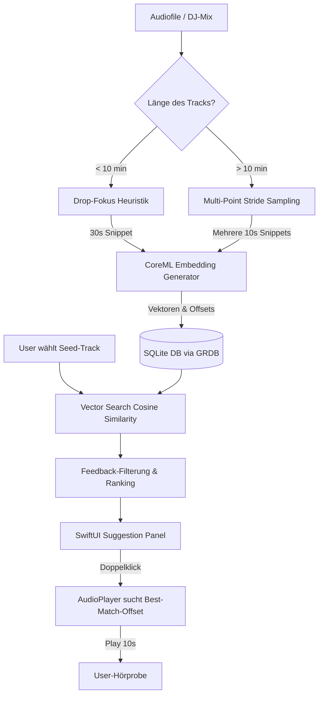

# Smart Song Suggestion Engine: Concept & Technical Blueprint

Dieses Dokument beschreibt das Konzept und die technische Architektur für das **Smart Song Suggestion Feature** im Music Library Manager (MLM). Es kombiniert dichte Audio-Embeddings (CoreML), intelligente Heuristiken für den Drop-Fokus, Multi-Point-Sampling für stundenlange DJ-Mixe sowie ein interaktives Debugging- und Feedback-System.

---

## 🎯 Überblick & Kernziele

1. **Echter Groove- & Vibe-Match:** Kein einfaches Metadaten-Matching oder sture Genre-Gleichheit. Die Engine findet Songs, die sich akustisch und rhythmisch ähnlich anfühlen (z. B. Crusy - Supersonic zu ähnlichen treibenden Tech-House-Tracks).
2. **Apple Silicon Optimierung:** Lokale, blitzschnelle Vektorähnlichkeitsberechnung via **CoreML** und das **Accelerate-Framework** (vDSP) – 100% offline, extrem performant und privat.
3. **Drop-Fokus ("Haupteil"-Erkennung):** Vermeidung langweiliger Intro-Mix-Schleifen durch intelligente Peak-Energie-Segmentierung.
4. **Mix-Kompatibilität (>30 Min):** Unterstützung langer DJ-Sets mittels Multi-Point-Sampling und automatischer Klassifizierung ("Chill House" vs. "Vixa Club").
5. **Interactive Playback ("Best Match"):** Doppelklick auf ein empfohlenes Lied spielt direkt das 5-10 Sekunden lange Segment ab, in dem das Modell die höchste Übereinstimmung sieht.
6. **Lernendes System:** Integrierte Feedback-Schleife (Guter/Schlechter Vorschlag) zur interaktiven Verfeinerung der Empfehlungen.

---

## 🏗 Systemarchitektur

Die Architektur gliedert sich in drei Hauptphasen: **Analyse (Import/Hintergrund)**, **Speicherung (GRDB)** und **Abfrage & Interaktion (SwiftUI/AudioPlayer)**.



---

## 📊 Phase 1: Die Analyse-Pipelines

### 1. Der "Drop-Finder" (Für normale Tracks < 10 Min)
Um die musikalische Identität eines Tracks zu erfassen, müssen wir den Drop/Chorus analysieren.
* **Intro/Outro-Ausschluss:** Die ersten 15% und die letzten 15% der Songlaufzeit werden ignoriert (Intro-Beats/Outro-Fades).
* **Segmentierung:** Der verbleibende Mittelteil (70%) wird in 10-Sekunden-Segmente unterteilt.
* **RMS/Loudness Profiling:** Für jedes Segment wird die durchschnittliche RMS-Energie berechnet.
* **Selection:** Das 30-Sekunden-Fenster (3 aufeinanderfolgende 10s-Segmente) mit der **höchsten durchschnittlichen Energie** wird als Repräsentant des Tracks gewählt.
* *Ergebnis:* Wir schicken genau die 30 Sekunden des Drops durch das CoreML-Modell.

### 2. Die Stride-Analyse (Für Mixe > 10 Min)
Stundenlange Mixe verändern ständig Stimmung und Genre. Ein einzelnes Snippet reicht nicht.
* **Multi-Point-Sampling:** Wir extrahieren alle 5 Minuten ein 10-Sekunden-Snippet (z. B. bei 05:00, 10:00, 15:00...).
* **Centroid-Embedding:** Jedes Snippet erhält ein eigenes 256-D Embedding. Diese Vektoren werden gemittelt, um ein globales "Mix-Embedding" zu erzeugen.
* **Klassifizierungs-Heuristik:**
  * **Chill House (Gesus8-Stil):** BPM < 125, mittlere Lautstärke (-11 bis -14 LUFS), hoher Dynamikumfang (LUFS-Range > 6dB), House-Schlüsselwörter.
  * **Vixa Club (Hazel/Ekwador-Stil):** BPM > 135, extreme Lautstärke (-5 bis -8 LUFS), extrem komprimierter Dynamikumfang (LUFS-Range < 4dB), Club/Retro-Schlüsselwörter.
  * *Datenbank-Attribut:* `mix_category` (Chill House | Vixa Club | Unknown).

---

## 💾 Phase 2: Datenbank-Schema (GRDB & SQLite)

Wir erweitern das SQLite-Schema um drei Tabellen zur Speicherung der Embeddings und des Nutzer-Feedbacks:

```sql
-- Speichert das globale Haupt-Embedding eines Tracks sowie die ermittelte Drop-Position
CREATE TABLE track_embeddings (
    track_id INTEGER PRIMARY KEY REFERENCES tracks(id) ON DELETE CASCADE,
    master_embedding BLOB NOT NULL, -- 256-dimensionales Float-Array (1024 Bytes)
    drop_offset REAL NOT NULL,      // Startsekunde des stärksten Drop-Segments
    mix_category TEXT DEFAULT NULL  -- Zur Filterung langer Sets ('Chill House', 'Vixa Club')
);

-- Speichert detaillierte Segment-Embeddings für die interaktive Hörprobe (nur bei lokal analysierten Tracks)
CREATE TABLE track_segment_embeddings (
    id INTEGER PRIMARY KEY AUTOINCREMENT,
    track_id INTEGER NOT NULL REFERENCES tracks(id) ON DELETE CASCADE,
    offset_seconds REAL NOT NULL,
    segment_embedding BLOB NOT NULL
);
CREATE INDEX idx_segment_track ON track_segment_embeddings(track_id);

-- Nutzer-Feedback zur Verfeinerung des Systems
CREATE TABLE track_similarity_feedback (
    seed_track_id INTEGER NOT NULL REFERENCES tracks(id) ON DELETE CASCADE,
    target_track_id INTEGER NOT NULL REFERENCES tracks(id) ON DELETE CASCADE,
    feedback_value INTEGER NOT NULL, -- +1 für genialer Match, -1 für schlechter Match
    timestamp TEXT DEFAULT CURRENT_TIMESTAMP,
    PRIMARY KEY (seed_track_id, target_track_id)
);
```

---

## ⚙️ Phase 3: Mathematischer Vektorvergleich (Swift & Accelerate)

Die Ähnlichkeit zweier Vektoren wird über die **Cosine Similarity** berechnet:

$$\text{Similarity}(\vec{A}, \vec{B}) = \frac{\vec{A} \cdot \vec{B}}{\|\vec{A}\| \|\vec{B}\|}$$

Da wir auf macOS laufen, nutzen wir das hochoptimierte **Accelerate-Framework** (`vDSP`), um diese Berechnung direkt auf der Hardware (Apple Silicon AMX/Neural Engine) zu parallelisieren:

```swift
import Accelerate

func cosineSimilarity(v1: [Float], v2: [Float]) -> Float {
    guard v1.count == v2.count else { return 0.0 }
    let length = vDSP_Length(v1.count)
    
    // Punktprodukt (Dot Product): A . B
    var dotProduct: Float = 0.0
    vDSP_dotpr(v1, 1, v2, 1, &dotProduct, length)
    
    // Magnitude A: ||A||
    var magA: Float = 0.0
    vDSP_sve_squares(v1, 1, &magA, length)
    magA = sqrt(magA)
    
    // Magnitude B: ||B||
    var magB: Float = 0.0
    vDSP_sve_squares(v2, 1, &magB, length)
    magB = sqrt(magB)
    
    guard magA > 0 && magB > 0 else { return 0.0 }
    return dotProduct / (magA * magB)
}
```

---

## 🖱 Phase 4: Doppelklick "Best Match" & Debugging UX

Wenn der Benutzer einen Track aus den Empfehlungen doppelklickt:
1. **Vergleich im Hintergrund:** Die App vergleicht das Embedding des Seed-Tracks mit allen *einzelnen* Segment-Embeddings (`track_segment_embeddings`) des empfohlenen Tracks.
2. **Bestes Segment ermitteln:** Das Segment mit der höchsten Ähnlichkeit wird gewählt.
3. **Seek & Play:** 
   ```swift
   let bestMatchOffset = db.getBestSegmentOffset(for: recommendedTrackId, matchingSeed: seedEmbedding)
   try audioPlayer.loadFile(at: recommendedTrack.url)
   try audioPlayer.seek(to: bestMatchOffset)
   audioPlayer.play()
   ```
4. **Visualisierung:** Im Player leuchtet ein Label auf: *"Hörprobe: Bester Match bei [Zeitstempel]"*. Nach 10 Sekunden kann die Wiedergabe sanft ausgeblendet oder normal fortgesetzt werden.

---

## 🛠️ Step 1: Vorbereitung der CoreML-Infrastruktur

Um dieses Vorhaben umzusetzen, bereiten wir folgende CoreML-Bausteine vor:

### 1. Modellauswahl
Wir setzen auf das offene **YAMNet**-Modell (von Google) oder **MusiCNN** (speziell für Musik). 
* **YAMNet:** Klassifiziert 521 Audio-Klassen und liefert exzellente, dichte 1024-dimensionale Embeddings aus der vorletzten Schicht. Es ist hochgradig für CoreML optimiert und läuft nativ auf iOS/macOS ohne Overhead.
* **Embedding-Größe:** Wir reduzieren die Dimensionen optional via PCA auf 256 Float-Werte, um die SQLite-Speichergröße gering zu halten (nur 1 KB pro Track!).

### 2. Audio-Preprocessing Pipeline (Swift + Accelerate)
Das neuronale Netz erwartet Audiosignale in einem exakten Format:
* **Samplerate:** 16.000 Hz Mono (oder 44.100 Hz je nach Modell).
* **Fensterung:** Berechnung eines Mel-Spektrogramms (Log-Mel-Spektrogramm, meist 64 Bins, 25ms Fenstergröße, 10ms Stride).
* **Swift-Klasse:** Wir erstellen eine `AudioPreprocessor` Hilfsklasse, die rohe PCM-Puffer von `ffmpeg` über `vDSP` in das Spektrogramm-Format transformiert, das der CoreML-Input verlangt.
