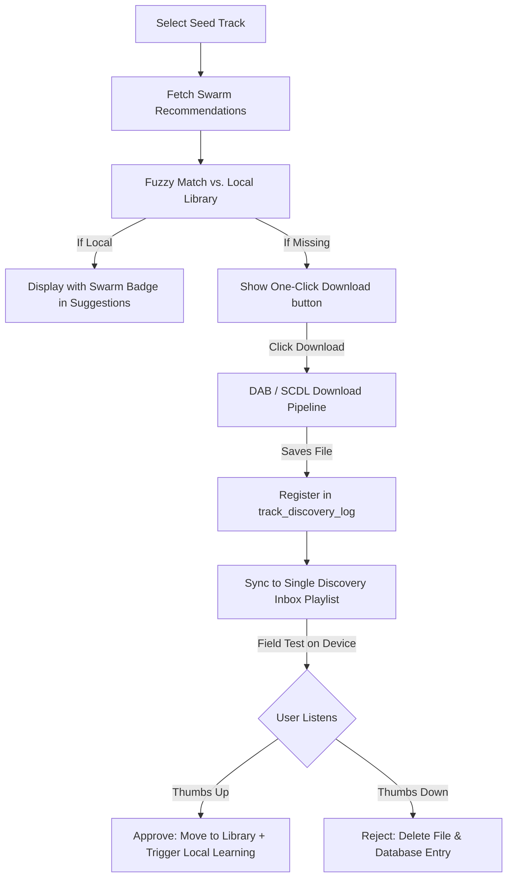

# Hybrid Swarm-Intelligence Suggestions Engine & Discovery Inbox

This document outlines the technical design, database schemas, UX architecture, and learning loops for the **Remote Swarm-Intelligence** suggestions engine. 

---

## 🎯 Core Objectives & Overview

The remote swarm-intelligence system works as a **hybrid** layer on top of our existing local acoustic features suggestions engine. Rather than relying solely on local calculations, MLM will query massive global music platforms (Last.fm, Spotify, and SoundCloud) to tap into their multi-billion-dollar collaborative filtering algorithms ("swarm intelligence"), intersecting their results with your local library.

1. **Acoustic + Swarm Hybrid Model:** Combine our local `danceability`, `lufsI`, and genre features with global associative listening patterns.
2. **The "Discovery Inbox" UX:** Avoid playlist clutter by introducing a single, unified "Inbox" playlist for field-testing newly downloaded recommended tracks before they are merged into your library.
3. **Auto-Download Pipeline:** Provide a one-click discovery workflow to automatically download missing recommended tracks via SoundCloud (`scdl`) or DABMusic (`qobuz.squid.wtf` / YouTube) directly.
4. **Vector Gravity (Local Learning Loop):** Allow the local engine to physically "learn" and adapt from approved swarm recommendations by warping local CoreML embedding vectors over time using gradient-like shifts.

---

## 🏗️ Part 1: System & Database Architecture

To track remote associations and support the Discovery Inbox without cluttering your library or creating 30 different smart playlists, we introduce a new SQLite schema.

### 1. Database Schema
We will create a new table `track_discovery_log` to maintain the relationship between a downloaded recommended "neighbor" and the "seed" track that spawned the suggestion:

```sql
-- Tracks associations and review states for downloaded recommendations
CREATE TABLE track_discovery_log (
    discovered_track_id INTEGER PRIMARY KEY REFERENCES tracks(id) ON DELETE CASCADE,
    seed_track_id INTEGER REFERENCES tracks(id) ON DELETE SET NULL,
    discovery_source TEXT NOT NULL, -- 'spotify', 'lastfm', 'soundcloud'
    status TEXT DEFAULT 'new',      -- 'new' (in inbox), 'approved' (saved), 'rejected' (deleted)
    date_added TEXT DEFAULT CURRENT_TIMESTAMP
);
```

### 2. Disk Directory Organization
To keep the physical files structured and readable outside of MLM, any neighbor track downloaded via the Discovery panel is saved into a dedicated directory nested by its seed track:

```text
/Volumes/Lexxar/Music/Discovered Neighbors/
  └── [Seed_Artist] - [Seed_Title]/
        ├── [Neighbor1_Artist] - [Neighbor1_Title].mp3
        └── [Neighbor2_Artist] - [Neighbor2_Title].flac
```
This guarantees physical context is preserved on your hard drive, even if the SQLite database is cleared.

---

## 🖥️ Part 2: The "Discovery Inbox" UX

Instead of blindly throwing downloaded recommended tracks into the main library or creating separate playlists for every search, MLM introduces a single virtual view.



### 1. The Unified Playlist
* A single playlist named **"Discovery Inbox"** (or `"Discovered Neighbors"`) is created.
* This playlist is added to your **SyncProfile** so it automatically copies to your DJ device/iPod for field testing.

### 2. The Inbox UI Panel
* A beautiful table displaying all downloaded tracks waiting for review.
* Next to each track, a prominent badge displays: `🔗 Neighbor of [Seed Track Title]`.
* Clicking the badge instantly focuses the seed track's detail panel.
* Inline controls:
  * **👍 Approve:** Fully merges the track into your primary library (clears the inbox flag) and feeds it into the local learning loop.
  * **👎 Reject:** Safely deletes the file from disk and removes the database row.
  * **🎧 Best Match Preview:** Instantly seeks and plays the loudest 10-second segment (Drop-Fokus) for a quick ears-on check.

---

## 🧠 Part 3: The Local Learning Loop

To make our local recommendations smarter, MLM will actively "learn" from every approved swarm recommendation.

### Layer A: Direct Similarity Feedback Boost
When a discovered track is **Approved (👍)**:
1. We write a positive relation into our existing `track_similarity_feedback` table:
   `saveSimilarityFeedback(seedTrackId: SeedId, targetTrackId: DiscoveredId, feedbackValue: 1)`
2. Our local ranking algorithm in `TrackRepository.swift` automatically loads this table and applies a **`+0.15` (or higher) boost** to the composite score for this specific pair.
3. **The Result:** The relationship is instantly locked in on-device, and the tracks will rank next to each other in offline/local suggestion lists.

### Layer B: Vector Gravity (Embedding Warping)
Over time, we want our local embedding space to bend and conform to global collaborative intelligence. When a neighbor is approved, we apply a small gravitational shift to the CoreML embedding vectors in `track_embeddings`:

$$\vec{E}_{\text{seed}} = \vec{E}_{\text{seed}} + \eta \times (\vec{E}_{\text{candidate}} - \vec{E}_{\text{seed}})$$
$$\vec{E}_{\text{candidate}} = \vec{E}_{\text{candidate}} + \eta \times (\vec{E}_{\text{seed}} - \vec{E}_{\text{candidate}})$$

*(Where $\eta \approx 0.05$ is the learning/attraction rate)*

* **Why this is awesome:** Over time, as you approve matches, your local vector space **deforms and self-organizes** to mirror the complex relationship graphs of Spotify and Last.fm, making your offline suggestions smarter and highly personalized without you ever having to manually label data!

---

## 🧪 Part 4: Remote Endpoints Headless Testing Plan

Before writing MLM code, we will write diagnostic scripts in `/Users/olli/schenanigans/MusicLibraryManager/scratch/` to test each endpoint:

1. **SoundCloud Related API:** Parse `SOUNDCLOUD_CLIENT_ID` from `.env`, query `https://api-v2.soundcloud.com/tracks/{track_id}/related` and extract track objects.
2. **Last.fm Similar Tracks API:** Query the free, open `track.getSimilar` endpoint to verify its response structure for Vixa and electronic tracks.
3. **Spotify Recommendations API:** Authenticate using `SPOTIFY_CLIENT_ID` and `SPOTIFY_CLIENT_SECRET` via Client Credentials flow, query `/v1/recommendations`, and verify output.
